# Parseltongue: Complete Architecture Documentation

> Meta-analysis: Parseltongue analyzing itself using its own HTTP API

**Version**: 1.4.2
**Analysis Date**: 2026-01-30
**Database**: `parseltongue20260130092739/analysis.db`
**Statistics**: 274 code entities, 4,894 dependency edges, Rust codebase

---

## Table of Contents

1. [Architecture Overview](#architecture-overview)
2. [Control Flow Execution](#control-flow-execution)
3. [Data Flow Transformations](#data-flow-transformations)
4. [HTTP API Reference](#http-api-reference)
5. [Module Dependencies](#module-dependencies)
6. [Key Algorithms](#key-algorithms)

---

## Architecture Overview

### High-Level System Architecture

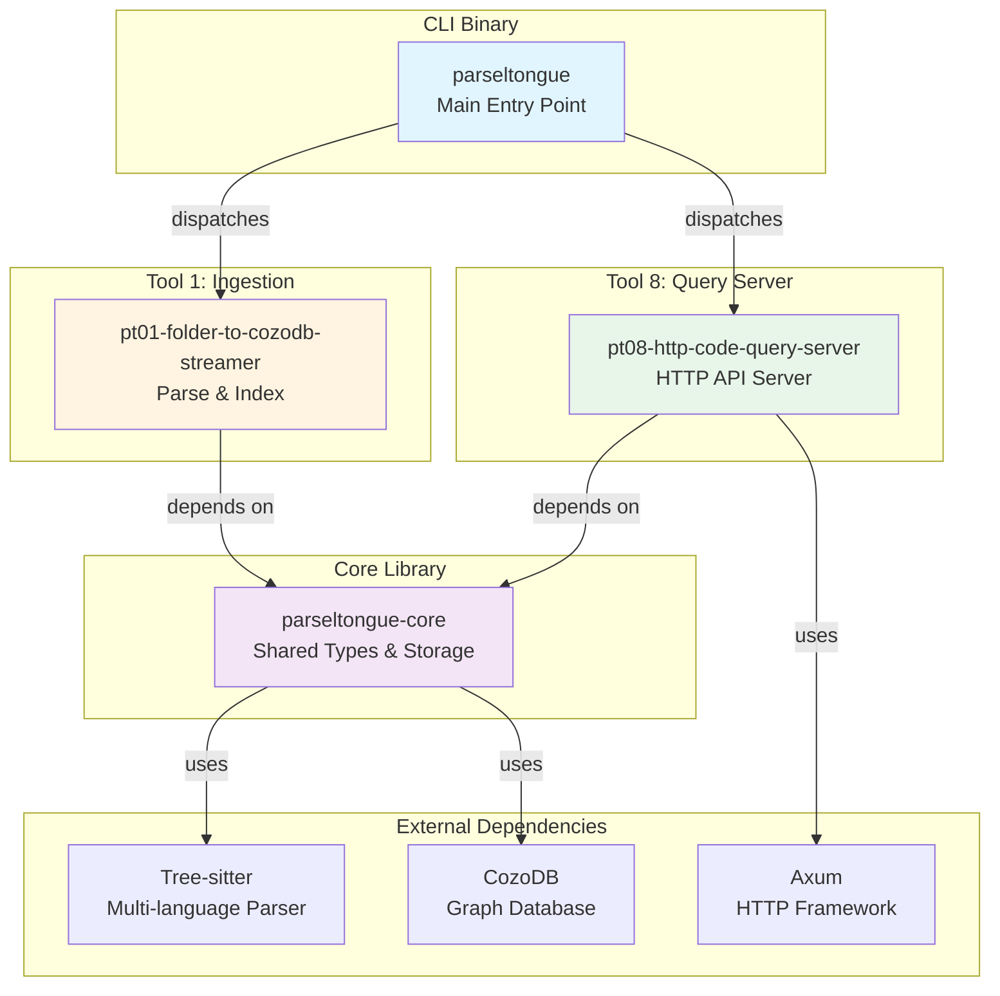
```mermaid
graph TB
    subgraph "CLI Binary"
        A[parseltongue<br/>Main Entry Point]
    end

    subgraph "Tool 1: Ingestion"
        B[pt01-folder-to-cozodb-streamer<br/>Parse & Index]
    end

    subgraph "Tool 8: Query Server"
        C[pt08-http-code-query-server<br/>HTTP API Server]
    end

    subgraph "Core Library"
        D[parseltongue-core<br/>Shared Types & Storage]
    end

    subgraph "External Dependencies"
        E[Tree-sitter<br/>Multi-language Parser]
        F[CozoDB<br/>Graph Database]
        G[Axum<br/>HTTP Framework]
    end

    A -->|dispatches| B
    A -->|dispatches| C
    B -->|depends on| D
    C -->|depends on| D
    D -->|uses| E
    D -->|uses| F
    C -->|uses| G

    style A fill:#e1f5ff
    style B fill:#fff4e1
    style C fill:#e8f5e9
    style D fill:#f3e5f5
```

### Four-Stage Data Pipeline

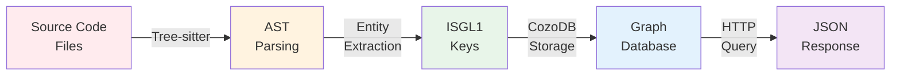
```mermaid
flowchart LR
    A[Source Code<br/>Files] -->|Tree-sitter| B[AST<br/>Parsing]
    B -->|Entity<br/>Extraction| C[ISGL1<br/>Keys]
    C -->|CozoDB<br/>Storage| D[Graph<br/>Database]
    D -->|HTTP<br/>Query| E[JSON<br/>Response]

    style A fill:#ffebee
    style B fill:#fff3e0
    style C fill:#e8f5e9
    style D fill:#e3f2fd
    style E fill:#f3e5f5
```

### Crate Dependency Hierarchy

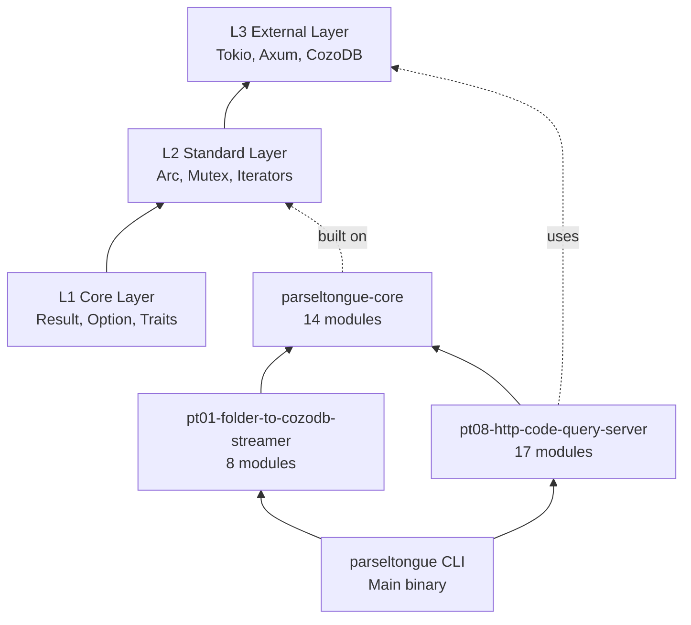
```mermaid
graph BT
    L1[L1 Core Layer<br/>Result, Option, Traits]
    L2[L2 Standard Layer<br/>Arc, Mutex, Iterators]
    L3[L3 External Layer<br/>Tokio, Axum, CozoDB]

    Core[parseltongue-core<br/>14 modules]
    PT01[pt01-folder-to-cozodb-streamer<br/>8 modules]
    PT08[pt08-http-code-query-server<br/>17 modules]
    CLI[parseltongue CLI<br/>Main binary]

    L1 --> L2
    L2 --> L3

    Core -.->|built on| L2
    PT01 --> Core
    PT08 --> Core
    CLI --> PT01
    CLI --> PT08
    PT08 -.->|uses| L3
```

---

## Control Flow Execution

### CLI Dispatcher Flow

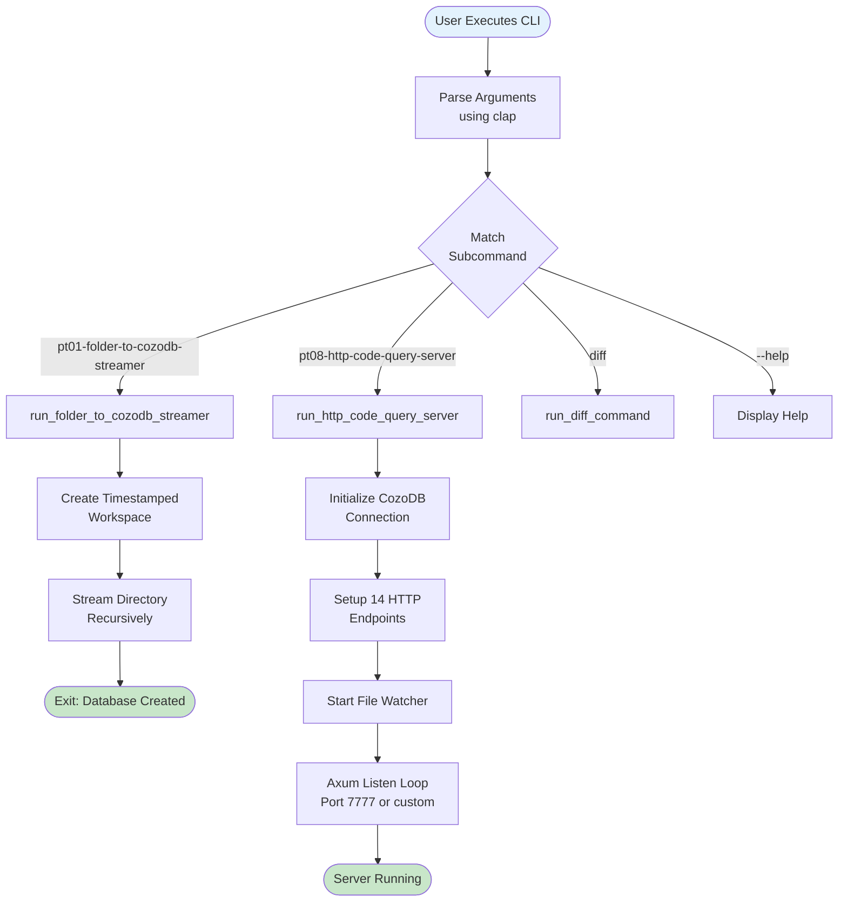
```mermaid
flowchart TD
    Start([User Executes CLI]) --> Parse[Parse Arguments<br/>using clap]
    Parse --> Match{Match<br/>Subcommand}

    Match -->|pt01-folder-to-cozodb-streamer| Ingest[run_folder_to_cozodb_streamer]
    Match -->|pt08-http-code-query-server| Server[run_http_code_query_server]
    Match -->|diff| Diff[run_diff_command]
    Match -->|--help| Help[Display Help]

    Ingest --> CreateWS[Create Timestamped<br/>Workspace]
    CreateWS --> Stream[Stream Directory<br/>Recursively]
    Stream --> Done1([Exit: Database Created])

    Server --> InitDB[Initialize CozoDB<br/>Connection]
    InitDB --> Routes[Setup 14 HTTP<br/>Endpoints]
    Routes --> Watch[Start File Watcher]
    Watch --> Listen[Axum Listen Loop<br/>Port 7777 or custom]
    Listen --> Running([Server Running])

    style Start fill:#e3f2fd
    style Done1 fill:#c8e6c9
    style Running fill:#c8e6c9
```

### PT01 Ingestion Pipeline

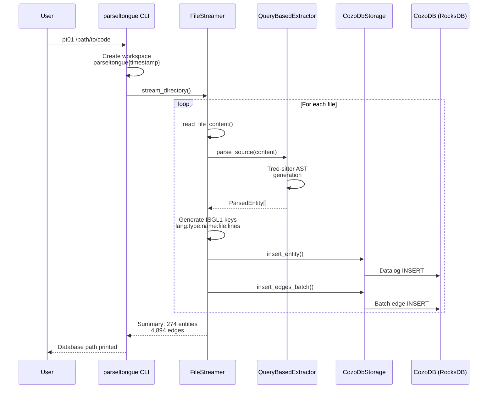
```mermaid
sequenceDiagram
    participant User
    participant CLI as parseltongue CLI
    participant Streamer as FileStreamer
    participant Parser as QueryBasedExtractor
    participant Storage as CozoDbStorage
    participant DB as CozoDB (RocksDB)

    User->>CLI: pt01 /path/to/code
    CLI->>CLI: Create workspace<br/>parseltongue{timestamp}
    CLI->>Streamer: stream_directory()

    loop For each file
        Streamer->>Streamer: read_file_content()
        Streamer->>Parser: parse_source(content)
        Parser->>Parser: Tree-sitter AST<br/>generation
        Parser-->>Streamer: ParsedEntity[]
        Streamer->>Streamer: Generate ISGL1 keys<br/>lang:type:name:file:lines
        Streamer->>Storage: insert_entity()
        Storage->>DB: Datalog INSERT
        Streamer->>Storage: insert_edges_batch()
        Storage->>DB: Batch edge INSERT
    end

    Streamer-->>CLI: Summary: 274 entities<br/>4,894 edges
    CLI-->>User: Database path printed
```

### PT08 HTTP Server Request Lifecycle

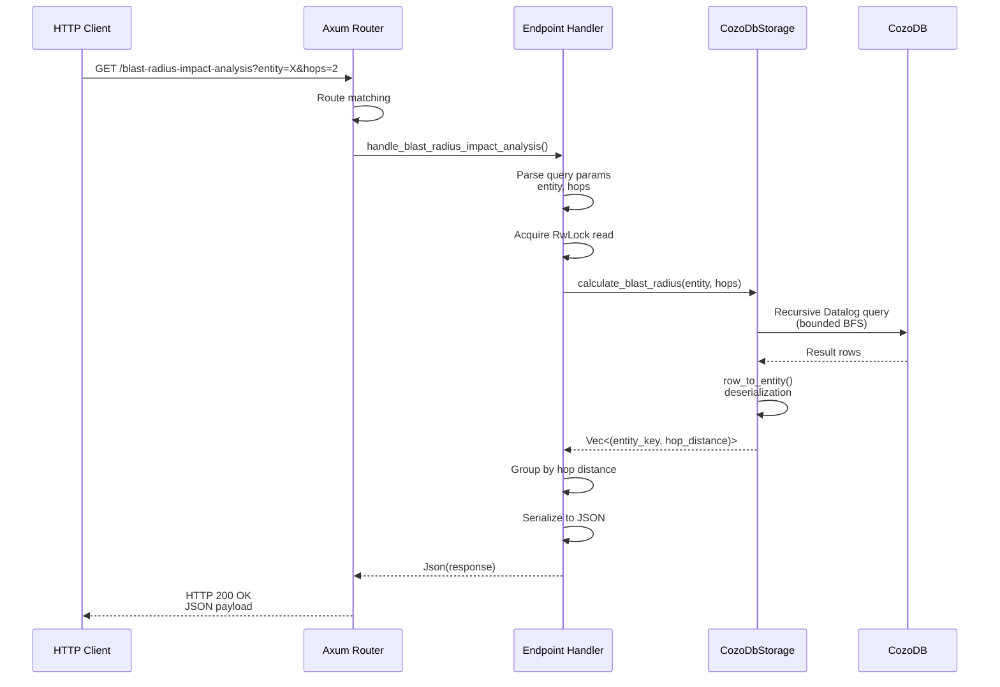
```mermaid
sequenceDiagram
    participant Client as HTTP Client
    participant Axum as Axum Router
    participant Handler as Endpoint Handler
    participant Storage as CozoDbStorage
    participant DB as CozoDB

    Client->>Axum: GET /blast-radius-impact-analysis?entity=X&hops=2
    Axum->>Axum: Route matching
    Axum->>Handler: handle_blast_radius_impact_analysis()
    Handler->>Handler: Parse query params<br/>entity, hops
    Handler->>Handler: Acquire RwLock read
    Handler->>Storage: calculate_blast_radius(entity, hops)
    Storage->>DB: Recursive Datalog query<br/>(bounded BFS)
    DB-->>Storage: Result rows
    Storage->>Storage: row_to_entity()<br/>deserialization
    Storage-->>Handler: Vec<(entity_key, hop_distance)>
    Handler->>Handler: Group by hop distance
    Handler->>Handler: Serialize to JSON
    Handler-->>Axum: Json(response)
    Axum-->>Client: HTTP 200 OK<br/>JSON payload
```

### File Watcher Incremental Update Flow

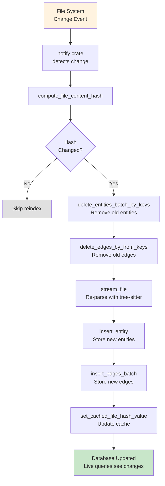
```mermaid
flowchart TD
    FS[File System<br/>Change Event] --> Detect[notify crate<br/>detects change]
    Detect --> Hash[compute_file_content_hash]
    Hash --> Compare{Hash<br/>Changed?}

    Compare -->|No| Skip[Skip reindex]
    Compare -->|Yes| Delete1[delete_entities_batch_by_keys<br/>Remove old entities]

    Delete1 --> Delete2[delete_edges_by_from_keys<br/>Remove old edges]
    Delete2 --> Reparse[stream_file<br/>Re-parse with tree-sitter]
    Reparse --> Insert1[insert_entity<br/>Store new entities]
    Insert1 --> Insert2[insert_edges_batch<br/>Store new edges]
    Insert2 --> Cache[set_cached_file_hash_value<br/>Update cache]
    Cache --> Done[Database Updated<br/>Live queries see changes]

    style FS fill:#fff3e0
    style Done fill:#c8e6c9
    style Skip fill:#e0e0e0
```

---

## Data Flow Transformations

### Complete Data Transformation Pipeline

```mermaid
flowchart LR
    subgraph Stage1[Stage 1: File Ingestion]
        A1[Source File<br/>.rs, .py, .js] --> A2[read_file_content]
        A2 --> A3[UTF-8 String<br/>Raw Source]
    end

    subgraph Stage2[Stage 2: Tree-sitter Parsing]
        B1[Tree-sitter Parser] --> B2[AST Tree<br/>Syntax Nodes]
        B2 --> B3[execute_query<br/>S-expression queries]
        B3 --> B4[ParsedEntity<br/>name, type, lines]
    end

    subgraph Stage3[Stage 3: Entity Construction]
        C1[parsed_entity_to_code_entity] --> C2[Generate ISGL1 Key<br/>rust:fn:main:src_main_rs:1-50]
        C2 --> C3[CodeEntity<br/>Enriched metadata]
    end

    subgraph Stage4[Stage 4: Database Storage]
        D1[entity_to_params<br/>Serialization] --> D2[CozoDB Datalog<br/>INSERT statement]
        D2 --> D3[RocksDB<br/>Persisted Row]
    end

    subgraph Stage5[Stage 5: Query Response]
        E1[Datalog SELECT] --> E2[row_to_entity<br/>Deserialization]
        E2 --> E3[JSON Response<br/>HTTP API]
    end

    A3 --> B1
    B4 --> C1
    C3 --> D1
    D3 --> E1

    style Stage1 fill:#ffebee
    style Stage2 fill:#fff3e0
    style Stage3 fill:#e8f5e9
    style Stage4 fill:#e3f2fd
    style Stage5 fill:#f3e5f5
```

### ISGL1 Key Format Structure

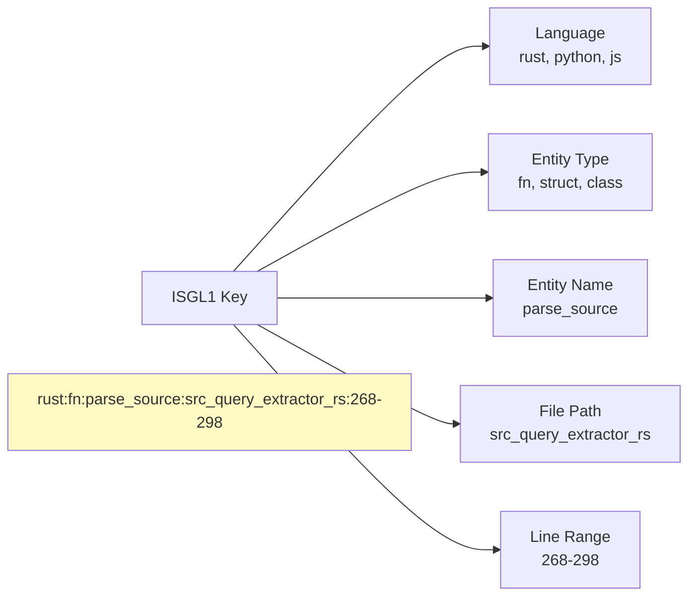
```mermaid
graph LR
    Key[ISGL1 Key] --> Lang[Language<br/>rust, python, js]
    Key --> Type[Entity Type<br/>fn, struct, class]
    Key --> Name[Entity Name<br/>parse_source]
    Key --> File[File Path<br/>src_query_extractor_rs]
    Key --> Lines[Line Range<br/>268-298]

    Example["rust:fn:parse_source:src_query_extractor_rs:268-298"]

    style Example fill:#fff9c4
```

### CozoDB Schema Structure

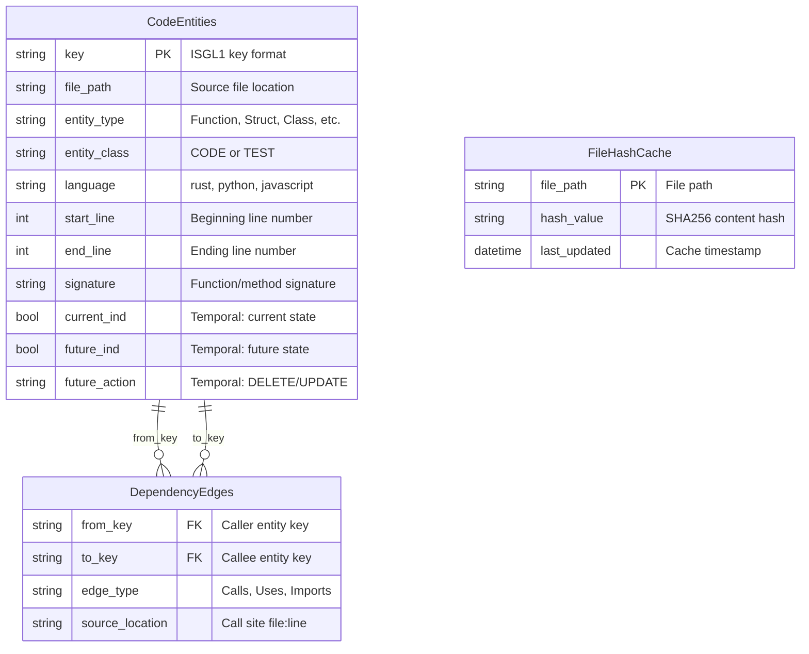
```mermaid
erDiagram
    CodeEntities {
        string key PK "ISGL1 key format"
        string file_path "Source file location"
        string entity_type "Function, Struct, Class, etc."
        string entity_class "CODE or TEST"
        string language "rust, python, javascript"
        int start_line "Beginning line number"
        int end_line "Ending line number"
        string signature "Function/method signature"
        bool current_ind "Temporal: current state"
        bool future_ind "Temporal: future state"
        string future_action "Temporal: DELETE/UPDATE"
    }

    DependencyEdges {
        string from_key FK "Caller entity key"
        string to_key FK "Callee entity key"
        string edge_type "Calls, Uses, Imports"
        string source_location "Call site file:line"
    }

    FileHashCache {
        string file_path PK "File path"
        string hash_value "SHA256 content hash"
        datetime last_updated "Cache timestamp"
    }

    CodeEntities ||--o{ DependencyEdges : "from_key"
    CodeEntities ||--o{ DependencyEdges : "to_key"
```

### Entity Type Hierarchy

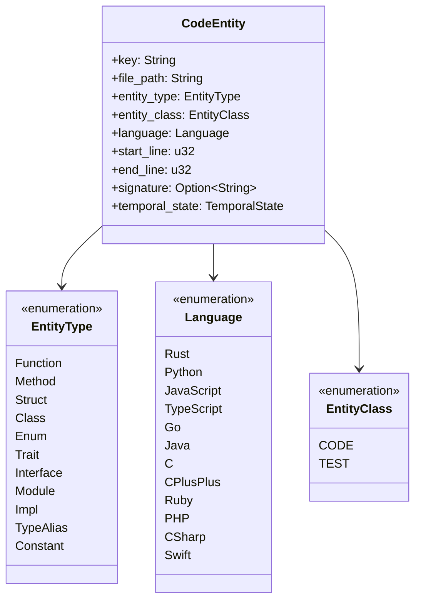
```mermaid
classDiagram
    class EntityType {
        <<enumeration>>
        Function
        Method
        Struct
        Class
        Enum
        Trait
        Interface
        Module
        Impl
        TypeAlias
        Constant
    }

    class Language {
        <<enumeration>>
        Rust
        Python
        JavaScript
        TypeScript
        Go
        Java
        C
        CPlusPlus
        Ruby
        PHP
        CSharp
        Swift
    }

    class EntityClass {
        <<enumeration>>
        CODE
        TEST
    }

    class CodeEntity {
        +key: String
        +file_path: String
        +entity_type: EntityType
        +entity_class: EntityClass
        +language: Language
        +start_line: u32
        +end_line: u32
        +signature: Option~String~
        +temporal_state: TemporalState
    }

    CodeEntity --> EntityType
    CodeEntity --> Language
    CodeEntity --> EntityClass
```

---

## HTTP API Reference

### 14 HTTP Endpoints Categorized

```mermaid
mindmap
  root((Parseltongue API<br/>14 Endpoints))
    Core 3
      /server-health-check-status
      /codebase-statistics-overview-summary
      /api-reference-documentation-help
    Entity Queries 3
      /code-entities-list-all
      /code-entity-detail-view/{key}
      /code-entities-search-fuzzy?q=
    Graph Queries 3
      /dependency-edges-list-all
      /reverse-callers-query-graph?entity=
      /forward-callees-query-graph?entity=
    Analysis 4
      /blast-radius-impact-analysis?entity=&hops=
      /circular-dependency-detection-scan
      /complexity-hotspots-ranking-view?top=
      /semantic-cluster-grouping-list
    Advanced 1
      /smart-context-token-budget?focus=&tokens=
```

### API Request/Response Flow

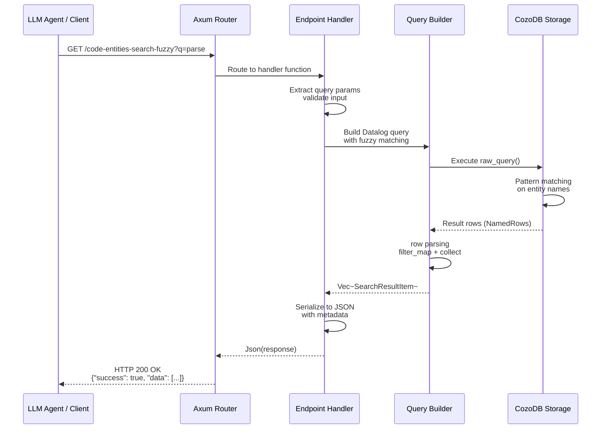
```mermaid
sequenceDiagram
    participant Client as LLM Agent / Client
    participant Router as Axum Router
    participant Handler as Endpoint Handler
    participant Query as Query Builder
    participant DB as CozoDB Storage

    Client->>Router: GET /code-entities-search-fuzzy?q=parse
    Router->>Handler: Route to handler function
    Handler->>Handler: Extract query params<br/>validate input
    Handler->>Query: Build Datalog query<br/>with fuzzy matching
    Query->>DB: Execute raw_query()
    DB->>DB: Pattern matching<br/>on entity names
    DB-->>Query: Result rows (NamedRows)
    Query->>Query: row parsing<br/>filter_map + collect
    Query-->>Handler: Vec~SearchResultItem~
    Handler->>Handler: Serialize to JSON<br/>with metadata
    Handler-->>Router: Json(response)
    Router-->>Client: HTTP 200 OK<br/>{"success": true, "data": [...]}
```

### Endpoint Handler Pattern (All 14 Follow This)

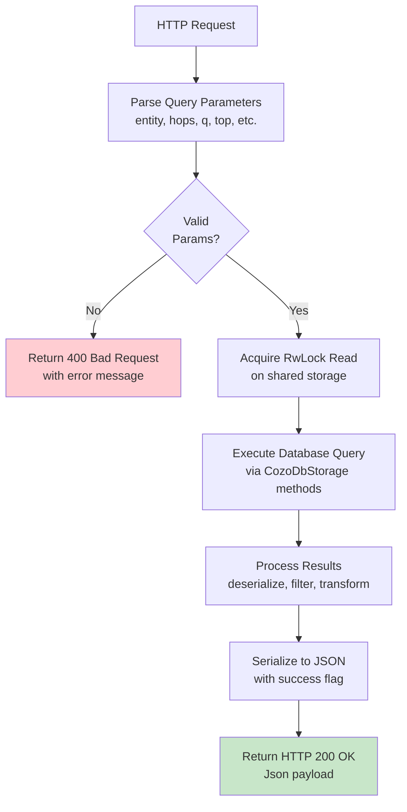
```mermaid
flowchart TD
    Request[HTTP Request] --> Parse[Parse Query Parameters<br/>entity, hops, q, top, etc.]
    Parse --> Validate{Valid<br/>Params?}
    Validate -->|No| Error400[Return 400 Bad Request<br/>with error message]
    Validate -->|Yes| Lock[Acquire RwLock Read<br/>on shared storage]
    Lock --> Query[Execute Database Query<br/>via CozoDbStorage methods]
    Query --> Process[Process Results<br/>deserialize, filter, transform]
    Process --> Serialize[Serialize to JSON<br/>with success flag]
    Serialize --> Response[Return HTTP 200 OK<br/>Json payload]

    style Error400 fill:#ffcdd2
    style Response fill:#c8e6c9
```

---

## Module Dependencies

### parseltongue-core Module Structure (14 Modules)

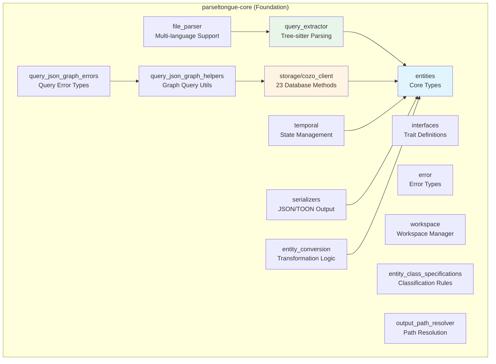
```mermaid
graph TD
    subgraph Core["parseltongue-core (Foundation)"]
        E[entities<br/>Core Types]
        S[storage/cozo_client<br/>23 Database Methods]
        Q[query_extractor<br/>Tree-sitter Parsing]
        F[file_parser<br/>Multi-language Support]
        T[temporal<br/>State Management]
        I[interfaces<br/>Trait Definitions]
        ER[error<br/>Error Types]
        SE[serializers<br/>JSON/TOON Output]
        W[workspace<br/>Workspace Manager]
        EC[entity_class_specifications<br/>Classification Rules]
        EV[entity_conversion<br/>Transformation Logic]
        OP[output_path_resolver<br/>Path Resolution]
        QH[query_json_graph_helpers<br/>Graph Query Utils]
        QE[query_json_graph_errors<br/>Query Error Types]
    end

    Q --> E
    S --> E
    F --> Q
    T --> E
    SE --> E
    EV --> E
    QH --> S
    QE --> QH

    style E fill:#e1f5ff
    style S fill:#fff4e1
    style Q fill:#e8f5e9
```

### pt01 Module Structure (8 Modules)

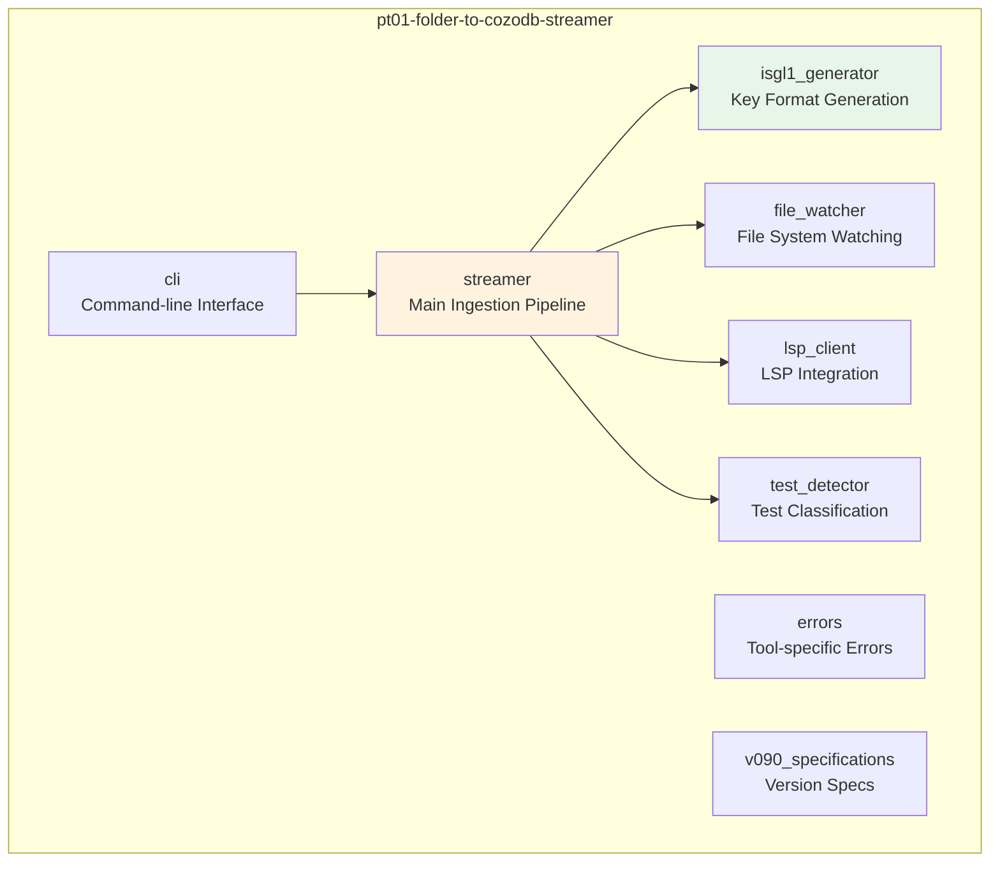
```mermaid
graph TD
    subgraph PT01["pt01-folder-to-cozodb-streamer"]
        ST[streamer<br/>Main Ingestion Pipeline]
        IS[isgl1_generator<br/>Key Format Generation]
        FW[file_watcher<br/>File System Watching]
        LS[lsp_client<br/>LSP Integration]
        TD[test_detector<br/>Test Classification]
        ER[errors<br/>Tool-specific Errors]
        CL[cli<br/>Command-line Interface]
        SP[v090_specifications<br/>Version Specs]
    end

    ST --> IS
    ST --> FW
    ST --> LS
    ST --> TD
    CL --> ST

    style ST fill:#fff3e0
    style IS fill:#e8f5e9
```

### pt08 Module Structure (17 Modules)

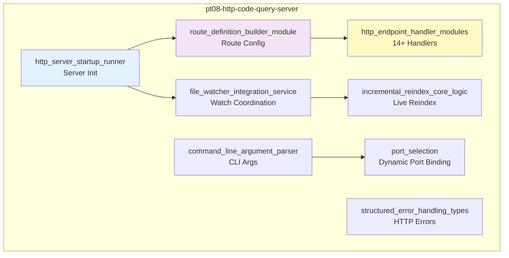
```mermaid
graph TD
    subgraph PT08["pt08-http-code-query-server"]
        HS[http_server_startup_runner<br/>Server Init]
        RB[route_definition_builder_module<br/>Route Config]
        CA[command_line_argument_parser<br/>CLI Args]
        PS[port_selection<br/>Dynamic Port Binding]
        FW[file_watcher_integration_service<br/>Watch Coordination]
        IR[incremental_reindex_core_logic<br/>Live Reindex]
        EH[structured_error_handling_types<br/>HTTP Errors]
        H1[http_endpoint_handler_modules<br/>14+ Handlers]
    end

    HS --> RB
    RB --> H1
    HS --> FW
    FW --> IR
    CA --> PS

    style HS fill:#e3f2fd
    style RB fill:#f3e5f5
    style H1 fill:#fff9c4
```

### CozoDbStorage 23 Methods Map

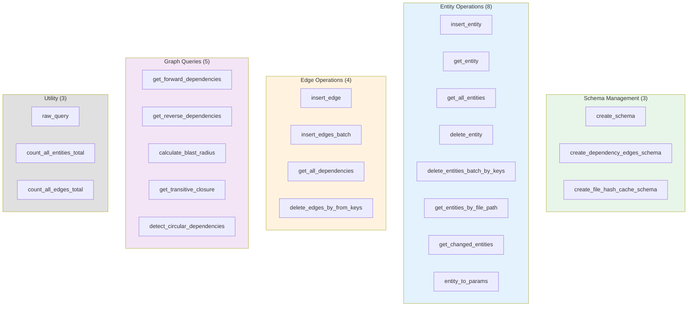
```mermaid
graph TB
    subgraph Schema["Schema Management (3)"]
        S1[create_schema]
        S2[create_dependency_edges_schema]
        S3[create_file_hash_cache_schema]
    end

    subgraph Entity["Entity Operations (8)"]
        E1[insert_entity]
        E2[get_entity]
        E3[get_all_entities]
        E4[delete_entity]
        E5[delete_entities_batch_by_keys]
        E6[get_entities_by_file_path]
        E7[get_changed_entities]
        E8[entity_to_params]
    end

    subgraph Edge["Edge Operations (4)"]
        D1[insert_edge]
        D2[insert_edges_batch]
        D3[get_all_dependencies]
        D4[delete_edges_by_from_keys]
    end

    subgraph Graph["Graph Queries (5)"]
        G1[get_forward_dependencies]
        G2[get_reverse_dependencies]
        G3[calculate_blast_radius]
        G4[get_transitive_closure]
        G5[detect_circular_dependencies]
    end

    subgraph Utility["Utility (3)"]
        U1[raw_query]
        U2[count_all_entities_total]
        U3[count_all_edges_total]
    end

    style Schema fill:#e8f5e9
    style Entity fill:#e3f2fd
    style Edge fill:#fff3e0
    style Graph fill:#f3e5f5
    style Utility fill:#e0e0e0
```

---

## Key Algorithms

### Blast Radius Impact Analysis Algorithm

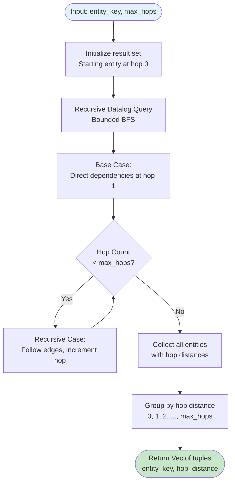
```mermaid
flowchart TD
    Start([Input: entity_key, max_hops]) --> Init[Initialize result set<br/>Starting entity at hop 0]
    Init --> Query[Recursive Datalog Query<br/>Bounded BFS]
    Query --> Base[Base Case:<br/>Direct dependencies at hop 1]
    Base --> Recursive{Hop Count<br/>< max_hops?}

    Recursive -->|Yes| Expand[Recursive Case:<br/>Follow edges, increment hop]
    Expand --> Recursive

    Recursive -->|No| Collect[Collect all entities<br/>with hop distances]
    Collect --> Group[Group by hop distance<br/>0, 1, 2, ..., max_hops]
    Group --> Return([Return Vec of tuples<br/>entity_key, hop_distance])

    style Start fill:#e3f2fd
    style Return fill:#c8e6c9
```

### Circular Dependency Detection (DFS)

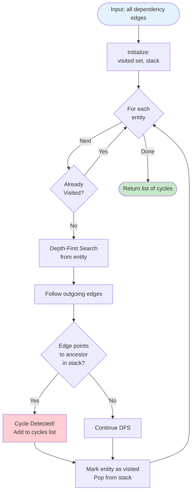
```mermaid
flowchart TD
    Start([Input: all dependency edges]) --> Init[Initialize:<br/>visited set, stack]
    Init --> Loop{For each<br/>entity}
    Loop -->|Next| Visit{Already<br/>Visited?}
    Visit -->|Yes| Loop
    Visit -->|No| DFS[Depth-First Search<br/>from entity]

    DFS --> Follow[Follow outgoing edges]
    Follow --> Check{Edge points<br/>to ancestor<br/>in stack?}

    Check -->|Yes| Cycle[Cycle Detected!<br/>Add to cycles list]
    Check -->|No| Continue[Continue DFS]

    Cycle --> Mark[Mark entity as visited<br/>Pop from stack]
    Continue --> Mark
    Mark --> Loop

    Loop -->|Done| Return([Return list of cycles])

    style Start fill:#e3f2fd
    style Cycle fill:#ffcdd2
    style Return fill:#c8e6c9
```

### Semantic Cluster Grouping (Label Propagation)

```mermaid
flowchart LR
    Start([Input: dependency graph]) --> Init[Initialize:<br/>Each entity = unique cluster ID]
    Init --> Iterate{Max iterations<br/>or convergence?}

    Iterate -->|Continue| Propagate[For each entity:<br/>Adopt most common<br/>neighbor cluster ID]
    Propagate --> Update[Update cluster assignments]
    Update --> Iterate

    Iterate -->|Done| Merge[Merge entities<br/>with same cluster ID]
    Merge --> Filter[Filter clusters<br/>by size threshold]
    Filter --> Return([Return list of semantic clusters])

    style Start fill:#e3f2fd
    style Return fill:#c8e6c9
```

### Smart Context Token Budget Algorithm

```mermaid
flowchart TD
    Start([Input: focus_entity, token_budget]) --> Get[Get focus entity details<br/>~100 tokens]
    Get --> Blast[Calculate blast radius<br/>hops=2]
    Blast --> Prioritize[Prioritize entities:<br/>1. Direct dependencies hop 1<br/>2. Transitive hop 2<br/>3. By coupling metrics]

    Prioritize --> Budget{Token<br/>budget<br/>remaining?}
    Budget -->|Yes| Add[Add next priority entity<br/>Estimate tokens from signature]
    Add --> Budget

    Budget -->|No| Return([Return filtered entity list<br/>within token budget])

    style Start fill:#e3f2fd
    style Return fill:#c8e6c9
```

---

## Architectural Patterns

### Four-Word Naming Convention Examples

```mermaid
graph LR
    Pattern[verb_constraint_target_qualifier] --> Examples

    Examples --> E1[filter_implementation_entities_only]
    Examples --> E2[handle_server_health_check_status]
    Examples --> E3[query_entities_with_filter_from_database]
    Examples --> E4[build_call_chain_from_root]
    Examples --> E5[compute_file_content_hash_value]
    Examples --> E6[delete_entities_batch_by_keys]

    style Pattern fill:#fff9c4
```

### Layered Architecture Dependency Rules

```mermaid
flowchart BT
    L1[L1 Core Layer<br/>✓ Ownership semantics<br/>✓ Result, Option<br/>✓ Traits, enums<br/>✓ RAII patterns<br/>✗ No external crates]

    L2[L2 Standard Layer<br/>✓ Collections Vec, HashMap<br/>✓ Arc, Mutex, RwLock<br/>✓ Iterators, Send, Sync<br/>✗ No async]

    L3[L3 External Layer<br/>✓ Tokio async runtime<br/>✓ Axum web framework<br/>✓ CozoDB database<br/>✓ Tree-sitter parsing]

    L1 --> L2
    L2 --> L3

    Core[parseltongue-core] -.->|uses| L2
    PT01[pt01] -.->|uses| L2
    PT08[pt08] -.->|uses| L3

    style L1 fill:#e8f5e9
    style L2 fill:#e3f2fd
    style L3 fill:#f3e5f5
```

---

## Performance Characteristics

### Query Performance Profile

```mermaid
graph LR
    subgraph Fast["Fast < 10ms"]
        F1[/server-health-check-status<br/>metadata only]
        F2[/code-entity-detail-view<br/>single key lookup]
        F3[/codebase-statistics-overview-summary<br/>counts only]
    end

    subgraph Medium["Medium 10-100ms"]
        M1[/code-entities-list-all<br/>full scan]
        M2[/code-entities-search-fuzzy<br/>pattern matching]
        M3[/forward-callees-query-graph<br/>1-hop traversal]
        M4[/reverse-callers-query-graph<br/>1-hop traversal]
    end

    subgraph Slow["Slow 100-500ms"]
        S1[/blast-radius-impact-analysis<br/>multi-hop recursion]
        S2[/circular-dependency-detection-scan<br/>full graph DFS]
        S3[/semantic-cluster-grouping-list<br/>label propagation]
        S4[/complexity-hotspots-ranking-view<br/>coupling calculation]
    end

    style Fast fill:#c8e6c9
    style Medium fill:#fff9c4
    style Slow fill:#ffccbc
```

---

## Token Efficiency Model

### Traditional Approach vs Parseltongue

```mermaid
graph LR
    subgraph Traditional["Traditional Grep (500K tokens)"]
        T1[Entire File 1<br/>5000 lines] --> T2[Entire File 2<br/>3000 lines]
        T2 --> T3[Entire File 3<br/>8000 lines]
        T3 --> T4[... 50+ files<br/>total 500K tokens]
    end

    subgraph Parseltongue["Parseltongue API (2-5K tokens)"]
        P1[Query: blast-radius?entity=X&hops=2] --> P2[Response: 15 entities<br/>with metadata]
        P2 --> P3[Entity 1: key, file, lines 10-25]
        P3 --> P4[Entity 2: key, file, lines 50-75]
        P4 --> P5[... total ~3K tokens<br/>99% reduction]
    end

    Traditional --> Compare{Token<br/>Efficiency}
    Parseltongue --> Compare

    Compare --> Result[500K → 3K tokens<br/>166x reduction]

    style Traditional fill:#ffcdd2
    style Parseltongue fill:#c8e6c9
    style Result fill:#fff9c4
```

---

## Appendix: Statistics from This Analysis

**Codebase Analyzed**: Parseltongue (self-analysis)
**Workspace**: `parseltongue20260130092739`
**Database**: `rocksdb:parseltongue20260130092739/analysis.db`

**Entity Statistics**:
- Total code entities: 274
- Test entities: 1,082 (excluded from analysis)
- Total dependency edges: 4,894
- Languages detected: Rust only

**Crate Breakdown**:
- `parseltongue-core`: 14 modules
- `pt01-folder-to-cozodb-streamer`: 8 modules
- `pt08-http-code-query-server`: 17 modules
- `parseltongue` (binary): 2 modules

**HTTP Server**:
- Total endpoints: 14 (documented)
- Additional analysis endpoints: 5+ (SCC, coupling, PageRank, instability)
- Default port: 7777
- File watching: Always enabled (v1.4.2)

**Key Algorithms Identified**:
- Blast radius: Bounded BFS, complexity O(V + E * max_hops)
- Circular dependency: DFS with cycle detection, O(V + E)
- Semantic clustering: Label propagation, O(V * E * iterations)
- Smart context: Priority-based budget allocation, O(V log V)

---

**Generated**: 2026-01-30 09:27 UTC
**Analysis Method**: Parseltongue HTTP API queries at `localhost:8888`
**Agent**: Claude Code using Task agents (Explore subtype)

