# ES-V200 Options (ELI5) with Mermaid
Date: 2026-02-27
Source option memo:
- `/Users/amuldotexe/Desktop/parseltongue-rust-LLM-companion/competior research/ES-V200-cocoindex-options-01.md`

## Big Picture (ELI5)
Think of Parseltongue like a smart city map for code.
- We want the map to be correct.
- We want it to load fast.
- We want humans and AI to trust every road shown.

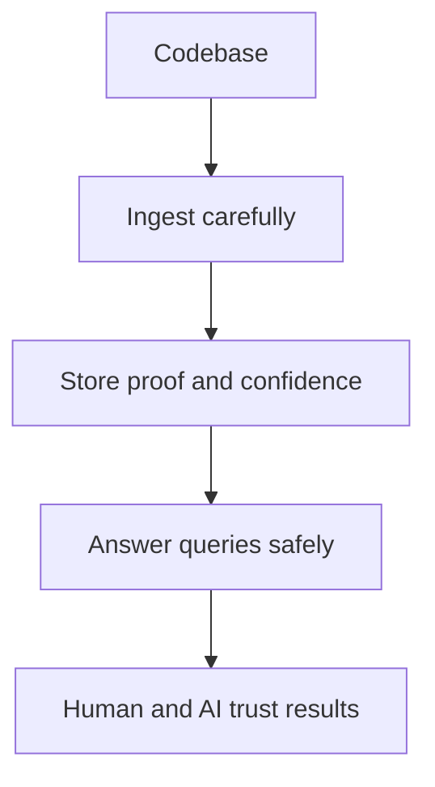

## Option 1: Zero-Config Workspace Boot
ELI5: App should find the right folder automatically, so users do not trip on setup.

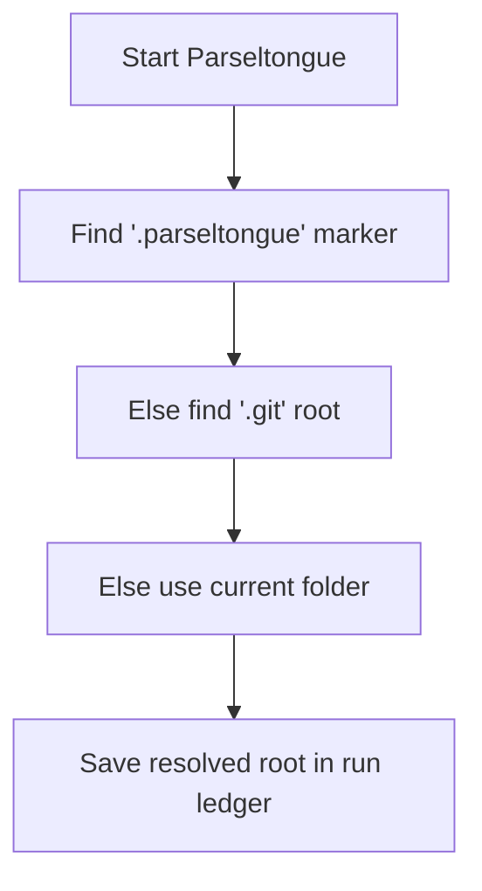

## Option 2: Freshness Contract + Singleflight Reindex
ELI5: User can pick "fresh now" or "fast enough now"; system clearly says data freshness.

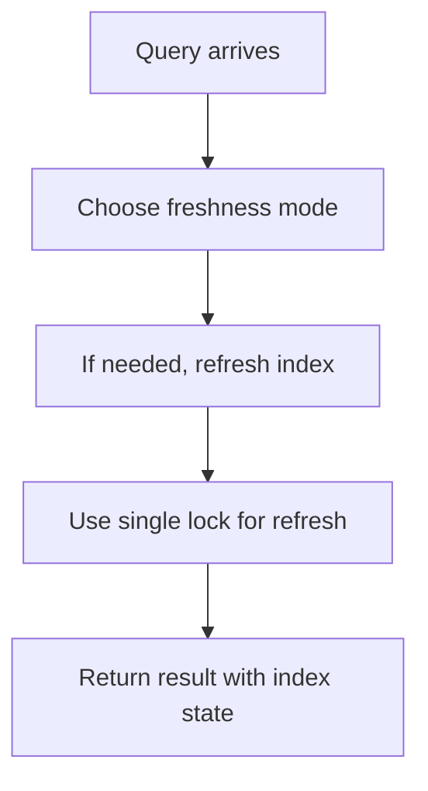

## Option 3: Two-Layer Response Envelope
ELI5: First show tiny answer card; expand only when user asks for full details.

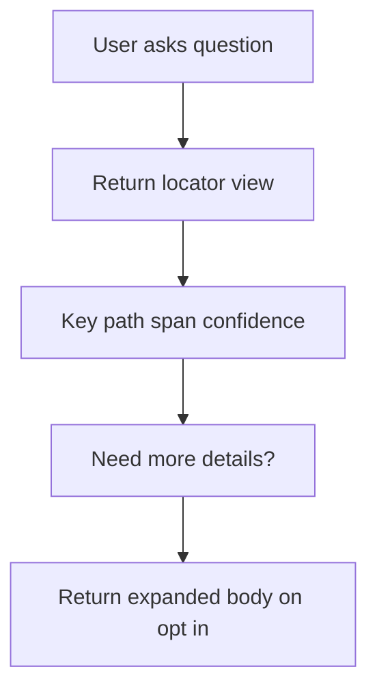

## Option 4: Evidence Search Sidecar
ELI5: Semantic search can suggest clues, but clues are not truth until verified.

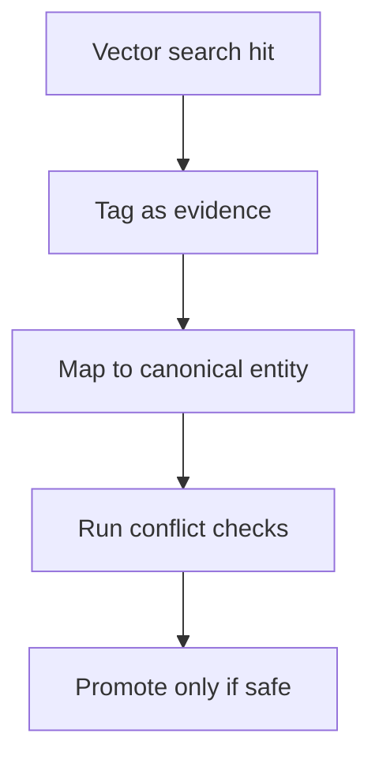

## Option 5: Capability Manifest Endpoint
ELI5: System should openly say what it is good at, partial at, or weak at.

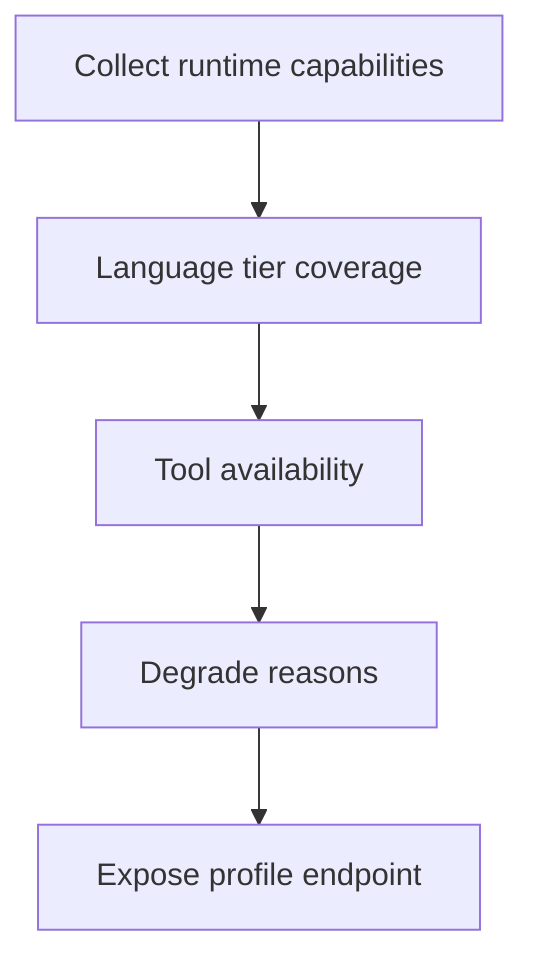

## Option 6: MCP Setup Command
ELI5: One command should connect Parseltongue to MCP clients safely.

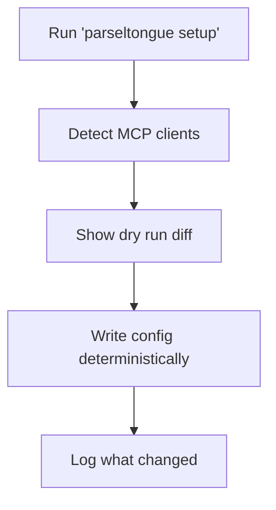

## Path Choices (ELI5)
Pick a path based on what matters right now.

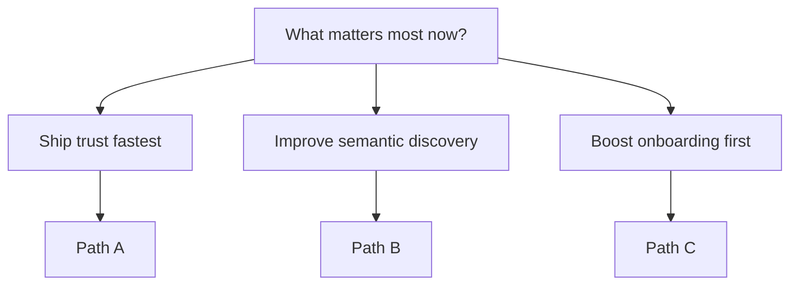

## Path A (Trust and Operator Moat)

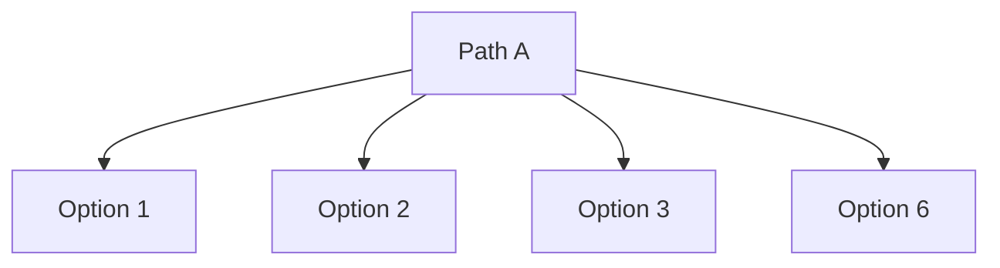

## Path B (Semantic Discovery Expansion)

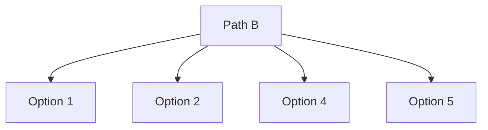

## Path C (Platform Handshake First)

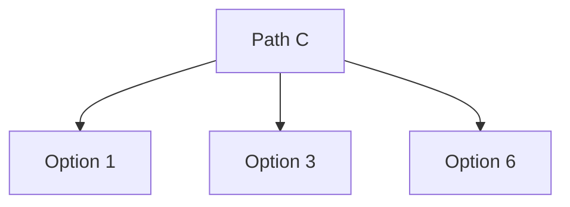

## Guardrails (Do Not Copy Blindly)

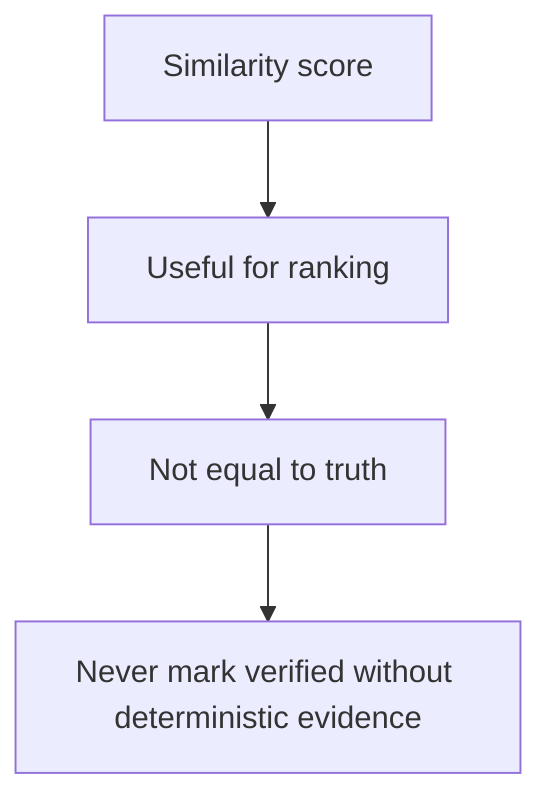
