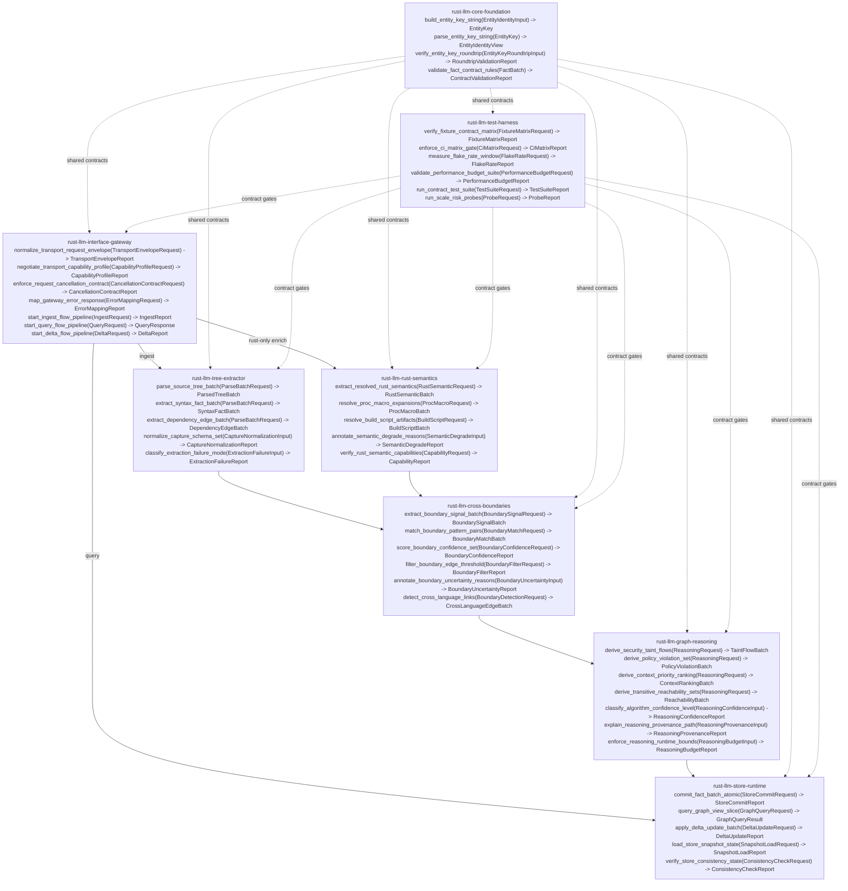

# ES-V200-Hashing-Risks-v01
Status: Draft v01
Purpose: Make V200 clean-room crate risks measurable by documenting public interfaces, dependency edges, and a repeatable rubber-debug loop that reduces Risk/Unclear scores with evidence.
Method reference: `docs/ES-V200-Dependency-Graph-Contract-Hardening.md`

## Scope
- Clean-room V200 only (no reuse from `pt*` crates).
- 8-crate architecture:
  - `rust-llm-interface-gateway`
  - `rust-llm-core-foundation`
  - `rust-llm-tree-extractor`
  - `rust-llm-rust-semantics`
  - `rust-llm-cross-boundaries`
  - `rust-llm-graph-reasoning`
  - `rust-llm-store-runtime`
  - `rust-llm-test-harness`

## V200 Non-Negotiable Hardening Gates (90+)
```text
+----+--------------------------------------+---------------------------------------------------------------------+----------------+
| ID | Gate                                 | Exact meaning                                                       | Pass link      |
+----+--------------------------------------+---------------------------------------------------------------------+----------------+
| G1 | Slim types gate                      | Entity/storage schema stays canonical, minimal, and deterministic   | CF-P1-F        |
| G2 | Single getter contract gate          | All read paths go through one storage getter contract               | SR-P2-F        |
| G3 | Filesystem source-read contract gate | Detail view returns current disk lines with explicit error contract | GW-P7-F        |
| G4 | Path normalization coverage gate     | Coverage treats ./path, path, and absolute path as one file        | TH-P8-F        |
+----+--------------------------------------+---------------------------------------------------------------------+----------------+
```
- Gate status controls score movement for linked crates in this ledger.

## V200 High-Priority Hardening Queue (80-89, crate-wise)
```text
+---------------------------+------------------------------+-----------------------------------------------------------------------+----------------------------------------------+
| Crate                     | PRD v173 item(s)             | Exact meaning                                                          | Contract/probe linkage                        |
+---------------------------+------------------------------+-----------------------------------------------------------------------+----------------------------------------------+
| rust-llm-test-harness     | #19, #20                     | Coverage distinguishes test-excluded and zero-entity files            | TH-P8 (coverage contract and fixture checks) |
| rust-llm-tree-extractor   | #26, #23                     | File discovery respects .gitignore and ingest path removes debug noise| TE-P4 (extraction integrity + clean artifacts)|
| rust-llm-interface-gateway| #6, #24                      | Endpoint mode guards are fail-fast and runtime watcher logs stay signal-only | GW-P7 (mode contract + runtime hygiene) |
| rust-llm-store-runtime    | #3                           | Export/import roundtrip remains deterministic and lossless            | SR-P2 (snapshot/consistency and replay checks)|
+---------------------------+------------------------------+-----------------------------------------------------------------------+----------------------------------------------+
```
- Crates with no 80-89 queue items in this cycle: `rust-llm-core-foundation`, `rust-llm-rust-semantics`, `rust-llm-cross-boundaries`, `rust-llm-graph-reasoning`.
- Execution rule: run this queue crate-wise after G1..G4 gate probes, without changing crate topology.

## V200 Promoted Requirement Bundle (requested, pre-PRD)
```text
+----+--------------------------------------+------------------------------+-------------------------+-----------------------------------------------+
| ID | Requested idea                       | Crate owner                  | Pass/probe linkage      | Requirement intent                             |
+----+--------------------------------------+------------------------------+-------------------------+-----------------------------------------------+
| R1 | #7 Route prefix nesting              | rust-llm-interface-gateway   | Pass 07 / GW-P7-G       | Stable namespaced routing by active mode       |
| R2 | #8 Auto port + port file             | rust-llm-interface-gateway   | Pass 07 / GW-P7-H       | Deterministic startup/discovery lifecycle      |
| R3 | #10 shutdown CLI command             | rust-llm-interface-gateway   | Pass 07 / GW-P7-I       | Graceful stop contract from CLI to server      |
| R4 | #25 XML-tagged responses             | rust-llm-interface-gateway   | Pass 07 / GW-P7-J       | Semantic response grouping for LLM consumption |
| R5 | #27 Project slug in URL              | rust-llm-interface-gateway   | Pass 07 / GW-P7-K       | Self-describing multi-project endpoint identity|
| R6 | #28 Slug in port file                | rust-llm-interface-gateway   | Pass 07 / GW-P7-L       | Slug-aware server discovery path               |
| R7 | #29 Token count at ingest            | rust-llm-store-runtime       | Pass 02 / SR-P2-G       | Persist real token_count for deterministic use |
| R8 | #35 Data-flow tree-sitter queries    | rust-llm-tree-extractor      | Pass 04 / TE-P4-F       | Extract assign/param/return flow edges         |
+----+--------------------------------------+------------------------------+-------------------------+-----------------------------------------------+
```
- Companion app boundary: Tauri remains an external consumer of these contracts; no new core crate is introduced by this bundle.

## Control-Flow Start and Primary Divergence
- Control flow begins in `rust-llm-interface-gateway/src/main.rs`.
- First divergence from existing parseltongue is immediate at dispatch:
  - New flow routes only into `rust-llm-*` crates.
  - No dependency on `pt01`, `pt08`, or other `pt*` crates.

## Mermaid: Public Interface Dependency Graph (v01)


## Public Interface Snapshot (ELI5)
```text
+----+------------------------------+--------------------------------------------+-------------------------------+--------------------------------------+
| #  | Crate                        | Main public interface                      | Input                         | Output                               |
+----+------------------------------+--------------------------------------------+-------------------------------+--------------------------------------+
| 0  | rust-llm-interface-gateway   | normalize/capability/cancel + ingest/query | CLI/HTTP/MCP request DTOs     | Canonical reports + mapped responses |
| 1  | rust-llm-core-foundation     | build/parse/verify keys + contract checks  | Identity/fact batches         | Stable keys + validation reports     |
| 2  | rust-llm-tree-extractor      | parse/query/normalize extraction contracts | File set + language parsers   | Syntax facts + dependency edges      |
| 3  | rust-llm-rust-semantics      | semantics + proc/build + degrade metadata  | Cargo workspace + RA config   | Resolved facts + degrade annotations |
| 4  | rust-llm-cross-boundaries    | extract/match/score boundary links         | Syntax+semantic fact batches  | Boundary edges + confidence scores   |
| 5  | rust-llm-graph-reasoning     | derive/score/explain reasoning outputs     | Facts + edges + constraints   | Derived findings and priorities      |
| 6  | rust-llm-store-runtime       | commit/query/delta/snapshot/consistency    | Fact+edge batches / queries   | Persisted graph + bounded result set |
| 7  | rust-llm-test-harness        | fixture/ci/flake/perf contract gates       | Suite/probe definitions       | Pass/fail + risk probe artifacts     |
+----+------------------------------+--------------------------------------------+-------------------------------+--------------------------------------+
```

## Baseline Risk/Unclear Matrix (v01)
```text
+----+------------------------------+-----------+-------------+----------------------------------------------------------+
| #  | Crate                        | Risk / 5  | Unclear / 5 | Why baseline is not low                                  |
+----+------------------------------+-----------+-------------+----------------------------------------------------------+
| 0  | rust-llm-interface-gateway   | 3         | 2           | Unified behavior across CLI/HTTP/MCP + cancellation      |
| 1  | rust-llm-core-foundation     | 4         | 4           | Key model and contract stability affect all crates       |
| 2  | rust-llm-tree-extractor      | 4         | 3           | 12-language query correctness and normalization gaps      |
| 3  | rust-llm-rust-semantics      | 5         | 4           | RA/proc-macro/build-script reliability and churn         |
| 4  | rust-llm-cross-boundaries    | 4         | 4           | Heuristic linking quality and confidence calibration      |
| 5  | rust-llm-graph-reasoning     | 4         | 3           | Rule correctness/scale tradeoffs in V200 scope           |
| 6  | rust-llm-store-runtime       | 5         | 4           | Delta consistency, indexing, snapshot durability         |
| 7  | rust-llm-test-harness        | 3         | 3           | Fixture breadth vs CI time and anti-flakiness design     |
+----+------------------------------+-----------+-------------+----------------------------------------------------------+
```

## Rubber-Debug Loop (Step-by-Step, Repeated per Crate)
1. Freeze one interface contract.
2. List top-3 failure modes for that contract.
3. Build smallest executable probe that can falsify assumptions.
4. Record observed behavior and artifacts.
5. Update Risk/Unclear with evidence (not intuition).
6. Promote interface from `provisional` to `stable` only after passing probes.

## Per-Crate Information Collection Checklist (v01)
```text
+---------------------------+--------------------------------------------------+---------------------------------------------------------+
| Crate                     | Evidence to collect                               | Probe/output artifact                                   |
+---------------------------+--------------------------------------------------+---------------------------------------------------------+
| interface-gateway         | mode parity + route/port/slug/response-shape contracts | request-lifecycle trace + namespace/port/shutdown + XML-shape fixtures |
| core-foundation           | slim schema invariants + key disambiguation       | schema determinism digest + key collision corpus        |
| tree-extractor            | capture completeness + data-flow edge extraction  | fixture-to-capture + assign/param/return edge diff report |
| rust-semantics            | proc-macro/build-script success/degrade behavior  | RA workspace matrix with pass/fallback classifications  |
| cross-boundaries          | precision/recall on known boundary fixtures       | boundary edge confusion matrix                          |
| graph-reasoning           | rule correctness + runtime at scale               | golden-rule output + p50/p95 runtime report             |
| store-runtime             | single-getter + delta durability + token_count persistence | read-path parity + recovery checks + token_count parity digest |
| test-harness              | path normalization + flake/wall-clock budgets     | canonical path fixture report + CI stability trend      |
+---------------------------+--------------------------------------------------+---------------------------------------------------------+
```

## Gate Evidence Backlog (pending capture; not counted in current E totals)
- E56: G1 slim-types artifact set (canonical schema snapshot + deterministic serialization digest).
- E57: G2 single-getter artifact set (handler-to-getter call-path map + result/error parity report).
- E58: G3 source-read artifact set (detail-view fixtures for valid/missing/moved files + line-range outcomes).
- E59: G4 path-normalization artifact set (`./x` vs `x` vs absolute fixture parity in coverage outputs).

## Promoted Requirement Evidence Backlog (pending capture; not counted in current E totals)
- E60: R1 route-prefix artifact set (mode namespace fixtures + wrong-prefix error contract).
- E61: R2 auto-port artifact set (startup assignment + discovery file lifecycle traces).
- E62: R3 shutdown-cli artifact set (CLI-to-endpoint shutdown handshake and cleanup report).
- E63: R4 XML-tagged response artifact set (grouped-schema fixtures across list/detail/query responses).
- E64: R5 project-slug URL artifact set (slug derivation and route mounting parity fixtures).
- E65: R6 slug port-file artifact set (slug-aware discovery filename and lookup parity).
- E66: R7 token-count ingest artifact set (`token_count` persistence and replay parity digest).
- E67: R8 data-flow extraction artifact set (assign/param/return edge fixture truth set).

## Risk Hashing Snapshot Format (for each iteration)
Use a compact hash to track movement across iterations:
- Format: `crate:R{risk}-U{unclear}-E{evidence_count}`
- Example: `rust-llm-rust-semantics:R5-U4-E2`
- Iteration digest = sorted concatenation of all crate hashes.

This gives a quick “did uncertainty actually go down?” signal across v01, v02, v03.
## Hard Scoring Policy for Gate-Linked Crates
- Do not reduce Risk/Unclear for gate-linked crates until the linked F-probe passes with artifact references.
- Gate to probe mapping:
  - G1 -> CF-P1-F
  - G2 -> SR-P2-F
  - G3 -> GW-P7-F
  - G4 -> TH-P8-F
## Pass Ledger
### Pass 01: `rust-llm-core-foundation` (Dependency Graph Contract Hardening)
Status: Contract freeze + hazard mapping complete. Probe execution pending.

#### 1) Contract freeze (v01)
```text
+------------------------------------------------------+-------------------------+-----------------------------------------------+
| Public interface                                     | Input                   | Output                                        |
+------------------------------------------------------+-------------------------+-----------------------------------------------+
| build_entity_key_string                              | EntityIdentityInput     | EntityKey                                     |
| parse_entity_key_string                              | EntityKey               | EntityIdentityView                            |
| verify_entity_key_roundtrip                          | EntityKeyRoundtripInput | RoundtripValidationReport                     |
| validate_fact_contract_rules                         | FactBatch               | ContractValidationReport                      |
+------------------------------------------------------+-------------------------+-----------------------------------------------+
```

#### 2) Rubber-duck dependency walk (core-foundation blast radius)
```text
- Upstream callers: gateway, tree-extractor, rust-semantics, cross-boundaries, graph-reasoning, store-runtime, test-harness.
- Shared assumption across all callers: key is deterministic, parseable, overload-safe, and language-safe.
- If key contract breaks:
  - store-runtime index joins fail or silently merge distinct entities
  - cross-boundaries can create false link unions
  - graph-reasoning results become non-reproducible across runs
  - downstream read-path consumers receive ambiguous entity identities
```

#### 3) Top failure modes found
```text
+----+-----------------------------------------------+--------------------------------------------------------------+----------------------+
| FM | Failure mode                                   | Why it matters                                                | Evidence status      |
+----+-----------------------------------------------+--------------------------------------------------------------+----------------------+
| 01 | Overload collision (same file + same name)     | Distinct overloaded funcs can collapse to one identity       | Confirmed legacy     |
| 02 | Delimiter/generic ambiguity                     | Coercive sanitization needed when format is not syntax-safe  | Confirmed legacy     |
| 03 | Path-derived semantic collapse                  | Logical namespace info is lost when key relies on file stem  | Confirmed design gap |
| 04 | Non-roundtrippable key components               | parse(build(x)) mismatch breaks dependency contract checks    | Unproven in v200     |
| 05 | External entity identity uncertainty            | crate/std/third-party entities may lack stable local anchors | Unproven in v200     |
+----+-----------------------------------------------+--------------------------------------------------------------+----------------------+
```

#### 4) Evidence captured this pass
```text
E01: Legacy key timestamp hash currently uses only file_path + entity_name as hash inputs,
     which is insufficient to distinguish overload signatures.
     Source: crates/parseltongue-core/src/isgl1_v2.rs (compute_birth_timestamp).

E02: Legacy key path had to add sanitize_entity_name_for_isgl1 for generic/delimiter safety,
     indicating format-level delimiter pressure rather than semantic clarity.
     Sources:
       - crates/parseltongue-core/src/isgl1_v2.rs (sanitize_entity_name_for_isgl1)
       - crates/pt01-folder-to-cozodb-streamer/src/isgl1_generator.rs (format_key)

E54: Earlier key implementation explicitly encoded line ranges in key identity
     (`{}:{}:{}:{}:{}-{}` with `entity.line_range.0` and `entity.line_range.1`),
     proving prior LOC-coupled key behavior existed in production lineage.
     Sources:
       - commit 626caa40b, file: crates/pt01-folder-to-cozodb-streamer/src/isgl1_generator.rs
       - commit 8b1ac707a, file: crates/pt01-folder-to-cozodb-streamer/src/isgl1_generator.rs

E55: ISGL1 v2 migration commit replaced line-range keys with semantic_path + birth timestamp
     (`{}:{}:{}:{}:T{}`), confirming concrete historical de-risking path for line-shift churn.
     Source:
       - commit 755678ad8, file: crates/pt01-folder-to-cozodb-streamer/src/isgl1_generator.rs
```

#### 5) Probe set for next pass execution (core-foundation)
```text
+---------+----------------------------------------------+--------------------------------------------------------------+
| Probe   | Intent                                        | Pass criterion                                               |
+---------+----------------------------------------------+--------------------------------------------------------------+
| CF-P1-A | Overload collision corpus probe               | 0 collisions for overload set across Java/C++/C#/TS fixtures |
| CF-P1-B | Minor-edit stability mutation probe           | Keys unchanged for whitespace/comment-only edits             |
| CF-P1-C | Build/parse roundtrip probe                   | parse(build(identity)) == canonical identity view            |
| CF-P1-D | Delimiter-safety cross-language probe         | No escaping/sanitization needed for valid language symbols   |
| CF-P1-E | External entity identity probe                | Stable keys for std/crate/third-party references             |
| CF-P1-F | Slim types gate probe                         | Canonical entity/storage schema remains minimal and deterministic |
+---------+----------------------------------------------+--------------------------------------------------------------+
```

#### 6) Score update for this pass
```text
- rust-llm-core-foundation remains Risk=4, Unclear=2.
- Rationale: historical implementation evidence de-risks key-model ambiguity (line-range -> timestamp migration proven), but blast radius and overload-collision risk remain high without probe outcomes.
```
### Pass 02: `rust-llm-store-runtime` (Dependency Graph Contract Hardening)
Status: Contract freeze + hazard mapping complete. Probe execution pending.

#### 1) Contract freeze (v01)
```text
+------------------------------------------------------+---------------------------+-----------------------------------------------+
| Public interface                                     | Input                     | Output                                        |
+------------------------------------------------------+---------------------------+-----------------------------------------------+
| commit_fact_batch_atomic                             | StoreCommitRequest        | StoreCommitReport                             |
| query_graph_view_slice                               | GraphQueryRequest         | GraphQueryResult                              |
| apply_delta_update_batch                             | DeltaUpdateRequest        | DeltaUpdateReport                             |
| load_store_snapshot_state                            | SnapshotLoadRequest       | SnapshotLoadReport                            |
| verify_store_consistency_state                       | ConsistencyCheckRequest   | ConsistencyCheckReport                        |
+------------------------------------------------------+---------------------------+-----------------------------------------------+
```

#### 2) Rubber-duck dependency walk (store-runtime blast radius)
```text
- Upstream callers: interface-gateway (ingest/query paths), graph-reasoning (derived fact commits), and watcher-driven delta paths.
- Shared assumption across callers: writes are atomic, reads are bounded, deltas are idempotent, and snapshot loads are contract-safe.
- If store contract breaks:
  - partial writes create entity/edge mismatch and corrupt downstream reasoning
  - unbounded query paths trigger memory spikes/OOM under scale
  - non-idempotent delta replays duplicate or orphan records
  - snapshot/schema drift produces silent data corruption
```

#### 3) Top failure modes found
```text
+----+--------------------------------------------------+--------------------------------------------------------------+----------------------+
| FM | Failure mode                                      | Why it matters                                                | Evidence status      |
+----+--------------------------------------------------+--------------------------------------------------------------+----------------------+
| 01 | Unbounded query path loads full graph             | Large-scale queries become OOM-prone                          | Confirmed legacy     |
| 02 | Non-atomic commit splits entities and edges       | Partial state leads to invalid joins and wrong analytics      | Unproven in v200     |
| 03 | Non-idempotent delta replay                       | Replayed updates can create duplicates/ghost nodes            | Unproven in v200     |
| 04 | Snapshot compatibility drift                      | Snapshot restore can silently violate runtime contract         | Confirmed design gap |
| 05 | Parse-failure delete path data loss               | Transient parse failures may delete valid historical entities | Confirmed legacy     |
+----+--------------------------------------------------+--------------------------------------------------------------+----------------------+
```

#### 4) Evidence captured this pass
```text
E03: At 1.6M edges, mem-first storage has ~3.2 GB base RAM cost before heavy queries,
     and full-scan paths add significant additional allocations.
     Source: docs/pre175/DECISION-v173-pt02-pt03-endpoint-selection.md

E04: For mem-first endpoint behavior at large scale, only 7/24 endpoints are safe on 8GB,
     while disk-backed strategy remains broadly viable.
     Source: docs/pre175/DECISION-v173-pt02-pt03-endpoint-selection.md

E05: Incremental reindex legacy logic includes a parse-failure path that deletes old
     entities and edges for the file, which is risky for transient parser instability.
     Source: crates/pt08-http-code-query-server/src/incremental_reindex_core_logic.rs

E06: Snapshot load path restores data into mem via full deserialize + bulk insert flow,
     with no explicit compatibility/consistency handshake in the load contract.
     Source: crates/pt08-http-code-query-server/src/snapshot_loader_module.rs
```

#### 5) Probe set for next pass execution (store-runtime)
```text
+---------+-----------------------------------------------------+---------------------------------------------------------------+
| Probe   | Intent                                               | Pass criterion                                                |
+---------+-----------------------------------------------------+---------------------------------------------------------------+
| SR-P2-A | Bounded query guard probe                            | Heavy queries are rejected/segmented before unsafe allocation |
| SR-P2-B | Atomic commit rollback probe                         | Mid-commit failure yields zero partial writes                 |
| SR-P2-C | Idempotent delta replay probe                        | Replay(delta) twice => identical final state hash             |
| SR-P2-D | Snapshot compatibility probe                         | Version mismatch yields explicit fail or migration path        |
| SR-P2-E | Transient parse-failure quarantine probe             | Single transient parse fail cannot hard-delete stable records  |
| SR-P2-F | Single getter contract gate probe                    | All read-path callers resolve through one getter contract with result/error parity |
| SR-P2-G | Token-count ingest contract probe                    | Ingest persists deterministic `token_count` per entity and replay preserves totals |
+---------+-----------------------------------------------------+---------------------------------------------------------------+
```

#### 6) Score update for this pass
```text
- rust-llm-store-runtime remains Risk=5, Unclear=4.
- Rationale: evidence increased (E=4), but no probe execution outcomes yet.
```
### Pass 03: `rust-llm-rust-semantics` (Dependency Graph Contract Hardening)
Status: Contract freeze + hazard mapping complete. Probe execution pending.

#### 1) Contract freeze (v01)
```text
+------------------------------------------------------+---------------------------+-----------------------------------------------+
| Public interface                                     | Input                     | Output                                        |
+------------------------------------------------------+---------------------------+-----------------------------------------------+
| extract_resolved_rust_semantics                      | RustSemanticRequest       | RustSemanticBatch                             |
| resolve_proc_macro_expansions                        | ProcMacroRequest          | ProcMacroBatch                                |
| resolve_build_script_artifacts                       | BuildScriptRequest        | BuildScriptBatch                              |
| annotate_semantic_degrade_reasons                    | SemanticDegradeInput      | SemanticDegradeReport                         |
| verify_rust_semantic_capabilities                    | CapabilityRequest         | CapabilityReport                              |
+------------------------------------------------------+---------------------------+-----------------------------------------------+
```

#### 2) Rubber-duck dependency walk (rust-semantics blast radius)
```text
- Upstream callers: interface-gateway ingest path and graph-reasoning enrichment path.
- Downstream dependents: cross-boundaries and graph-reasoning expect semantic accuracy labels.
- Shared assumption across callers: semantic facts are either resolved or explicitly marked degraded.
- If contract breaks:
  - trait/type edges can be wrong while still looking "valid"
  - proc-macro/build-script failures can silently downgrade analysis quality
  - runtime memory/time spikes can stall ingest and block downstream crates
```

#### 3) Top failure modes found
```text
+----+--------------------------------------------------+--------------------------------------------------------------+----------------------+
| FM | Failure mode                                      | Why it matters                                                | Evidence status      |
+----+--------------------------------------------------+--------------------------------------------------------------+----------------------+
| 01 | ra_ap API churn / version skew                    | Minor version drift can break compile/contracts               | Confirmed legacy     |
| 02 | Proc-macro expansion instability                  | Crashed/absent macros can hide trait impls and type facts     | Confirmed legacy     |
| 03 | Build-script variability                          | Environment/target variance can shift semantic outputs         | Confirmed design gap |
| 04 | Silent degrade without metadata                   | Downstream crates can treat unknowns as authoritative facts    | Unproven in v200     |
| 05 | Resource envelope overrun                         | Large workspaces can exceed practical memory/time budgets      | Confirmed legacy     |
+----+--------------------------------------------------+--------------------------------------------------------------+----------------------+
```

#### 4) Evidence captured this pass
```text
E07: rust-analyzer integration requires exact version pinning across all ra_ap crates;
     internal API mismatch is a known breakage vector.
     Source: docs/Prep-V200-Rust-Analyzer-API-Surface.md

E08: Proc-macro expansion has known failure paths and can fall back to unknown output;
     this can cascade into missing impl/type visibility if not surfaced explicitly.
     Source: docs/Prep-V200-Rust-Analyzer-API-Surface.md

E09: Build cost for RA path is materially higher (feature-gated) and intended to be optional;
     indicates mandatory capability negotiation at runtime.
     Source: docs/Prep-V200-Rust-Analyzer-API-Surface.md

E10: RA memory/time envelopes are non-trivial for large workspaces (2-4 GB, 10-60s range),
     requiring bounded execution policy and degrade handling.
     Source: docs/Prep-V200-Rust-Analyzer-API-Surface.md

E11: RA adds semantic classes impossible in tree-sitter alone (resolved types, trait impl
     closure, macro-expanded impls), so fallbacks must be explicit to preserve trust.
     Sources:
       - docs/Prep-V200-Rust-Analyzer-API-Surface.md
       - docs/Prep-V200-Compiled-Research-Best-Ideas.md
```

#### 5) Probe set for next pass execution (rust-semantics)
```text
+---------+-----------------------------------------------------+---------------------------------------------------------------+
| Probe   | Intent                                               | Pass criterion                                                |
+---------+-----------------------------------------------------+---------------------------------------------------------------+
| RS-P3-A | Version-pinning canary probe                         | Any ra_ap skew fails fast with explicit diagnostic             |
| RS-P3-B | Proc-macro chaos probe                               | Crash/unavailable macro yields degrade annotation, not silence |
| RS-P3-C | Build-script variance probe                          | Output delta is deterministic or flagged as non-deterministic  |
| RS-P3-D | Semantic degrade integrity probe                     | Unknown/degraded facts are tagged and excluded from strict joins|
| RS-P3-E | Resource envelope probe                              | Ingest obeys configured memory/time ceiling with graceful exit  |
+---------+-----------------------------------------------------+---------------------------------------------------------------+
```

#### 6) Score update for this pass
```text
- rust-llm-rust-semantics remains Risk=5, Unclear=4.
- Rationale: evidence increased (E=5), but probe execution outcomes are pending.
```

### Pass 04: `rust-llm-tree-extractor` (Dependency Graph Contract Hardening + Design101 TDD Lens)
Status: Contract freeze + hazard mapping complete. Probe execution pending.

#### 1) Contract freeze (v01)
```text
+------------------------------------------------------+-----------------------------+-----------------------------------------------+
| Public interface                                     | Input                       | Output                                        |
+------------------------------------------------------+-----------------------------+-----------------------------------------------+
| parse_source_tree_batch                              | ParseBatchRequest           | ParsedTreeBatch                               |
| extract_syntax_fact_batch                            | ParseBatchRequest           | SyntaxFactBatch                               |
| extract_dependency_edge_batch                        | ParseBatchRequest           | DependencyEdgeBatch                           |
| normalize_capture_schema_set                         | CaptureNormalizationInput   | CaptureNormalizationReport                    |
| classify_extraction_failure_mode                     | ExtractionFailureInput      | ExtractionFailureReport                       |
+------------------------------------------------------+-----------------------------+-----------------------------------------------+
```

#### 2) Executable contract clauses (Design101)
```text
Preconditions:
- Parser and query assets exist for every language in ParseBatchRequest.
- Capture schema includes required names (@name + @definition.* / @reference.*).
- Source byte ranges map deterministically to file path and language identity.

Postconditions:
- Every emitted entity/edge contains deterministic file_path + line_range metadata.
- Unsupported/malformed input yields explicit extraction failure/degrade artifacts.
- Same input batch yields the same output hash across repeated runs.

Error conditions:
- Missing parser or query compile error => file-level hard failure artifact.
- Syntax error recovery with partial tree => emit partial facts + failure annotation.
- Capture schema mismatch => reject affected facts and emit contract violation counts.
```

#### 3) Rubber-duck dependency walk (tree-extractor blast radius)
```text
- Upstream callers: interface-gateway ingest path and test-harness fixture suites.
- Downstream dependents: rust-semantics enrichment, cross-boundaries linking, store-runtime persistence, graph-reasoning analytics.
- Shared assumption across callers: extraction is complete enough, deterministic, and explicit about degradation.
- If extractor contract breaks:
  - store-runtime persists structurally incomplete graphs with silent holes
  - rust-semantics and cross-boundaries operate on missing entities/edges
  - graph-reasoning conclusions become skewed by extraction blind spots
  - downstream reader quality drops due to incomplete graph neighborhoods
```

#### 4) Top failure modes found
```text
+----+--------------------------------------------------+---------------------------------------------------------------+----------------------+
| FM | Failure mode                                      | Why it matters                                                 | Evidence status      |
+----+--------------------------------------------------+---------------------------------------------------------------+----------------------+
| 01 | Query blind spots for dominant repo patterns      | Const-object exports / decorated defs can collapse coverage    | Confirmed legacy     |
| 02 | Shebang/normalization parse mismatch              | Valid repos can report near-zero entities if pre-parse fails   | Confirmed legacy     |
| 03 | Capture schema drift across 12 grammars           | Grammar updates can silently break @name/@definition mapping   | Confirmed design gap |
| 04 | Silent partial extraction on syntax recovery      | Missing degrade markers create false confidence downstream      | Unproven in v200     |
| 05 | Full-tree re-extraction under file churn          | No range-bounded extraction increases latency/risk at scale    | Confirmed design gap |
+----+--------------------------------------------------+---------------------------------------------------------------+----------------------+
```

#### 5) Evidence captured this pass
```text
E12: TypeScript entity query currently captures function/class/interface/type alias/enum and
     direct variable->arrow forms, but does not capture dominant const-object export patterns.
     Source: entity_queries/typescript.scm

E13: Python entity query currently matches class_definition and function_definition directly,
     but does not match decorated_definition wrappers used by @mcp.tool()-style handlers.
     Source: entity_queries/python.scm

E14: Low-coverage CR analysis attributes failures primarily to narrow .scm extraction patterns
     (const object exports, decorated functions, handler callbacks) rather than parser failure.
     Source: docs/CR-v173-01.md

E15: Current query extractor path performs full parse + full-tree query match
     (parser.parse(source, None) + cursor.matches(root_node,...)) with no changed-range limiting.
     Source: crates/parseltongue-core/src/query_extractor.rs

E16: Tree-sitter prep research recommends changed_ranges + set_byte_range incremental querying,
     and documents that v1.x captures only a subset of available structural metadata.
     Source: docs/Prep-V200-Tree-Sitter-Query-Patterns.md
```

#### 6) Probe set for next pass execution (tree-extractor)
```text
+---------+-----------------------------------------------------+---------------------------------------------------------------+
| Probe   | Intent                                               | Pass criterion                                                |
+---------+-----------------------------------------------------+---------------------------------------------------------------+
| TE-P4-A | Blind-spot fixture probe                             | Captures const-object exports + decorated defs in golden set  |
| TE-P4-B | Capture-schema contract probe                        | 100% of emitted facts include required capture schema fields  |
| TE-P4-C | Degrade-visibility probe                             | Partial parse paths always emit explicit failure/degrade tags  |
| TE-P4-D | Determinism replay probe                             | Two identical runs produce identical extraction digest         |
| TE-P4-E | Incremental-range probe                              | Range-bounded run equals full run on changed spans only       |
| TE-P4-F | Data-flow extraction contract probe                  | assign/param/return edges are extracted with fixture-backed parity |
+---------+-----------------------------------------------------+---------------------------------------------------------------+
```

#### 7) STUB -> RED -> GREEN -> REFACTOR execution plan (Design101)
```text
STUB:
- Add multi-language fixtures for const-object export, decorated_definition, shebang, CRLF, and malformed snippets.

RED:
- Assert TE-P4-A..F on current extractor; expect failures for blind-spot and range-bounded contracts.

GREEN:
- Extend query patterns/capture normalization until TE-P4-A..E pass with deterministic outputs.

REFACTOR:
- Deduplicate query/capture processing paths and re-run determinism + performance guard tests.
```

#### 8) Score update for this pass
```text
- rust-llm-tree-extractor remains Risk=4, Unclear=3.
- Rationale: evidence increased (E=5), but probe execution outcomes are pending.
```

### Pass 05: `rust-llm-cross-boundaries` (Dependency Graph Contract Hardening + Design101 TDD Lens)
Status: Contract freeze + hazard mapping complete. Probe execution pending.

#### 1) Contract freeze (v01)
```text
+------------------------------------------------------+---------------------------+-----------------------------------------------+
| Public interface                                     | Input                     | Output                                        |
+------------------------------------------------------+---------------------------+-----------------------------------------------+
| extract_boundary_signal_batch                        | BoundarySignalRequest     | BoundarySignalBatch                           |
| match_boundary_pattern_pairs                         | BoundaryMatchRequest      | BoundaryMatchBatch                            |
| score_boundary_confidence_set                        | BoundaryConfidenceRequest | BoundaryConfidenceReport                      |
| filter_boundary_edge_threshold                       | BoundaryFilterRequest     | BoundaryFilterReport                          |
| annotate_boundary_uncertainty_reasons               | BoundaryUncertaintyInput  | BoundaryUncertaintyReport                     |
| detect_cross_language_links                          | BoundaryDetectionRequest  | CrossLanguageEdgeBatch                        |
+------------------------------------------------------+---------------------------+-----------------------------------------------+
```

#### 2) Executable contract clauses (Design101)
```text
Preconditions:
- Syntax and semantic fact batches expose normalized entity/file/language identity.
- Pattern detector registry is loaded for compile-time and runtime boundary classes.
- Confidence policy (base/bonus/penalty + thresholds) is configured before matching.

Postconditions:
- Every emitted edge includes pattern, confidence, source/target roles, and supporting signals.
- Edges below threshold are excluded from default graph while counted in uncertainty reports.
- Re-running same input batch yields identical deduplicated boundary edge digest.

Error conditions:
- Missing detector capability for a language/pattern emits explicit capability-gap diagnostics.
- Conflicting signals for same source/target pair emit uncertain classification, not silent promotion.
- Config-indirect or runtime-constructed identifiers emit unresolved markers, not hard edges.
```

#### 3) Rubber-duck dependency walk (cross-boundaries blast radius)
```text
- Upstream callers: tree-extractor (signals) and rust-semantics (Rust-side enrichments).
- Downstream dependents: graph-reasoning and store-runtime.
- Shared assumption across callers: cross-language edges are calibrated, explainable, and uncertainty-tagged.
- If cross-boundary contract breaks:
  - graph-reasoning propagates false positives across language boundaries
  - store-runtime persists noisy or missing boundary edges that skew analytics
  - risk scoring appears improved while trustworthiness of derived links degrades
```

#### 4) Top failure modes found
```text
+----+--------------------------------------------------+----------------------------------------------------------------+----------------------+
| FM | Failure mode                                      | Why it matters                                                  | Evidence status      |
+----+--------------------------------------------------+----------------------------------------------------------------+----------------------+
| 01 | Runtime string ambiguity (HTTP/MQ)                | URL/topic matching can over-link unrelated services            | Confirmed legacy     |
| 02 | Compile-time marker drift                          | Rust attribute syntax/version drift can hide real boundaries   | Confirmed design gap |
| 03 | Confidence calibration drift                       | Wrong thresholds either flood graph or drop critical edges     | Confirmed design gap |
| 04 | External API / cross-repo contamination            | Outbound/external strings can be misclassified as local edges  | Confirmed design gap |
| 05 | Multi-pattern dedupe instability                   | Same pair detected by many patterns can become non-deterministic| Unproven in v200     |
+----+--------------------------------------------------+----------------------------------------------------------------+----------------------+
```

#### 5) Evidence captured this pass
```text
E17: Confidence model defines base pattern scores plus bonus/penalty adjustments and tiered
     thresholds (>=0.80 high confidence, <0.40 reject).
     Source: docs/Prep-V200-Cross-Language-Detection-Heuristics.md

E18: Estimated false-positive rates are materially higher for runtime patterns
     (HTTP 10-20%, MQ 15-25%) than compile-time patterns (FFI/WASM/PyO3 tiers).
     Source: docs/Prep-V200-Cross-Language-Detection-Heuristics.md

E19: Rust 2024 `#[unsafe(no_mangle)]` requires dual query handling with classic
     `#[no_mangle]`, otherwise FFI boundary detection will miss valid exports.
     Source: docs/Prep-V200-Cross-Language-Detection-Heuristics.md

E20: Proposed detection pipeline explicitly filters edges below threshold (default 0.40)
     and deduplicates multi-pattern hits by highest-confidence edge merge.
     Source: docs/Prep-V200-Cross-Language-Detection-Heuristics.md

E21: Current dependency extraction model emits only Calls/Uses/Implements edge classes with
     no boundary pattern typing or confidence field in the extraction contract.
     Source: crates/parseltongue-core/src/query_extractor.rs

E22: Cross-language detection depends on string-literal extraction/matching, and v1.x baseline
     leaves string-literal structural signals largely uncaptured for boundary linking.
     Sources:
       - docs/Prep-V200-Tree-Sitter-Query-Patterns.md
       - docs/Prep-Doc-V200.md
```

#### 6) Probe set for next pass execution (cross-boundaries)
```text
+---------+-----------------------------------------------------+----------------------------------------------------------------+
| Probe   | Intent                                               | Pass criterion                                                 |
+---------+-----------------------------------------------------+----------------------------------------------------------------+
| CB-P5-A | Compile-time boundary precision probe                | FFI/WASM/PyO3 fixture precision >= 0.90 with reproducible edge set |
| CB-P5-B | Runtime ambiguity containment probe                  | HTTP/MQ fixtures maintain bounded FP rate under threshold policy |
| CB-P5-C | Confidence calibration replay probe                  | Threshold flips are deterministic and fully explainable by signals |
| CB-P5-D | Multi-pattern dedupe stability probe                 | Same source/target pair resolves to stable final edge + reasons |
| CB-P5-E | External/config-indirect quarantine probe            | Non-literal/external matches are tagged unresolved, not promoted |
+---------+-----------------------------------------------------+----------------------------------------------------------------+
```

#### 7) STUB -> RED -> GREEN -> REFACTOR execution plan (Design101)
```text
STUB:
- Add fixtures for FFI/WASM/PyO3/JNI/Ruby, HTTP/gRPC routes, and MQ topic patterns with known truth labels.

RED:
- Run CB-P5-A..E against baseline matcher; expect failures in calibration and unresolved-string handling paths.

GREEN:
- Implement signal extraction, confidence calibration, and threshold filtering until probes pass with stable digests.

REFACTOR:
- Consolidate pattern detector interfaces and confidence composition to reduce drift across pattern modules.
```

#### 8) Score update for this pass
```text
- rust-llm-cross-boundaries remains Risk=4, Unclear=4.
- Rationale: evidence increased (E=6), but probe execution outcomes are pending.
```

### Pass 06: `rust-llm-graph-reasoning` (Dependency Graph Contract Hardening + Design101 TDD Lens)
Status: Contract freeze + hazard mapping complete. Probe execution pending.

#### 1) Contract freeze (v01)
```text
+------------------------------------------------------+----------------------------+-----------------------------------------------+
| Public interface                                     | Input                      | Output                                        |
+------------------------------------------------------+----------------------------+-----------------------------------------------+
| derive_security_taint_flows                          | ReasoningRequest           | TaintFlowBatch                                |
| derive_policy_violation_set                          | ReasoningRequest           | PolicyViolationBatch                          |
| derive_context_priority_ranking                      | ReasoningRequest           | ContextRankingBatch                           |
| derive_transitive_reachability_sets                  | ReasoningRequest           | ReachabilityBatch                             |
| classify_algorithm_confidence_level                  | ReasoningConfidenceInput   | ReasoningConfidenceReport                     |
| explain_reasoning_provenance_path                    | ReasoningProvenanceInput   | ReasoningProvenanceReport                     |
| enforce_reasoning_runtime_bounds                     | ReasoningBudgetInput       | ReasoningBudgetReport                         |
+------------------------------------------------------+----------------------------+-----------------------------------------------+
```

#### 2) Executable contract clauses (Design101)
```text
Preconditions:
- Input fact graph includes typed entities/edges plus cross-boundary signal confidence where relevant.
- Rule catalog and algorithm set are version-pinned before execution.
- Runtime budget, scope boundaries, and result-threshold policy are configured before rule evaluation.

Postconditions:
- Every derived finding includes rule/algorithm provenance and deterministic identity.
- Taint/policy/context outputs include confidence/severity metadata for downstream gating.
- Identical input facts produce identical derived-result digest across runs.

Error conditions:
- Rule registration/compile mismatch yields explicit hard-fail diagnostics (no silent fallback).
- Budget overrun yields partial-output markers with bounded execution report.
- Missing prerequisite relations emit capability-gap errors, not empty-success responses.
```

#### 3) Rubber-duck dependency walk (graph-reasoning blast radius)
```text
- Upstream callers: tree-extractor, rust-semantics, and cross-boundaries (all feed facts/edges/signals).
- Downstream dependents: store-runtime persistence and interface-gateway query surfaces.
- Shared assumption across callers: reasoning outputs are reproducible, explainable, and confidence-calibrated.
- If reasoning contract breaks:
  - store-runtime persists misleading findings that look authoritative
  - gateway/API users see non-deterministic or contradictory policy/taint results
  - architecture risk scoring can appear improved while inference quality regresses
```

#### 4) Top failure modes found
```text
+----+--------------------------------------------------+----------------------------------------------------------------+----------------------+
| FM | Failure mode                                      | Why it matters                                                  | Evidence status      |
+----+--------------------------------------------------+----------------------------------------------------------------+----------------------+
| 01 | Coarse edge semantics in base graph               | Calls/Uses/Implements-only modeling limits reasoning precision | Confirmed legacy     |
| 02 | Rule-strata/negation mis-modeling                 | Incorrect recursion/negation yields contradictory findings      | Confirmed design gap |
| 03 | Non-incremental recomputation under deltas        | Frequent updates can exceed runtime SLO without bounded fallback| Confirmed design gap |
| 04 | Missing provenance/explainability in findings     | Consumers cannot audit why policy/taint results were emitted   | Confirmed design gap |
| 05 | Algorithmic runtime blowups on large graphs       | Centrality/taint path computations can exceed interactive budget| Confirmed design gap |
+----+--------------------------------------------------+----------------------------------------------------------------+----------------------+
```

#### 5) Evidence captured this pass
```text
E23: Ascent rule prep defines rust-llm-04 reasoning scope with a catalog of recursive and
     derived rules (taint, reachability, dead code, layering, async boundaries, etc.).
     Source: docs/Prep-V200-Datalog-Ascent-Rule-Patterns.md

E24: Ascent limitations explicitly note no incremental computation; full recomputation is the
     default behavior for changed facts unless manually partitioned.
     Source: docs/Prep-V200-Datalog-Ascent-Rule-Patterns.md

E25: Ascent constraints include stratified negation and no recursion through negation, requiring
     careful rule-shape design to avoid invalid or misleading inference.
     Source: docs/Prep-V200-Datalog-Ascent-Rule-Patterns.md

E26: Current server wiring exposes graph algorithms as separate endpoint handlers rather than a
     unified reasoning contract surface with shared provenance semantics.
     Source: crates/pt08-http-code-query-server/src/route_definition_builder_module.rs

E27: Existing centrality and technical-debt handlers rebuild graph views from raw edge queries
     per request, with algorithm-specific complexity/runtime profiles.
     Sources:
       - crates/pt08-http-code-query-server/src/http_endpoint_handler_modules/centrality_measures_entity_handler.rs
       - crates/pt08-http-code-query-server/src/http_endpoint_handler_modules/technical_debt_sqale_handler.rs

E28: Shared graph representation stores node links and edge_type string values, but no native
     provenance/confidence/time dimensions for inference-grade output auditing.
     Source: crates/parseltongue-core/src/graph_analysis/adjacency_list_graph_representation.rs

E29: Taint-analysis thesis shows practical FP tradeoffs and emphasizes confidence scoring for
     prioritization, reinforcing non-binary output needs in reasoning contracts.
     Source: docs/THESIS-taint-analysis-for-parseltongue.md
```

#### 6) Probe set for next pass execution (graph-reasoning)
```text
+---------+-----------------------------------------------------+----------------------------------------------------------------+
| Probe   | Intent                                               | Pass criterion                                                 |
+---------+-----------------------------------------------------+----------------------------------------------------------------+
| GR-P6-A | Rule-soundness golden-corpus probe                  | Derived taint/policy/reachability sets match expected fixtures |
| GR-P6-B | Provenance completeness probe                        | 100% findings include explain path + rule identifier           |
| GR-P6-C | Confidence calibration probe                         | Confidence bands track fixture truth labels with bounded drift |
| GR-P6-D | Delta-workload budget probe                          | Repeated update batches stay within budget or emit bounded partial markers |
| GR-P6-E | Determinism-ordering probe                           | Input permutation does not change final reasoning digest        |
+---------+-----------------------------------------------------+----------------------------------------------------------------+
```

#### 7) STUB -> RED -> GREEN -> REFACTOR execution plan (Design101)
```text
STUB:
- Add golden fixtures for taint, policy violations, reachability, and contradictory-rule edge cases.

RED:
- Execute GR-P6-A..E on baseline reasoning stack; expect failures in provenance and delta-budget paths.

GREEN:
- Implement rule provenance tagging, confidence calibration, and runtime bounding until probes pass.

REFACTOR:
- Extract reusable rule modules and simplify rule composition without changing verified outputs.
```

#### 8) Score update for this pass
```text
- rust-llm-graph-reasoning remains Risk=4, Unclear=3.
- Rationale: evidence increased (E=7), but probe execution outcomes are pending.
```


### Pass 07: `rust-llm-interface-gateway` (Dependency Graph Contract Hardening + Design101 TDD Lens)
Status: Contract freeze + hazard mapping complete. Probe execution pending.

#### 1) Contract freeze (v01)
```text
+------------------------------------------------------+-----------------------------+-----------------------------------------------+
| Public interface                                     | Input                       | Output                                        |
+------------------------------------------------------+-----------------------------+-----------------------------------------------+
| normalize_transport_request_envelope                 | TransportEnvelopeRequest    | TransportEnvelopeReport                       |
| negotiate_transport_capability_profile               | CapabilityProfileRequest    | CapabilityProfileReport                       |
| enforce_request_cancellation_contract                | CancellationContractRequest | CancellationContractReport                    |
| map_gateway_error_response                           | ErrorMappingRequest         | ErrorMappingReport                            |
| start_ingest_flow_pipeline                           | IngestRequest               | IngestReport                                  |
| start_query_flow_pipeline                            | QueryRequest                | QueryResponse                                 |
| start_delta_flow_pipeline                            | DeltaRequest                | DeltaReport                                   |
+------------------------------------------------------+-----------------------------+-----------------------------------------------+
```

#### 2) Executable contract clauses (Design101)
```text
Preconditions:
- Transport envelope includes request identity, mode hints, and normalized payload schema.
- Capability profile for the active transport (CLI/HTTP/MCP) is resolved before dispatch.
- Cancellation and timeout policy is attached before delegating to downstream crates.

Postconditions:
- Equivalent semantic requests across transports produce the same core result digest.
- Responses include canonical status/error mapping independent of transport surface.
- Cancellation/shutdown outcomes are explicit and never reported as silent success.

Error conditions:
- Unsupported transport capability returns explicit contract mismatch diagnostics.
- Mode/prefix mismatch emits corrective error metadata (expected mode/prefix + reason).
- Backend unavailability yields fail-closed readiness for data-dependent operations.
```

#### 3) Rubber-duck dependency walk (interface-gateway blast radius)
```text
- Upstream callers: CLI commands, HTTP clients, and planned MCP clients.
- Downstream dependents: core-foundation contracts plus extractor/semantics/cross-boundary/reasoning/store flows.
- Shared assumption across callers: gateway behavior is transport-consistent, cancellable, and error-explicit.
- If gateway contract breaks:
  - transport-specific divergences produce conflicting answers for the same task
  - cancellation/timeout expectations become non-deterministic under long-running requests
  - upstream clients mis-handle errors because mapping differs by transport/mode
  - downstream probe evidence is obscured by front-door routing variance
```

#### 4) Top failure modes found
```text
+----+--------------------------------------------------+----------------------------------------------------------------+----------------------+
| FM | Failure mode                                      | Why it matters                                                  | Evidence status      |
+----+--------------------------------------------------+----------------------------------------------------------------+----------------------+
| 01 | CLI/HTTP/MCP contract parity drift                | Same intent can yield different behavior across transports      | Confirmed design gap |
| 02 | stdio protocol contamination risk                 | MCP stdio transport fails if non-protocol output leaks to stdout| Confirmed design gap |
| 03 | Mode/prefix routing divergence                    | /db vs /mem and root route splits complicate stable contracts  | Confirmed legacy     |
| 04 | Silent empty-state startup fallback               | Data-path failures degrade into "running" but empty service      | Confirmed legacy     |
| 05 | Timeout/cancellation policy under-specification   | Declared timeout knobs lack enforced lifecycle guarantees       | Confirmed design gap |
+----+--------------------------------------------------+----------------------------------------------------------------+----------------------+
```

#### 5) Evidence captured this pass
```text
E37: Current CLI entrypoint fans out into separate tool-specific command paths (pt01/pt02/pt08),
     showing transport-specific orchestration instead of a single gateway envelope contract.
     Source: crates/parseltongue/src/main.rs

E38: CLI/server startup paths use extensive stdout `println!` logging, coupling operational output
     to transport behavior in ways incompatible with strict stdio protocols.
     Sources:
       - crates/parseltongue/src/main.rs
       - crates/pt08-http-code-query-server/src/http_server_startup_runner.rs

E39: MCP integration guidance requires stdout to carry only JSON-RPC frames for stdio transport,
     with logs redirected to stderr; violating this breaks MCP interoperability.
     Source: docs/Prep-V200-MCP-Protocol-Integration.md

E40: HTTP router nests API routes under mode-specific prefixes (`/{mode}`) and adds wrong-prefix
     fallback behavior, confirming mode-dependent route contracts.
     Source: crates/pt08-http-code-query-server/src/route_definition_builder_module.rs

E41: Startup uses smart port fallback (preferred port can shift) and writes mode-specific port
     discovery files, creating endpoint-discovery variance for clients.
     Source: crates/pt08-http-code-query-server/src/http_server_startup_runner.rs

E42: Snapshot/database connection failures explicitly fall back to empty application state while
     server startup continues, risking fail-open gateway semantics for data-dependent flows.
     Source: crates/pt08-http-code-query-server/src/http_server_startup_runner.rs

E43: Snapshot mode reports reduced endpoint availability (`23/24` vs `24/24`), confirming
     capability asymmetry that gateway contracts must expose explicitly.
     Source: crates/pt08-http-code-query-server/src/http_server_startup_runner.rs

E44: Startup config includes idle-timeout/daemon controls, but timeout policy is not enforced in
     startup loop lifecycle logic, leaving cancellation/timeout behavior contract-unclear.
     Sources:
       - crates/pt08-http-code-query-server/src/command_line_argument_parser.rs
       - crates/pt08-http-code-query-server/src/http_server_startup_runner.rs
```

#### 6) Probe set for next pass execution (interface-gateway)
```text
+---------+-----------------------------------------------------+----------------------------------------------------------------+
| Probe   | Intent                                               | Pass criterion                                                 |
+---------+-----------------------------------------------------+----------------------------------------------------------------+
| GW-P7-A | Cross-transport parity probe                         | Same semantic request (CLI/HTTP/MCP) yields identical result digest |
| GW-P7-B | Stdio hygiene probe                                  | MCP stdio run emits protocol frames on stdout and logs on stderr only |
| GW-P7-C | Mode/capability negotiation probe                    | /db and /mem capability deltas are machine-readable and stable |
| GW-P7-D | Fail-closed readiness probe                          | Backend init failure blocks data-dependent routes with explicit readiness error |
| GW-P7-E | Cancellation/timeout contract probe                  | Deadline breach yields deterministic cancellation outcome and no partial-success report |
| GW-P7-F | Filesystem source-read contract gate probe           | Detail-view path returns current disk lines for valid range and explicit errors for missing/moved files |
| GW-P7-G | Route-prefix nesting contract probe                  | Mode namespace routes are stable and wrong-prefix guidance is deterministic |
| GW-P7-H | Auto-port lifecycle contract probe                   | Startup allocates available port and writes discoverable port file consistently |
| GW-P7-I | Shutdown CLI contract probe                          | CLI shutdown path reaches server stop endpoint and removes discovery file |
| GW-P7-J | XML-tagged response contract probe                   | Response payloads expose deterministic semantic grouping keys for LLM use |
| GW-P7-K | Project-slug URL contract probe                      | Routes include project slug with stable derivation from workspace identity |
| GW-P7-L | Slug-aware port-file contract probe                  | Discovery file naming includes slug + mode and resolves target server deterministically |
+---------+-----------------------------------------------------+----------------------------------------------------------------+
```

#### 7) STUB -> RED -> GREEN -> REFACTOR execution plan (Design101)
```text
STUB:
- Add transport-parity fixtures and request envelope corpus with equivalent intent cases.
- Add lifecycle fixtures for route-prefix, auto-port, shutdown, slug URL, and slug discovery filename behaviors.

RED:
- Execute GW-P7-A..L against baseline gateway wiring; expect failures in stdio hygiene and lifecycle-contract paths.

GREEN:
- Implement canonical envelope normalization, capability negotiation, and fail-closed readiness gates until probes pass.

REFACTOR:
- Extract shared gateway orchestration modules so CLI/HTTP/MCP dispatch paths reuse the same verified contract logic.
```

#### 8) Score update for this pass
```text
- rust-llm-interface-gateway remains Risk=3, Unclear=2.
- Rationale: evidence increased (E=8), but probe execution outcomes are pending.
```

### Pass 08: `rust-llm-test-harness` (Dependency Graph Contract Hardening + Design101 TDD Lens)
Status: Contract freeze + hazard mapping complete. Probe execution pending.

#### 1) Contract freeze (v01)
```text
+------------------------------------------------------+-----------------------------+-----------------------------------------------+
| Public interface                                     | Input                       | Output                                        |
+------------------------------------------------------+-----------------------------+-----------------------------------------------+
| verify_fixture_contract_matrix                       | FixtureMatrixRequest        | FixtureMatrixReport                           |
| enforce_ci_matrix_gate                               | CiMatrixRequest             | CiMatrixReport                                |
| measure_flake_rate_window                            | FlakeRateRequest            | FlakeRateReport                               |
| validate_performance_budget_suite                    | PerformanceBudgetRequest    | PerformanceBudgetReport                       |
| run_contract_test_suite                              | TestSuiteRequest            | TestSuiteReport                               |
| run_scale_risk_probes                                | ProbeRequest                | ProbeReport                                   |
+------------------------------------------------------+-----------------------------+-----------------------------------------------+
```

#### 2) Executable contract clauses (Design101)
```text
Preconditions:
- Fixture corpus and expectations are machine-readable and version-pinned before suite execution.
- CI matrix targets and gate policy (required vs advisory checks) are declared before run start.
- Flake/performance budgets are configured with explicit thresholds and time windows.

Postconditions:
- Every test result includes deterministic pass/fail status, artifact path, and suite digest.
- Contract suite failures block promotion of affected crate interfaces to stable state.
- Re-running identical suite inputs yields identical verdict digest (ignoring timestamps only).

Error conditions:
- Missing fixture or malformed expectation schema yields explicit contract-load failure.
- Compile-time API drift between tests and target interfaces fails the suite before runtime probes.
- Budget/timeout exceedance emits bounded-failure reports, never silent pass.
```

#### 3) Rubber-duck dependency walk (test-harness blast radius)
```text
- Upstream callers: every crate pass in this ledger (core, extractor, semantics, boundaries, reasoning, store, gateway).
- Downstream dependents: release gating, risk re-scoring, and stable-contract promotion decisions.
- Shared assumption across callers: harness verdicts are executable, deterministic, and CI-enforced.
- If test-harness contract breaks:
  - risk scores can be reduced without trustworthy probe evidence
  - interface drift can survive until runtime/production pathways
  - flaky/non-deterministic tests can mask regressions or create false alarms
  - cross-platform behavior can diverge while appearing green on one platform
```

#### 4) Top failure modes found
```text
+----+--------------------------------------------------+----------------------------------------------------------------+----------------------+
| FM | Failure mode                                      | Why it matters                                                  | Evidence status      |
+----+--------------------------------------------------+----------------------------------------------------------------+----------------------+
| 01 | Fixture expectation non-executability             | Prose expectations can drift from assertions without hard fail | Confirmed legacy     |
| 02 | Assertion looseness and heuristic matching        | Substring/threshold checks allow silent semantic regressions    | Confirmed legacy     |
| 03 | E2E harness drift from interface contracts        | API signature changes break tests before behavior is validated  | Confirmed legacy     |
| 04 | Critical coverage paths disabled or placeholderd  | Ignored/stubbed tests reduce confidence in regression gates     | Confirmed legacy     |
| 05 | CI gate softness for quality checks               | Non-blocking checks can ship degradations despite warnings      | Confirmed design gap |
+----+--------------------------------------------------+----------------------------------------------------------------+----------------------+
```

#### 5) Evidence captured this pass
```text
E45: Workspace architecture and local workspace crate dependencies currently include parseltongue/parseltongue-core/pt01/pt02/pt08,
     with no dedicated rust-llm test-harness crate yet, confirming harness centralization is still design-stage.
     Sources:
       - AGENTS.md
       - Cargo.toml

E46: Fixture harness loader paths hard-fail via panic on missing fixture files and unsupported language detection,
     indicating limited structured error reporting for harness orchestration failures.
     Source: crates/parseltongue-core/tests/fixture_harness.rs

E47: validate_fixture_extraction_results returns parsed tuples but does not parse/validate EXPECTED.txt contracts,
     leaving key expectation enforcement outside the harness API.
     Source: crates/parseltongue-core/tests/fixture_harness.rs

E48: Fixture corpus spec defines EXPECTED.txt as structured prose and explicitly avoids generated schemas/snapshots,
     increasing manual interpretation burden for assertions.
     Source: test-fixtures/README.md

E49: Representative fixture tests rely on substring presence and minimum-count assertions (>=N) rather than exact
     contract maps, which can pass despite semantic extraction drift.
     Sources:
       - crates/parseltongue-core/tests/t_rust_edge_tests.rs
       - crates/parseltongue-core/tests/t_typescript_tests.rs

E50: End-to-end file watcher tests contain explicit placeholder/stub commentary ("demonstrates test structure",
     "In v1.4.3"), showing partially non-executable acceptance coverage.
     Source: crates/pt08-http-code-query-server/tests/e2e_file_watcher_tests.rs

E51: Full workflow integration coverage includes ignored tests requiring explicit opt-in, reducing default
     execution coverage in routine test runs.
     Source: crates/parseltongue-core/tests/end_to_end_workflow.rs

E52: Route builder contract now requires mode argument, while multiple E2E tests still call single-argument
     build_complete_router_instance signatures, demonstrating harness/API drift.
     Sources:
       - crates/pt08-http-code-query-server/src/route_definition_builder_module.rs
       - crates/pt08-http-code-query-server/tests/e2e_file_watcher_tests.rs
       - crates/pt08-http-code-query-server/tests/e2e_incremental_reindex_isgl1v2_tests.rs

E53: CI workflow marks clippy as continue-on-error, so lint-quality regressions are advisory rather than hard gates.
     Source: .github/workflows/test.yml
```

#### 6) Probe set for next pass execution (test-harness)
```text
+---------+-----------------------------------------------------+----------------------------------------------------------------+
| Probe   | Intent                                               | Pass criterion                                                 |
+---------+-----------------------------------------------------+----------------------------------------------------------------+
| TH-P8-A | Fixture-contract executability probe                 | EXPECTED corpus is machine-validated with zero manual interpretation paths |
| TH-P8-B | API-drift compile gate probe                         | Test suites fail-fast on interface signature drift with actionable diagnostics |
| TH-P8-C | Cross-platform parity probe                          | Linux/macOS/Windows verdict digests match for identical fixture sets |
| TH-P8-D | Flake-budget stability probe                         | Repeat runs stay within defined flake threshold window         |
| TH-P8-E | Performance/concurrency budget probe                 | Contract+probe suites meet runtime budgets under parallel load |
| TH-P8-F | Path-normalization coverage gate probe               | Coverage treats ./path, path, and absolute path as one canonical file |
+---------+-----------------------------------------------------+----------------------------------------------------------------+
```

#### 7) STUB -> RED -> GREEN -> REFACTOR execution plan (Design101)
```text
STUB:
- Add machine-readable fixture expectation schema and per-suite artifact manifest format.

RED:
- Execute TH-P8-A..F against current harness; expect failures in expectation executability and drift gates.

GREEN:
- Implement schema-backed expectations, deterministic assertions, and compile-drift checks until probes pass.

REFACTOR:
- Consolidate per-crate fixture runners behind shared harness adapters while preserving verified verdict digests.
```

#### 8) Score update for this pass
```text
- rust-llm-test-harness remains Risk=3, Unclear=3.
- Rationale: evidence increased (E=9), but probe execution outcomes are pending.
```

## Risk Hash Snapshot History
```text
Baseline:
  rust-llm-core-foundation:R4-U4-E0
  rust-llm-store-runtime:R5-U4-E0
  rust-llm-rust-semantics:R5-U4-E0
  rust-llm-tree-extractor:R4-U3-E0
  rust-llm-cross-boundaries:R4-U4-E0
  rust-llm-graph-reasoning:R4-U3-E0
  rust-llm-interface-gateway:R3-U2-E0
  rust-llm-test-harness:R3-U3-E0

After Pass 01:
  rust-llm-core-foundation:R4-U2-E4

After Pass 02:
  rust-llm-store-runtime:R5-U4-E4

After Pass 03:
  rust-llm-rust-semantics:R5-U4-E5

After Pass 04:
  rust-llm-tree-extractor:R4-U3-E5

After Pass 05:
  rust-llm-cross-boundaries:R4-U4-E6

After Pass 06:
  rust-llm-graph-reasoning:R4-U3-E7


After Pass 07:
  rust-llm-interface-gateway:R3-U2-E8
After Pass 08:
  rust-llm-test-harness:R3-U3-E9
```

## v01 Immediate Next Actions
1. `rust-llm-core-foundation` (Pass 01): execute `CF-P1-F` first (attach E56), then `CF-P1-A..E`; store schema-determinism and key-collision artifacts.
2. `rust-llm-store-runtime` (Pass 02): execute `SR-P2-F` first (attach E57), then `SR-P2-A..E` plus `SR-P2-G`; store single-getter parity, consistency artifacts, and `#29` token-count parity (E66).
3. `rust-llm-rust-semantics` (Pass 03): execute `RS-P3-A..E`; store capability/degrade and resource-envelope artifacts.
4. `rust-llm-tree-extractor` (Pass 04): execute `TE-P4-A..F`; include crate-wise 80-89 queue capture for `#26` (.gitignore-respecting discovery) and `#23` (ingest debug-noise removal), plus `#35` data-flow extraction capture (E67).
5. `rust-llm-cross-boundaries` (Pass 05): execute `CB-P5-A..E`; store confidence calibration and unresolved-link artifacts.
6. `rust-llm-graph-reasoning` (Pass 06): execute `GR-P6-A..E`; store soundness/provenance/runtime-bound artifacts.
7. `rust-llm-interface-gateway` (Pass 07): execute `GW-P7-F` first (attach E58), then `GW-P7-A..L`; include crate-wise 80-89 queue capture for `#6` (endpoint guards) and `#24` (watcher/runtime noise hygiene), plus promoted requirement captures `#7/#8/#10/#25/#27/#28` (E60..E65).
8. `rust-llm-test-harness` (Pass 08): execute `TH-P8-F` first (attach E59), then `TH-P8-A..E`; include crate-wise 80-89 queue capture for `#19` (test exclusion coverage) and `#20` (zero-entity tagging).
9. `rust-llm-store-runtime` hardening extension: capture crate-wise 80-89 queue item `#3` (export/import deterministic-lossless roundtrip) and attach parity digest artifacts.
10. Re-score all 8 crates only after gate-linked `F` probes pass and artifacts are attached.
11. Produce v01->v02 transition digest with stable-contract promotions and unresolved-risk carryover list.
