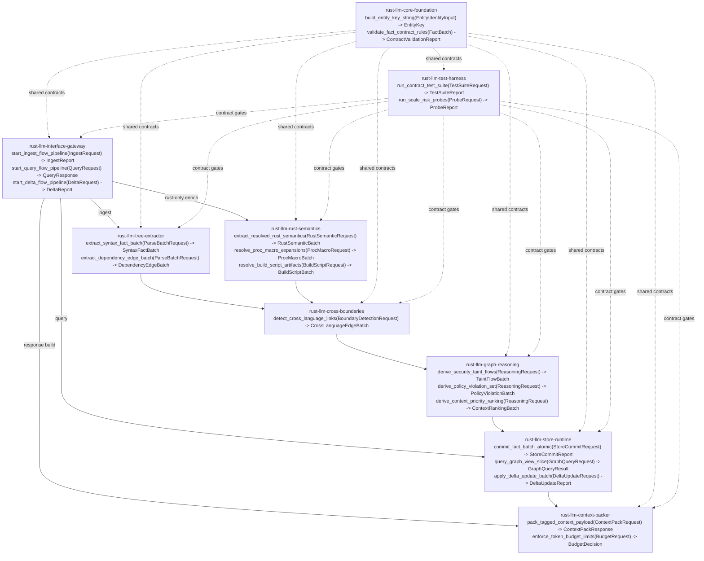

# Prep-v200-Hashing-Risks-v01
Status: Draft v01
Purpose: Make V200 clean-room crate risks measurable by documenting public interfaces, dependency edges, and a repeatable rubber-debug loop that reduces Risk/Unclear scores with evidence.

## Scope
- Clean-room V200 only (no reuse from `pt*` crates).
- 9-crate architecture:
  - `rust-llm-interface-gateway`
  - `rust-llm-core-foundation`
  - `rust-llm-tree-extractor`
  - `rust-llm-rust-semantics`
  - `rust-llm-cross-boundaries`
  - `rust-llm-graph-reasoning`
  - `rust-llm-store-runtime`
  - `rust-llm-context-packer`
  - `rust-llm-test-harness`

## Control-Flow Start and Primary Divergence
- Control flow begins in `rust-llm-interface-gateway/src/main.rs`.
- First divergence from existing parseltongue is immediate at dispatch:
  - New flow routes only into `rust-llm-*` crates.
  - No dependency on `pt01`, `pt08`, or other `pt*` crates.

## Mermaid: Public Interface Dependency Graph (v01)


## Public Interface Snapshot (ELI5)
```text
+----+------------------------------+--------------------------------------------+-------------------------------+--------------------------------------+
| #  | Crate                        | Main public interface                      | Input                         | Output                               |
+----+------------------------------+--------------------------------------------+-------------------------------+--------------------------------------+
| 0  | rust-llm-interface-gateway   | start_ingest/query/delta_flow_pipeline     | CLI/HTTP/MCP request DTOs     | Ingest/report/query response DTOs    |
| 1  | rust-llm-core-foundation     | build_entity_key_string + contract checks  | Identity/fact batches         | Stable keys + validation report      |
| 2  | rust-llm-tree-extractor      | extract_syntax_fact_batch                  | File set + language parsers   | Syntax facts + dependency edges      |
| 3  | rust-llm-rust-semantics      | extract_resolved_rust_semantics            | Cargo workspace + RA config   | Resolved Rust semantic facts         |
| 4  | rust-llm-cross-boundaries    | detect_cross_language_links                | Syntax+semantic fact batches  | Boundary edges + confidence scores   |
| 5  | rust-llm-graph-reasoning     | derive_taint/policy/context rankings       | Facts + edges + constraints   | Derived findings and priorities      |
| 6  | rust-llm-store-runtime       | commit/query/apply_delta                   | Fact+edge batches / queries   | Persisted graph + query result slices|
| 7  | rust-llm-context-packer      | pack_tagged_context_payload                | Query slices + token limits   | Tagged/token-bounded LLM payload     |
| 8  | rust-llm-test-harness        | run_contract_test_suite                    | Suite/probe definitions       | Pass/fail + risk probe artifacts     |
+----+------------------------------+--------------------------------------------+-------------------------------+--------------------------------------+
```

## Baseline Risk/Unclear Matrix (v01)
```text
+----+------------------------------+-----------+-------------+----------------------------------------------------------+
| #  | Crate                        | Risk / 5  | Unclear / 5 | Why baseline is not low                                  |
+----+------------------------------+-----------+-------------+----------------------------------------------------------+
| 0  | rust-llm-interface-gateway   | 3         | 2           | Unified behavior across CLI/HTTP/MCP + cancellation      |
| 1  | rust-llm-core-foundation     | 4         | 4           | Key model and contract stability affect all crates       |
| 2  | rust-llm-tree-extractor      | 4         | 3           | 12-language query correctness and normalization gaps      |
| 3  | rust-llm-rust-semantics      | 5         | 4           | RA/proc-macro/build-script reliability and churn         |
| 4  | rust-llm-cross-boundaries    | 4         | 4           | Heuristic linking quality and confidence calibration      |
| 5  | rust-llm-graph-reasoning     | 4         | 3           | Rule correctness/scale tradeoffs in V200 scope           |
| 6  | rust-llm-store-runtime       | 5         | 4           | Delta consistency, indexing, snapshot durability         |
| 7  | rust-llm-context-packer      | 3         | 3           | Ranking quality under strict token ceilings              |
| 8  | rust-llm-test-harness        | 3         | 3           | Fixture breadth vs CI time and anti-flakiness design     |
+----+------------------------------+-----------+-------------+----------------------------------------------------------+
```

## Rubber-Debug Loop (Step-by-Step, Repeated per Crate)
1. Freeze one interface contract.
2. List top-3 failure modes for that contract.
3. Build smallest executable probe that can falsify assumptions.
4. Record observed behavior and artifacts.
5. Update Risk/Unclear with evidence (not intuition).
6. Promote interface from `provisional` to `stable` only after passing probes.

## Per-Crate Information Collection Checklist (v01)
```text
+---------------------------+--------------------------------------------------+---------------------------------------------------------+
| Crate                     | Evidence to collect                               | Probe/output artifact                                   |
+---------------------------+--------------------------------------------------+---------------------------------------------------------+
| interface-gateway         | mode parity (CLI/HTTP/MCP), cancellation model    | request-lifecycle trace + error mapping table           |
| core-foundation           | key uniqueness + overload disambiguation          | key collision corpus + determinism report               |
| tree-extractor            | per-language capture completeness                 | fixture-to-capture diff report (12 languages)           |
| rust-semantics            | proc-macro/build-script success/degrade behavior  | RA workspace matrix with pass/fallback classifications  |
| cross-boundaries          | precision/recall on known boundary fixtures       | boundary edge confusion matrix                          |
| graph-reasoning           | rule correctness + runtime at scale               | golden-rule output + p50/p95 runtime report             |
| store-runtime             | delta correctness + crash durability              | mutation replay logs + recovery consistency checks      |
| context-packer            | token budget faithfulness + relevance ranking     | budget packing audit + human relevance spot-check       |
| test-harness              | flake rate + suite wall-clock budget             | CI stability trend and quarantine list                  |
+---------------------------+--------------------------------------------------+---------------------------------------------------------+
```

## Risk Hashing Snapshot Format (for each iteration)
Use a compact hash to track movement across iterations:
- Format: `crate:R{risk}-U{unclear}-E{evidence_count}`
- Example: `rust-llm-rust-semantics:R5-U4-E2`
- Iteration digest = sorted concatenation of all crate hashes.

This gives a quick “did uncertainty actually go down?” signal across v01, v02, v03.

## v01 Immediate Next Actions
1. Lock `core-foundation` key contract draft (`EntityKey`, overload handling, externals).
2. Define `rust-semantics` fallback policy for proc-macro/build-script failure modes.
3. Build `store-runtime` delta replay probe before broader implementation.
4. Run first risk-hash update and produce v02.
