# Rust-Analyzer Folder Structure & Organization

**Visual Guide with Mermaid Diagrams**

## Overall Codebase Structure

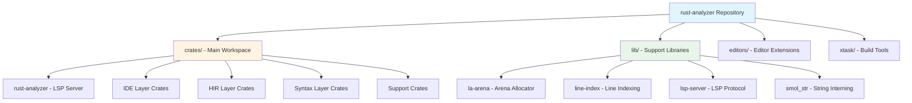

## Main Crates Dependency Layers

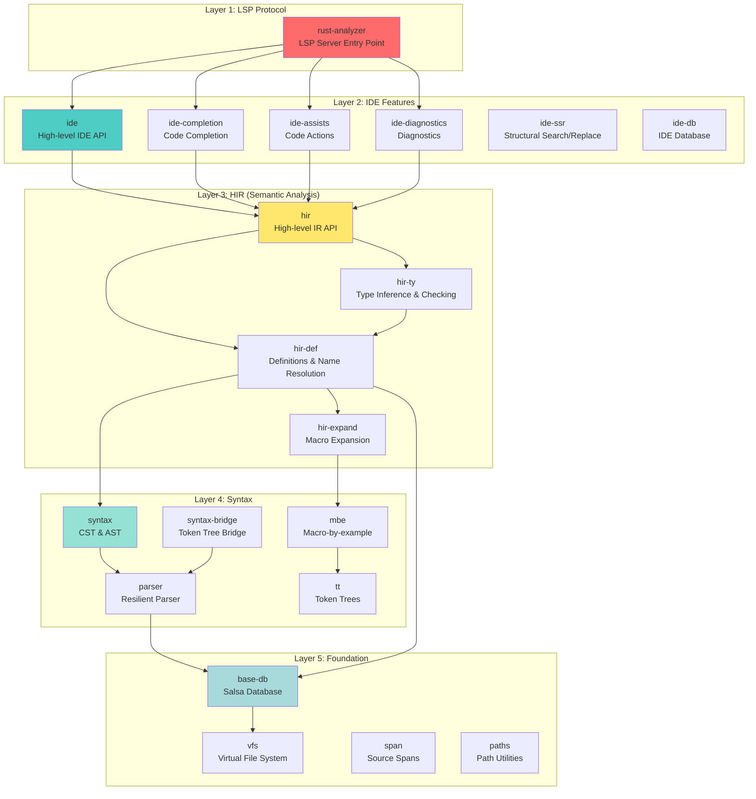

## Complete Crates Organization

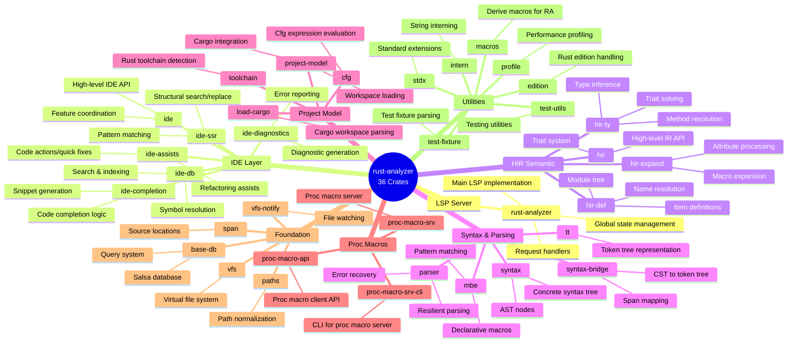

## File-by-File Structure (Key Crates)

### rust-analyzer Crate

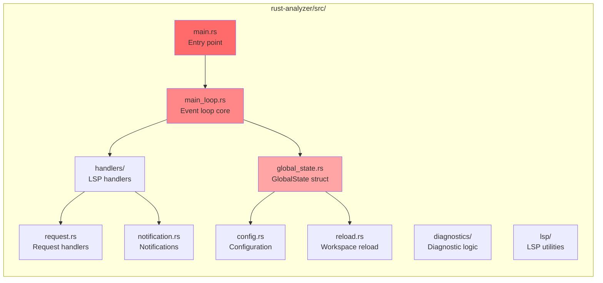

### hir-def Crate (Name Resolution)

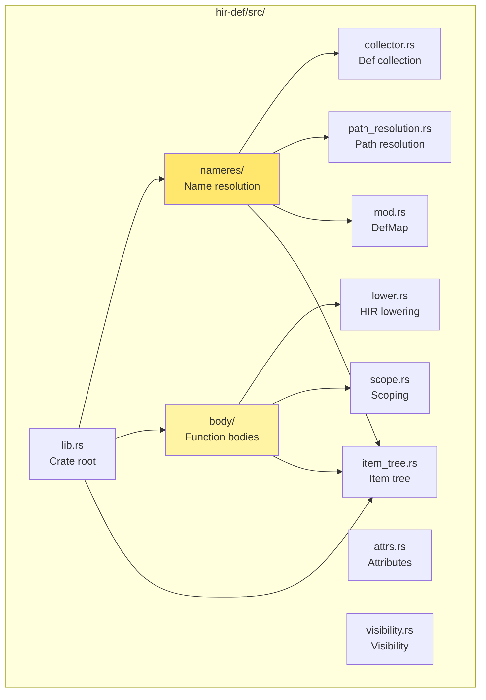

### hir-ty Crate (Type Inference)

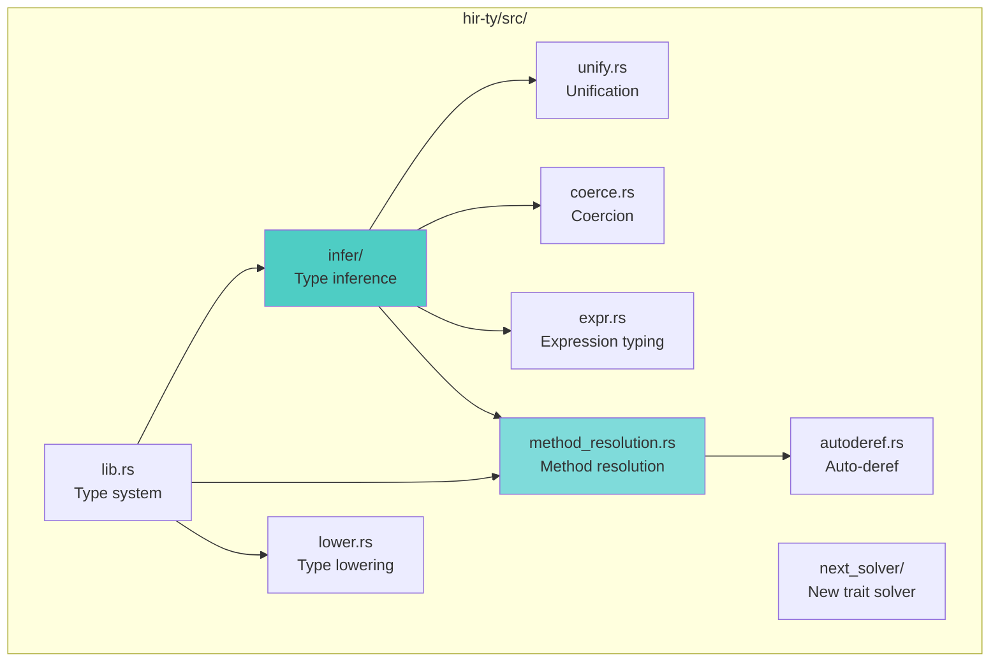

### ide Crate (IDE Features)

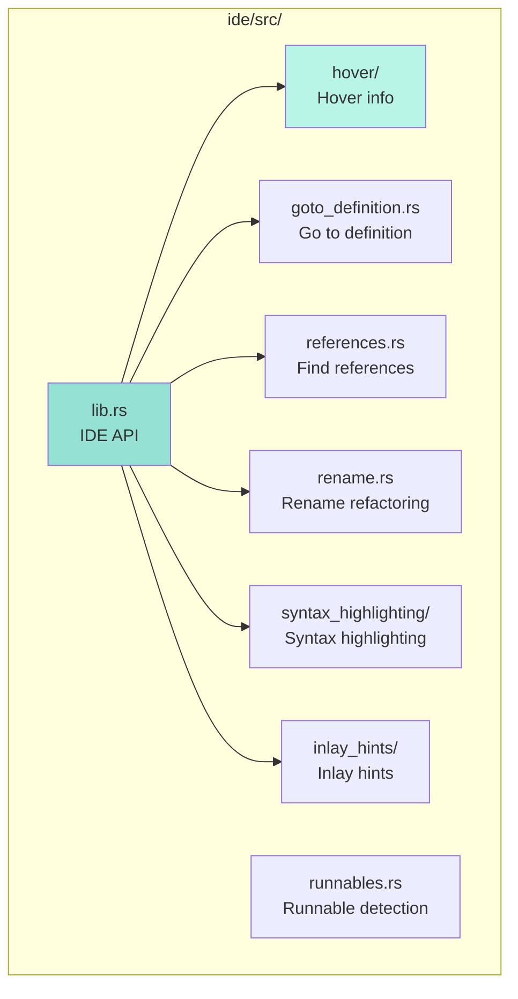

## Data Flow Between Folders

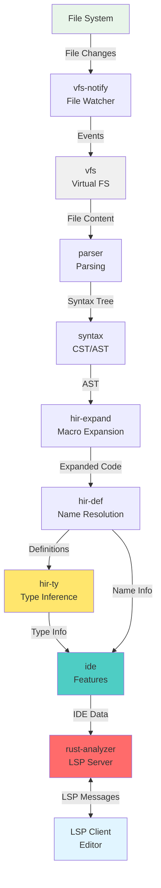

## Lib Directory Structure

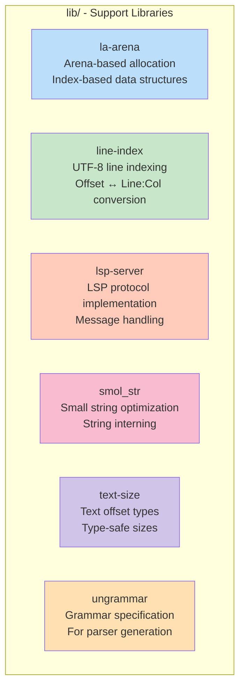

## Project Model Flow

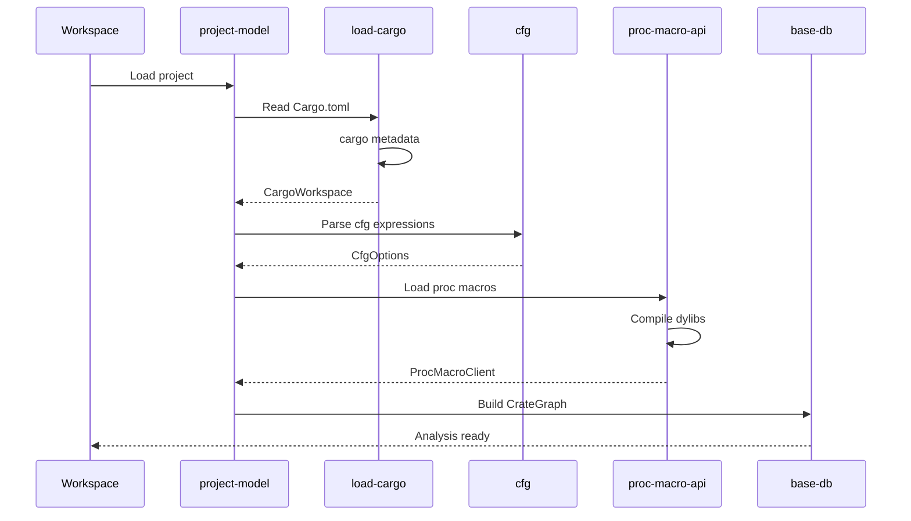

## Syntax Parsing Flow

## Summary of Key Directories

| Directory | Purpose | Key Files | ELI5 |
|-----------|---------|-----------|------|
| `rust-analyzer/` | LSP server entry point | `main.rs`, `main_loop.rs`, `global_state.rs` | The "front desk" that talks to your editor |
| `ide/` | IDE feature implementations | `hover.rs`, `goto_definition.rs`, `completion.rs` | The "brains" that provide smart code features |
| `hir/` | High-level IR | `lib.rs`, `semantics.rs` | Simplified view of your code for analysis |
| `hir-def/` | Name resolution | `nameres/`, `body/`, `item_tree.rs` | Figures out what names mean |
| `hir-ty/` | Type inference | `infer/`, `method_resolution.rs` | Figures out types of expressions |
| `hir-expand/` | Macro expansion | `builtin_fn_macro.rs`, `proc_macro.rs` | Expands macros into regular code |
| `syntax/` | Syntax tree | `ast/`, `ptr.rs` | Parse tree structure |
| `parser/` | Parsing | `grammar/`, `lib.rs` | Converts text to tree |
| `base-db/` | Database | `lib.rs`, `input.rs` | Salsa query system |
| `vfs/` | Virtual file system | `lib.rs`, `loader.rs` | In-memory file tracking |
| `project-model/` | Workspace | `workspace.rs`, `cargo_workspace.rs` | Understands Cargo projects |
| `ide-completion/` | Code completion | `completions/`, `render/` | Suggests code as you type |
| `ide-assists/` | Quick fixes | `handlers/` | Code actions and refactorings |
| `ide-diagnostics/` | Error checking | `handlers/` | Shows errors and warnings |
| `proc-macro-api/` | Proc macro client | `msg.rs`, `process.rs` | Talks to proc macro server |
| `proc-macro-srv/` | Proc macro server | `dylib.rs`, `lib.rs` | Runs proc macros |

## Directory Interaction Patterns

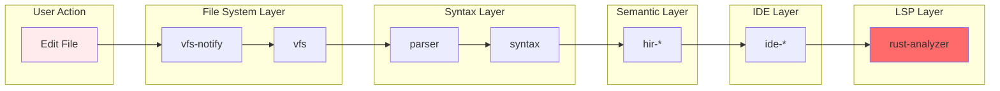

This folder structure shows how rust-analyzer is organized as a **layered architecture** where each layer has clear responsibilities and dependencies flow downward.
