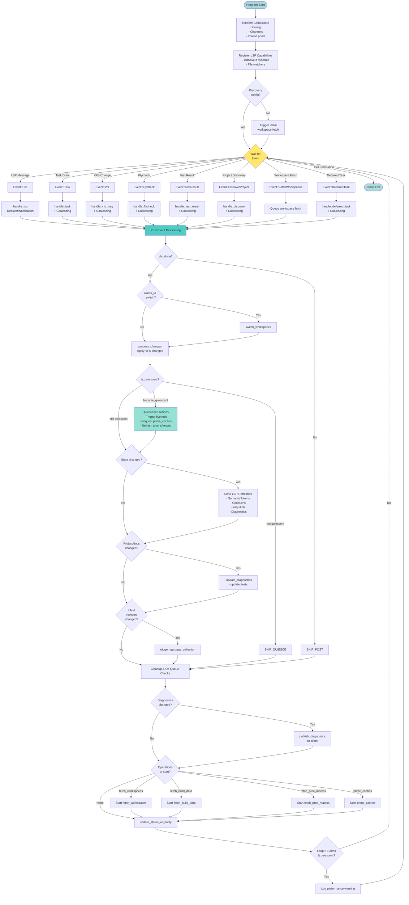
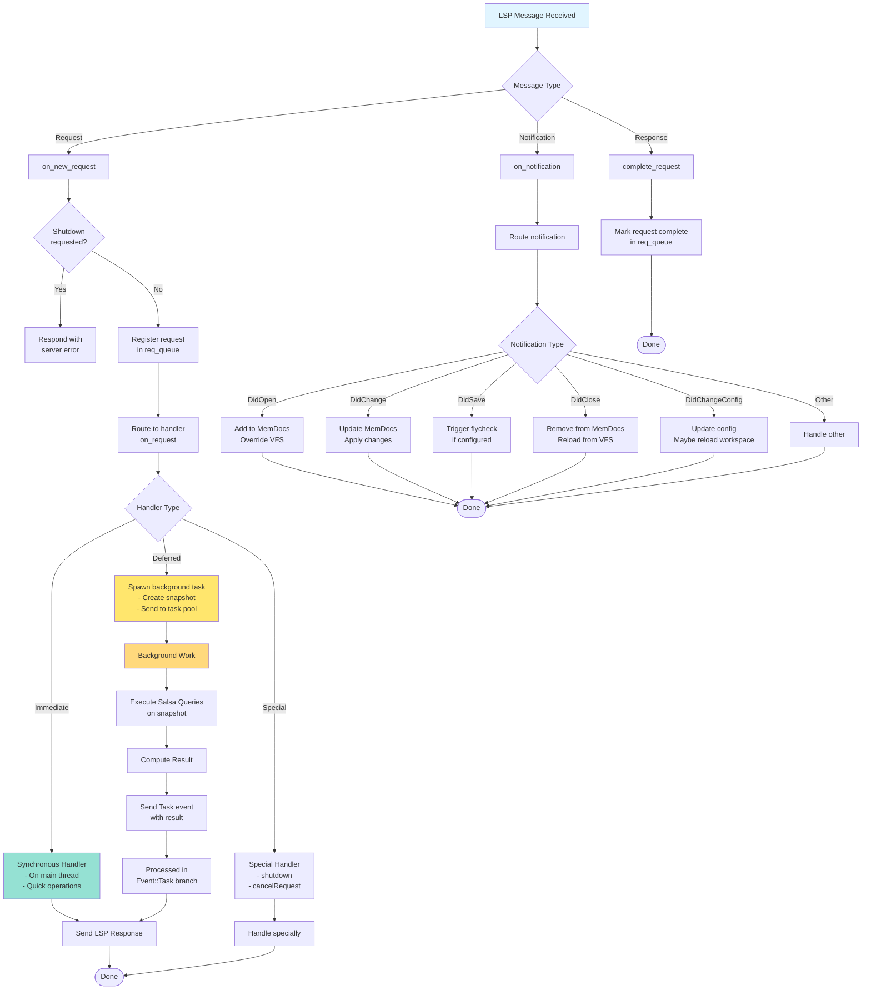
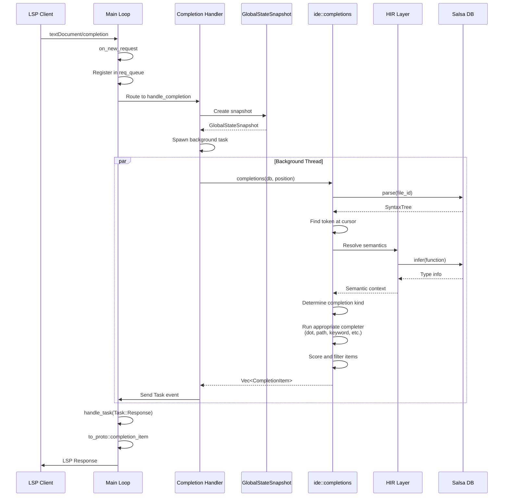
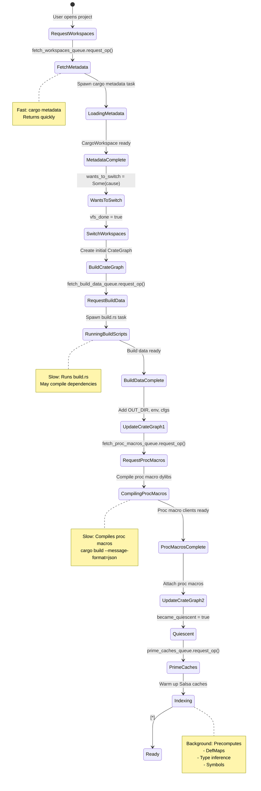
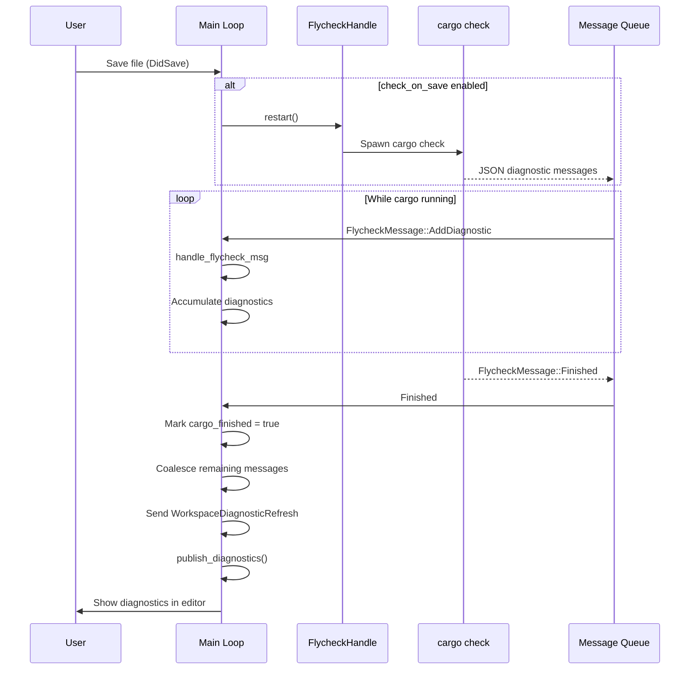
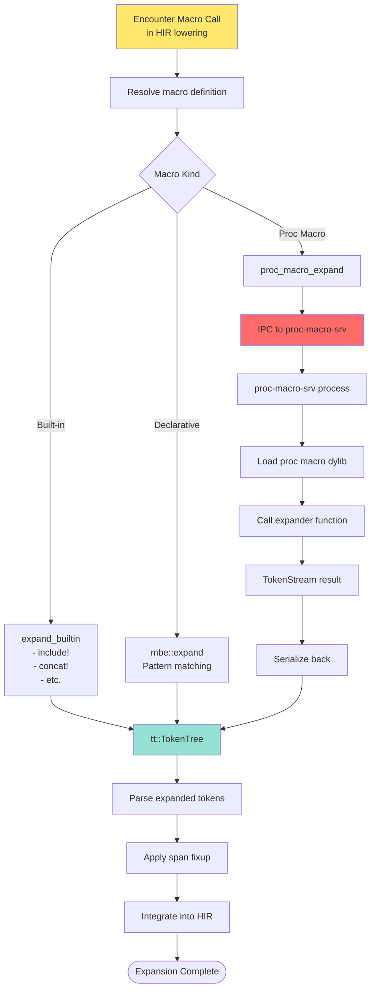
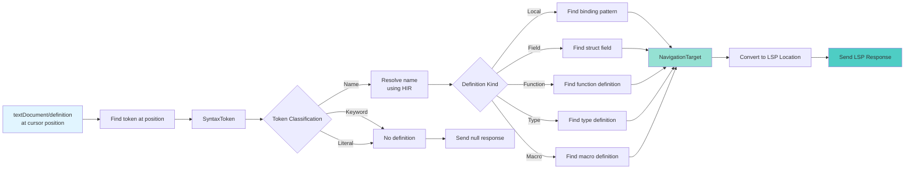

# Rust-Analyzer Control Flow Diagrams

**Visual Guide to How Code Flows Through the System**

## Main Event Loop Control Flow



## LSP Request Handling Flow



## Completion Request Flow



## Workspace Loading Control Flow



## VFS Change Processing

```mermaid
flowchart TD
    FS_CHANGE[File System Change]
    FS_CHANGE --> WATCHER[vfs-notify<br/>File Watcher]

    WATCHER --> LOADER_MSG[vfs::loader::Message]
    LOADER_MSG --> EVENT[Event::Vfs]

    EVENT --> HANDLE_VFS[handle_vfs_msg]

    HANDLE_VFS --> MSG_TYPE{Message Type}

    MSG_TYPE -->|Loaded| LOADED[Update VFS<br/>set_file_contents]
    MSG_TYPE -->|Progress| PROGRESS[Track progress]

    LOADED --> COALESCE{More VFS<br/>messages?}
    PROGRESS --> COALESCE

    COALESCE -->|Yes| DRAIN[try_recv next]
    COALESCE -->|No| REPORT_PROG

    DRAIN --> HANDLE_VFS

    REPORT_PROG[Report Progress<br/>"Roots Scanned"]
    REPORT_PROG --> POST_EVENT[Post-event processing]

    POST_EVENT --> PROCESS{vfs_done?}
    PROCESS -->|Yes| PROC_CHANGES[process_changes]
    PROCESS -->|No| SKIP

    PROC_CHANGES --> TAKE_CHANGES[vfs.take_changes]
    TAKE_CHANGES --> FOR_EACH[For each changed FileId]

    FOR_EACH --> INVALIDATE[Invalidate Salsa queries<br/>- file_text<br/>- parse<br/>- etc.]

    INVALIDATE --> APPLY[analysis_host.apply_change]

    APPLY --> DONE[State changed = true]
    DONE --> TRIGGER_UPDATE[Trigger diagnostics update<br/>on next quiescence]

    SKIP --> NO_CHANGE[State changed = false]

    style FS_CHANGE fill:#e8f5e9
    style INVALIDATE fill:#ff6b6b
    style TRIGGER_UPDATE fill:#4ecdc4
```

## Flycheck (Cargo Check) Flow



## Macro Expansion Control Flow



## Goto Definition Flow



## Salsa Query Execution Flow

```mermaid
flowchart TD
    QUERY_START[Execute Query<br/>e.g., infer(function_id)]

    QUERY_START --> CHECK_MEMO{Result<br/>memoized?}

    CHECK_MEMO -->|Yes| CHECK_DEPS{Dependencies<br/>changed?}
    CHECK_MEMO -->|No| EXECUTE

    CHECK_DEPS -->|No| RETURN_MEMO[Return cached result]
    CHECK_DEPS -->|Yes| INVALIDATE[Invalidate cache]

    INVALIDATE --> EXECUTE[Execute query function]

    EXECUTE --> TRACK_DEPS[Track dependencies]
    TRACK_DEPS --> COMPUTE[Compute result]

    COMPUTE --> MAY_CALL{Query calls<br/>other queries?}

    MAY_CALL -->|Yes| NESTED_QUERY[Execute nested query]
    NESTED_QUERY --> TRACK_DEP[Track as dependency]
    TRACK_DEP --> COMPUTE

    MAY_CALL -->|No| MEMOIZE[Memoize result]

    MEMOIZE --> RETURN[Return result]

    RETURN_MEMO --> DONE([Done])
    RETURN --> DONE

    style CHECK_MEMO fill:#ffe66d
    style RETURN_MEMO fill:#95e1d3
    style EXECUTE fill:#ff6b6b
```

## Summary of Control Flow Patterns

### Event Loop Pattern
- **Central loop** waits for events from multiple sources
- **Event coalescing** batches similar events
- **Post-processing** applies changes and triggers follow-ups

### Request/Response Pattern
- **Synchronous**: Fast queries on main thread
- **Asynchronous**: Slow queries on background threads using snapshots
- **Queue tracking**: Requests tracked for cancellation

### State Machine Pattern
- **Workspace loading**: Multi-phase state transitions
- **Quiescence detection**: Idle state triggers optimizations
- **VFS synchronization**: Gates workspace switching

### Observer Pattern
- **File watching**: Filesystem → VFS → Analysis
- **Diagnostic updates**: Changes → Re-analysis → Publish
- **Progress reporting**: Long operations → Client notifications

### Pipeline Pattern
- **Syntax → Semantics → IDE**: Layered transformations
- **Incremental**: Only re-execute changed stages
- **Memoized**: Salsa caches intermediate results
