# Rust-Analyzer Data Flow Diagrams

**Visual Guide to How Data Transforms Through the System**

## Complete Data Pipeline

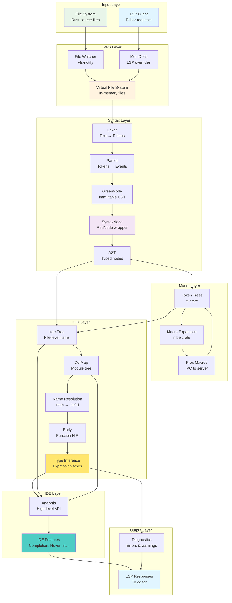

## Text to Syntax Tree Transformation

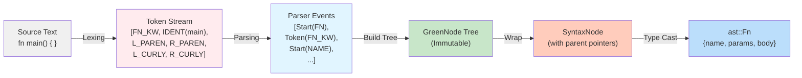

## File Change to Re-Analysis

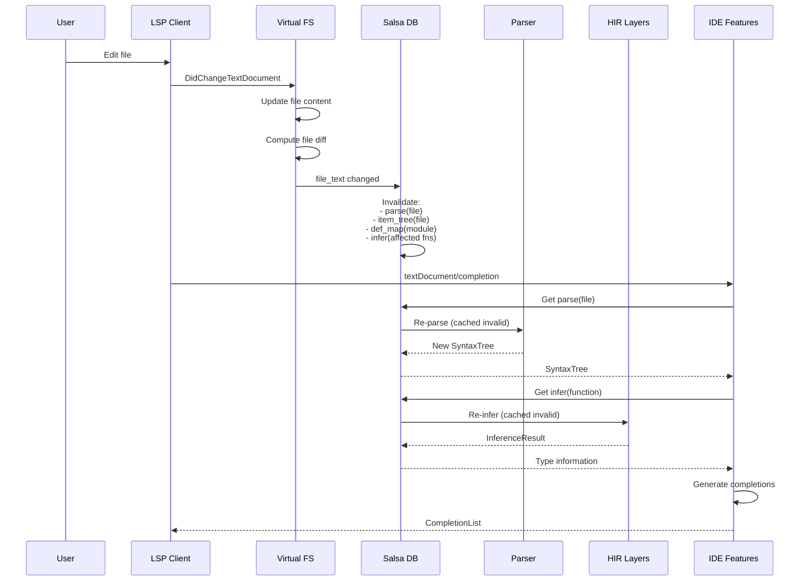

## Workspace to CrateGraph Transformation

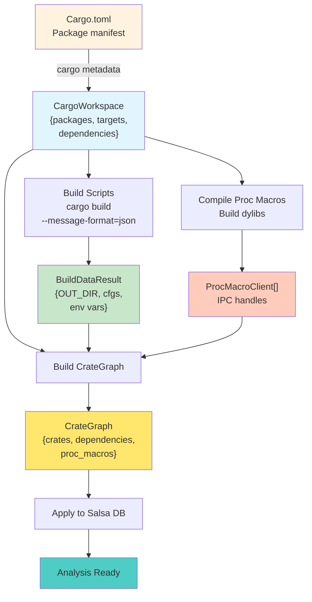

## Name Resolution Data Flow

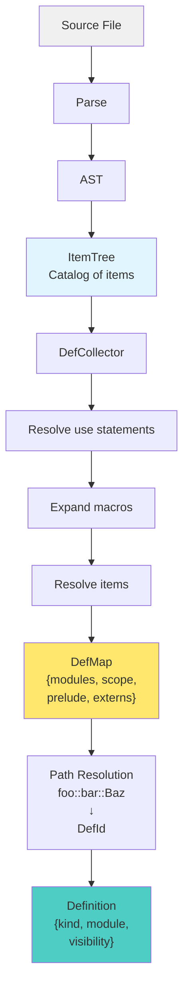

## Type Inference Data Flow

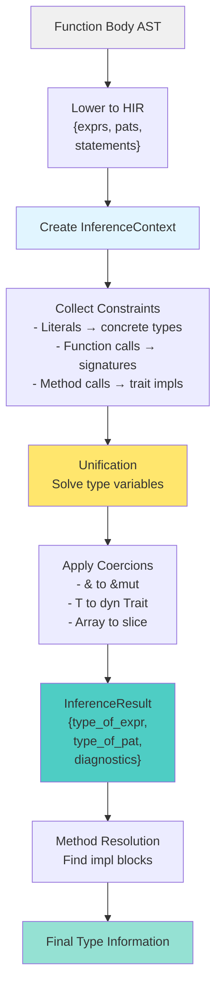

## Completion Data Generation

```mermaid
flowchart LR
    CURSOR[Cursor Position]

    CURSOR --> CONTEXT["CompletionContext<br/>{token, semantic_scope,<br/>expected_type}"]

    CONTEXT --> DETERMINE{Completion Kind}

    DETERMINE -->|foo.| DOT_COMP[Dot Completion<br/>Methods & fields]
    DETERMINE -->|use foo::| PATH_COMP[Path Completion<br/>Modules & items]
    DETERMINE -->|fn | KEYWORD_COMP[Keyword Completion]
    DETERMINE -->|"let x = | EXPR_COMP[Expression Completion]

    DOT_COMP --> RECEIVER_TY[Get receiver type]
    RECEIVER_TY --> METHODS[List methods<br/>via trait impls]
    METHODS --> FIELDS[List fields]

    PATH_COMP --> SCOPE[Get current scope]
    SCOPE --> VISIBLE[List visible items]

    KEYWORD_COMP --> KEYWORDS[Rust keywords]

    EXPR_COMP --> EXPECTED[Expected type]
    EXPECTED --> COMPATIBLE[Find compatible items]

    METHODS --> ITEMS[CompletionItem[]]
    FIELDS --> ITEMS
    VISIBLE --> ITEMS
    KEYWORDS --> ITEMS
    COMPATIBLE --> ITEMS

    ITEMS --> SCORE[Score & Rank<br/>- Relevance<br/>- Fuzzy match<br/>- Deprecation]

    SCORE --> SNIPPETS[Add Snippets<br/>- Function calls<br/>- Struct literals]

    SNIPPETS --> FINAL[Final CompletionList]

    style CURSOR fill:#f0f0f0
    style CONTEXT fill:#e1f5ff
    style ITEMS fill:#ffe66d
    style FINAL fill:#4ecdc4
```

## Diagnostic Generation Flow

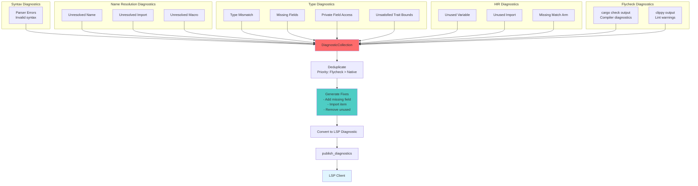

## Token to Semantic Token Mapping

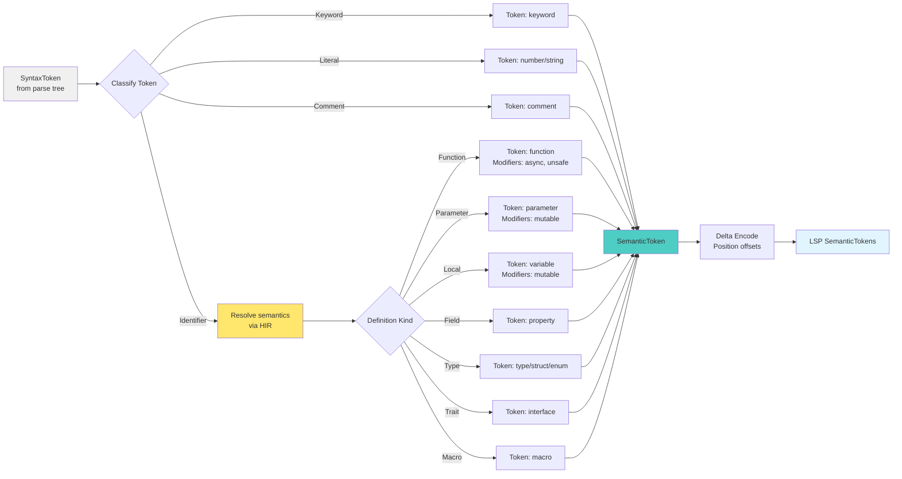

## Hover Information Assembly

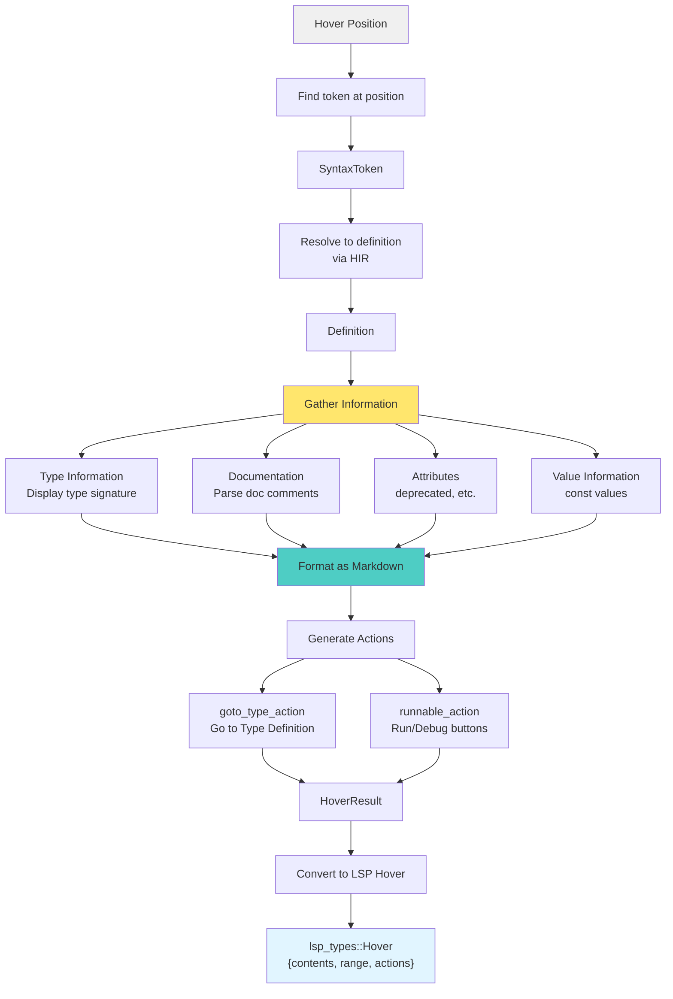

## Inlay Hints Data Flow

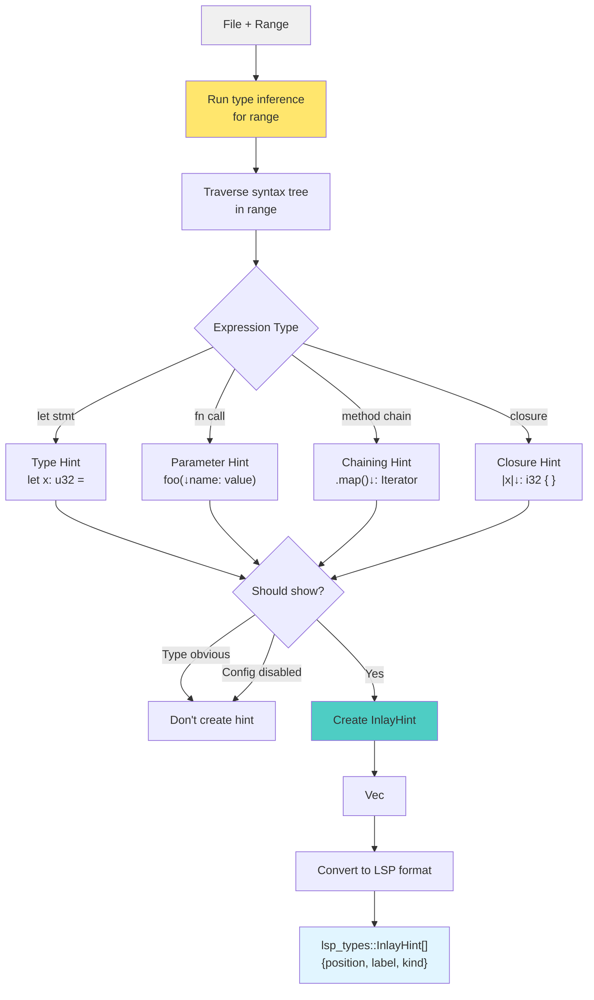

## Memory Layout of Key Structures

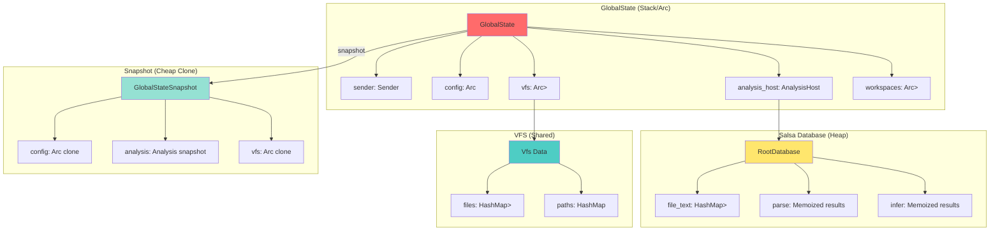

## Data Transformation Layers Summary

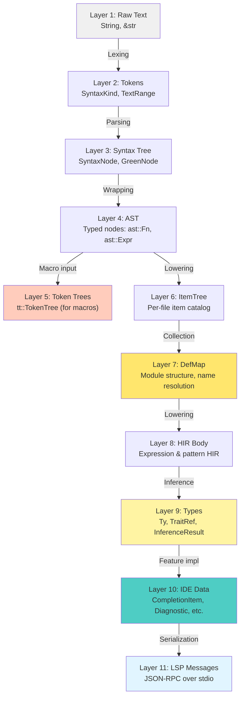

## Key Takeaways

### Data Flow Principles

1. **Layered Transformations**: Each layer produces a higher-level representation
2. **Immutability**: Most data structures are immutable (GreenNode, Arc<T>)
3. **Memoization**: Salsa caches expensive computations
4. **Incremental**: Only re-compute what changed
5. **Shared Ownership**: Arc enables cheap cloning for snapshots

### Transformation Characteristics

| From | To | Crate | Incremental? | Cached? |
|------|----|----|-------------|---------|
| Text | Tokens | parser | Yes (reparsing) | No |
| Tokens | CST | parser | Yes | Yes (parse query) |
| CST | AST | syntax | N/A (wrapping) | N/A |
| AST | ItemTree | hir-def | Yes (per file) | Yes |
| ItemTree | DefMap | hir-def | Yes (per module) | Yes |
| AST | Body | hir-def | Yes (per fn) | Yes |
| Body | Types | hir-ty | Yes (per fn) | Yes |
| HIR | IDE Data | ide-* | Depends | Partial |

### Memory Patterns

- **Interning**: Small strings (SmolStr), paths stored once
- **Arena allocation**: Syntax nodes, HIR elements use arena
- **Reference counting**: Arc<T> for shared immutable data
- **Copy-on-write**: VFS tracks changes, applies in batch
