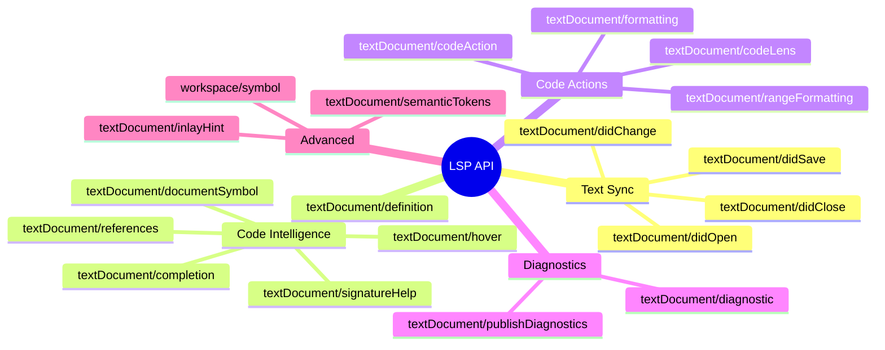
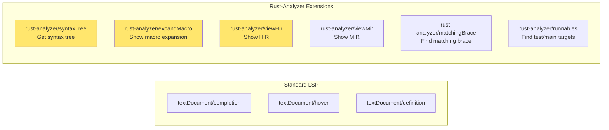
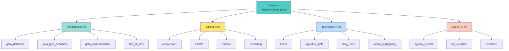
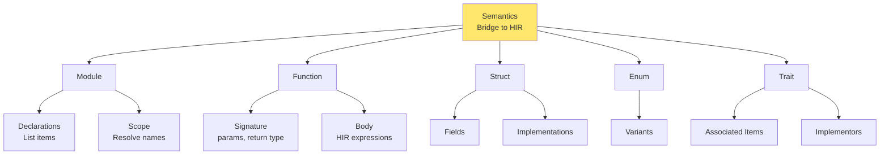
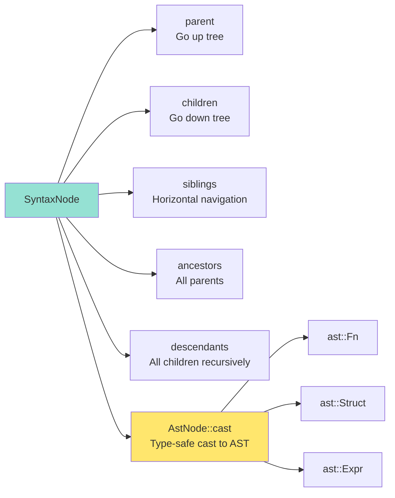
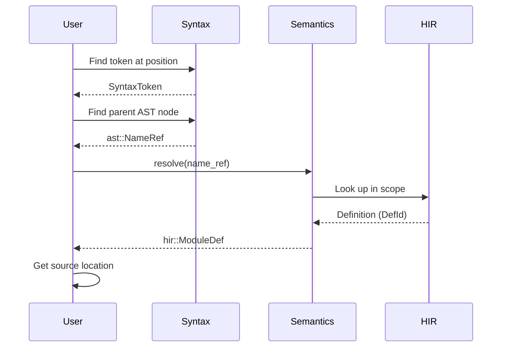
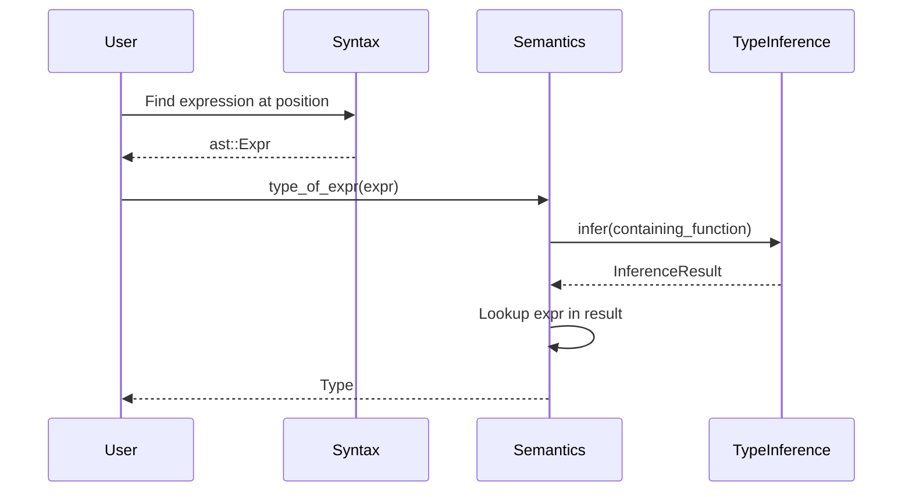
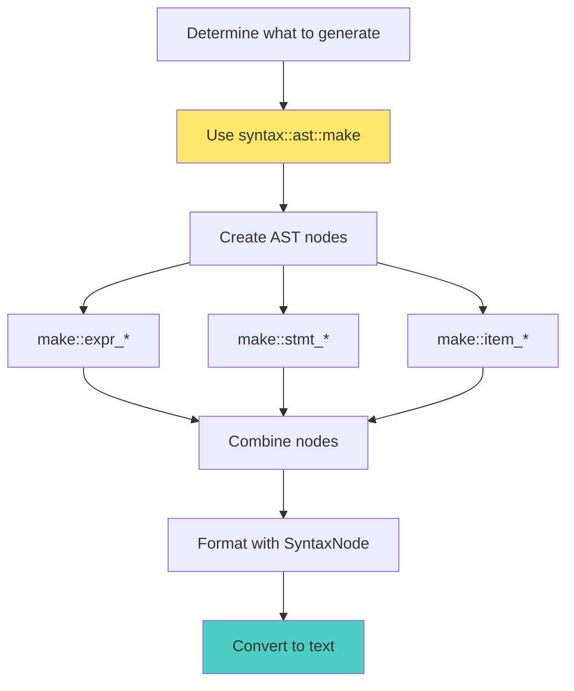
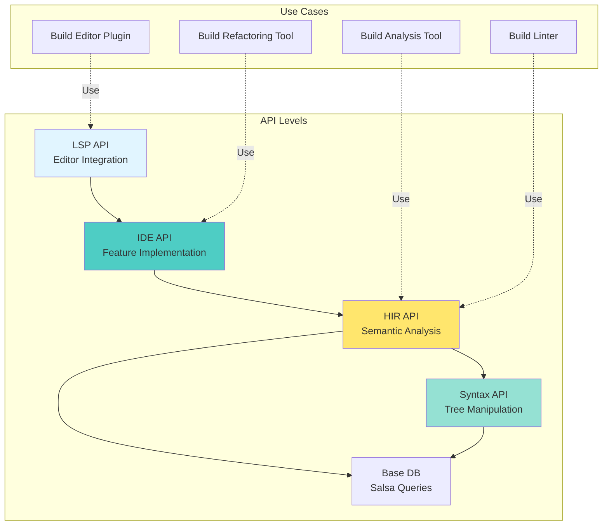

# Rust-Analyzer API Usage Guide

**How to Use Rust-Analyzer's APIs - For Library Users and Contributors**

## Overview

Rust-analyzer exposes APIs at multiple levels:

1. **LSP API** - For editor integration (VS Code, Emacs, Vim, etc.)
2. **IDE API** - For building IDE features (`ide` crate)
3. **HIR API** - For semantic analysis (`hir` crate)
4. **Syntax API** - For syntax tree manipulation (`syntax` crate)

## LSP API (Editor Integration)

### What You Can Do



### Example: Completion Request

**Request:**
```json
{
  "jsonrpc": "2.0",
  "id": 1,
  "method": "textDocument/completion",
  "params": {
    "textDocument": {
      "uri": "file:///path/to/file.rs"
    },
    "position": {
      "line": 10,
      "character": 5
    }
  }
}
```

**Response:**
```json
{
  "jsonrpc": "2.0",
  "id": 1,
  "result": {
    "isIncomplete": false,
    "items": [
      {
        "label": "println!",
        "kind": 3,
        "detail": "macro",
        "insertText": "println!(\"$1\");",
        "insertTextFormat": 2
      }
    ]
  }
}
```

### Custom LSP Extensions

Rust-analyzer extends LSP with custom commands:



## IDE API (ide crate)

### Entry Point: Analysis

```rust
use ide::Analysis;

// Create analysis from files
let analysis = Analysis::new(...);

// Get completions
let completions = analysis.completions(
    &config,
    FilePosition { file_id, offset }
)?;

// Get hover info
let hover = analysis.hover(
    &config,
    FilePosition { file_id, offset }
)?;

// Find references
let refs = analysis.find_all_refs(
    FilePosition { file_id, offset },
    search_scope
)?;
```

### API Structure



### Example: Using Completions API

```rust
use ide::{Analysis, CompletionConfig, FilePosition};

fn get_completions(
    analysis: &Analysis,
    file_id: FileId,
    offset: TextSize,
) -> Option<Vec<CompletionItem>> {
    let config = CompletionConfig::default();

    let position = FilePosition { file_id, offset };

    let completions = analysis
        .completions(&config, position)
        .ok()??;

    Some(completions.into_iter().collect())
}
```

### Example: Using Hover API

```rust
use ide::{Analysis, HoverConfig, FilePosition};

fn get_hover_info(
    analysis: &Analysis,
    file_id: FileId,
    offset: TextSize,
) -> Option<String> {
    let config = HoverConfig {
        links_in_hover: true,
        documentation: Some(HoverDocFormat::Markdown),
        ..Default::default()
    };

    let position = FilePosition { file_id, offset };

    let hover = analysis.hover(&config, position).ok()??;

    Some(hover.info.markup.as_str().to_string())
}
```

## HIR API (hir crate)

### Entry Point: Semantics

```rust
use hir::Semantics;
use syntax::ast;

let sema = Semantics::new(&db);

// Find definition of a name
let name: ast::Name = ...;
let def = sema.resolve_bind_pat_to_const(&name);

// Get type of expression
let expr: ast::Expr = ...;
let ty = sema.type_of_expr(&expr);

// List methods of a type
let ty: hir::Type = ...;
let methods = ty.iterate_method_candidates(...);
```

### HIR Structure



### Example: Type Checking

```rust
use hir::{Semantics, Type};
use syntax::ast;

fn check_type_compatibility(
    sema: &Semantics<RootDatabase>,
    expr1: &ast::Expr,
    expr2: &ast::Expr,
) -> bool {
    let ty1 = sema.type_of_expr(expr1).map(|t| t.adjusted());
    let ty2 = sema.type_of_expr(expr2).map(|t| t.adjusted());

    match (ty1, ty2) {
        (Some(t1), Some(t2)) => t1.could_unify_with(&t2),
        _ => false,
    }
}
```

### Example: Finding Trait Implementations

```rust
use hir::{Semantics, Type, Trait};

fn find_trait_impls(
    sema: &Semantics<RootDatabase>,
    ty: &Type,
    trait_: &Trait,
) -> Vec<hir::Impl> {
    let db = sema.db;

    // Get all implementations of the trait
    trait_
        .all_assoc_items(db)
        .into_iter()
        .filter_map(|item| {
            // Check if type implements this trait item
            ty.impls_trait(db, trait_, &[])
                .then(|| item.as_impl())
        })
        .flatten()
        .collect()
}
```

## Syntax API (syntax crate)

### Working with Syntax Trees

```rust
use syntax::{
    ast::{self, AstNode},
    SyntaxKind, SyntaxNode,
};

// Parse source code
let parse = syntax::SourceFile::parse(source_code);
let root: ast::SourceFile = parse.tree();

// Traverse tree
for item in root.items() {
    match item {
        ast::Item::Fn(func) => {
            let name = func.name()?.to_string();
            println!("Function: {}", name);
        }
        ast::Item::Struct(struct_) => {
            let name = struct_.name()?.to_string();
            println!("Struct: {}", name);
        }
        _ => {}
    }
}
```

### Syntax Tree Navigation



### Example: Finding All Functions

```rust
use syntax::{
    ast::{self, AstNode, HasName},
    SyntaxNode,
};

fn find_all_functions(root: &SyntaxNode) -> Vec<String> {
    root.descendants()
        .filter_map(ast::Fn::cast)
        .filter_map(|func| func.name())
        .map(|name| name.to_string())
        .collect()
}
```

### Example: Syntax Tree Editing

```rust
use syntax::{
    ast::{self, make, edit::AstNodeEdit},
    SyntaxNode,
};

fn add_parameter_to_function(
    func: ast::Fn,
    param_name: &str,
    param_type: &str,
) -> ast::Fn {
    let param = make::param(
        make::ident_pat(make::name(param_name)),
        make::ty(param_type),
    );

    let param_list = func.param_list()?;
    let new_param_list = param_list.append_param(param);

    func.with_param_list(new_param_list)
}
```

## Common Usage Patterns

### Pattern 1: Position to Definition



### Pattern 2: Type Information Query



### Pattern 3: Code Generation



## Testing Utilities

### Using test-utils

```rust
use test_utils::Fixture;

#[test]
fn test_completion() {
    let fixture = r#"
//- /main.rs
fn main() {
    let x = 42;
    x.$0
}
    "#;

    let (analysis, position) = Fixture::single_file(fixture);

    let completions = analysis
        .completions(&Default::default(), position)
        .unwrap()
        .unwrap();

    assert!(!completions.is_empty());
}
```

### Using ide-db for testing

```rust
use ide_db::RootDatabase;
use test_utils::Fixture;

#[test]
fn test_type_inference() {
    let fixture = r#"
fn foo() -> i32 {
    let x = 42;
    x
}
    "#;

    let (db, file_id) = RootDatabase::with_single_file(fixture);

    // Access Salsa queries directly
    let parse = db.parse(file_id);
    let tree = parse.tree();

    // ... test logic
}
```

## Configuration

### IDE Config Options

```rust
pub struct CompletionConfig {
    pub enable_postfix_completions: bool,
    pub enable_imports_on_the_fly: bool,
    pub enable_self_on_the_fly: bool,
    pub enable_private_editable: bool,
    pub callable: Option<CallableSnippets>,
    pub snippet_cap: Option<SnippetCap>,
    pub insert_use: InsertUseConfig,
    pub snippets: Vec<Snippet>,
    pub limit: Option<usize>,
}
```

### Analysis Host Config

```rust
pub struct Config {
    pub check_on_save: bool,
    pub cargo_autoreload: bool,
    pub expand_proc_macros: bool,
    pub prefill_caches: bool,
    // ... many more options
}
```

## Performance Tips

### 1. Use Snapshots for Background Work

```rust
// ✅ Good: Use snapshot
let snapshot = analysis.snapshot();
task_pool.spawn(move || {
    snapshot.completions(...)
});

// ❌ Bad: Hold main Analysis
task_pool.spawn(|| {
    analysis.completions(...) // Blocks main thread
});
```

### 2. Batch Queries

```rust
// ✅ Good: Single Semantics instance
let sema = Semantics::new(&db);
for expr in exprs {
    let ty = sema.type_of_expr(&expr);
}

// ❌ Bad: Create Semantics repeatedly
for expr in exprs {
    let sema = Semantics::new(&db);
    let ty = sema.type_of_expr(&expr);
}
```

### 3. Limit Scope

```rust
// ✅ Good: Limit search scope
let refs = analysis.find_all_refs(
    position,
    Some(SearchScope::single_file(file_id))
)?;

// ❌ Bad: Search entire workspace
let refs = analysis.find_all_refs(
    position,
    None // searches everywhere
)?;
```

## Summary



### API Choice Guide

| You Want To... | Use This API | Example |
|----------------|--------------|---------|
| Build editor plugin | LSP API | VS Code extension |
| Implement IDE feature | IDE API | Custom completion |
| Analyze semantics | HIR API | Find unused code |
| Parse/transform syntax | Syntax API | Code formatter |
| Query internals | Salsa DB | Debugging RA |
