# Rust-Analyzer: Per-File Detailed Analysis with Mermaid Diagrams

**Generated from Parseltongue Database Queries**
**Database:** 14,852 entities, 92,931 edges

---

## rust-analyzer Crate - Main LSP Server

### File: main_loop.rs (30 entities)

**Purpose:** Core event loop that processes LSP messages and coordinates all subsystems

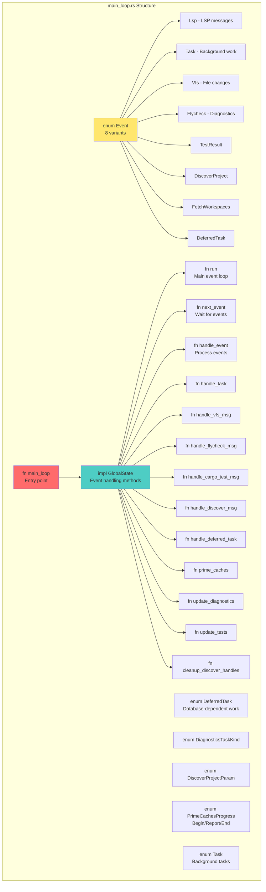

**Data Flow in main_loop.rs:**

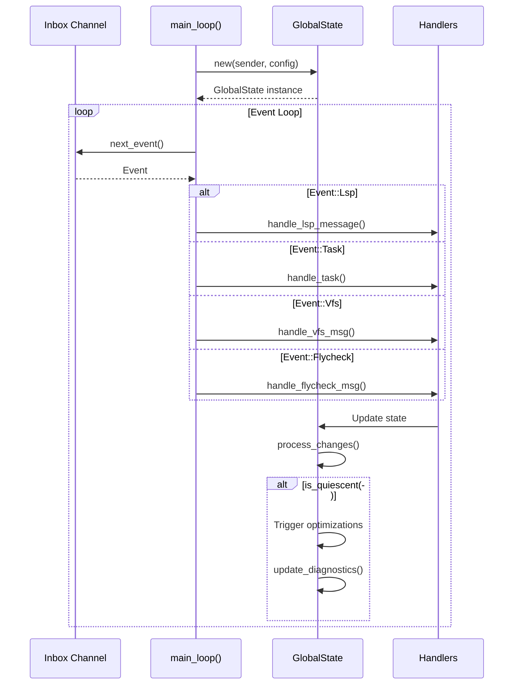

---

### File: global_state.rs (44 entities)

**Purpose:** Central state management for the LSP server

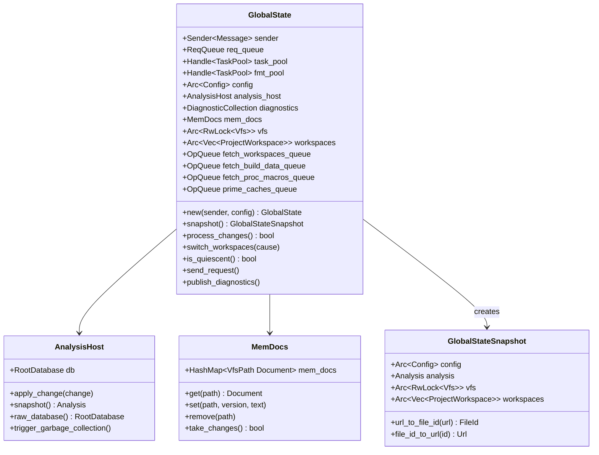

**State Transitions:**

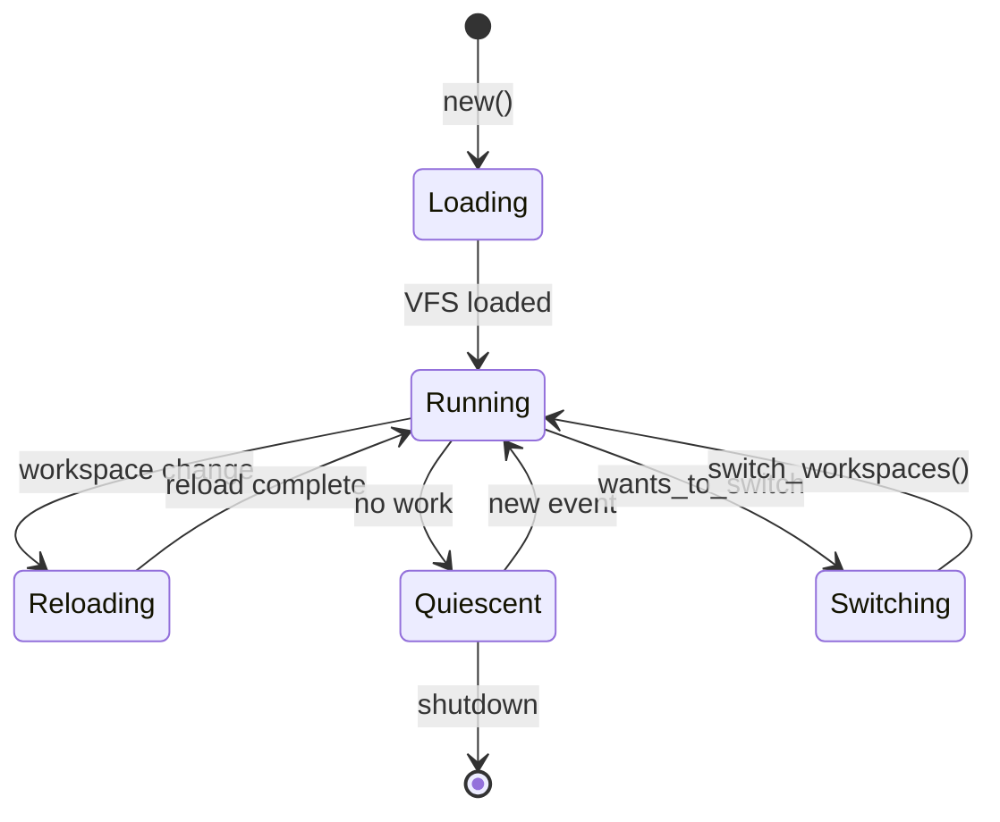

---

### File: lsp/ext.rs (152 entities)

**Purpose:** Custom LSP protocol extensions specific to rust-analyzer

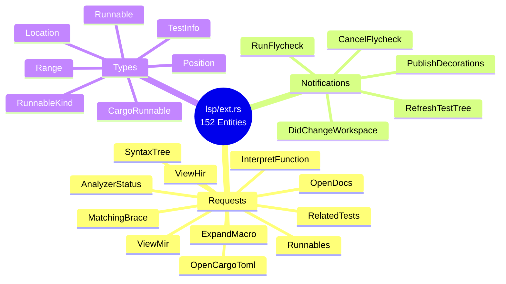

---

## HIR Layer Crates

### File: hir/src/lib.rs

**Purpose:** High-level Intermediate Representation API

```mermaid
graph TB
    subgraph "HIR API Entry Points"
        SEMA[struct Semantics<br/>Bridge to HIR]

        MODULE[struct Module]
        FUNCTION[struct Function]
        STRUCT[struct Struct]
        ENUM[struct Enum]
        TRAIT[struct Trait]
        IMPL[struct Impl]

        TYPE[struct Type]
        CONST[struct Const]
        STATIC[struct Static]

        SEMA --> MODULE
        SEMA --> FUNCTION
        SEMA --> TYPE

        MODULE --> DECLS[declarations()]
        MODULE --> SCOPE[scope()]
        MODULE --> PATH_RES[resolve_path()]

        FUNCTION --> SIG[signature()]
        FUNCTION --> BODY[body()]
        FUNCTION --> PARAMS[params()]

        TYPE --> METHODS[iterate_methods()]
        TYPE --> FIELDS[fields()]
        TYPE --> IMPLS[impls()]
    end

    style SEMA fill:#ffe66d
    style MODULE fill:#fff4a3
    style FUNCTION fill:#ffd97d
    style TYPE fill:#ffb347
```

**Semantics Usage Pattern:**

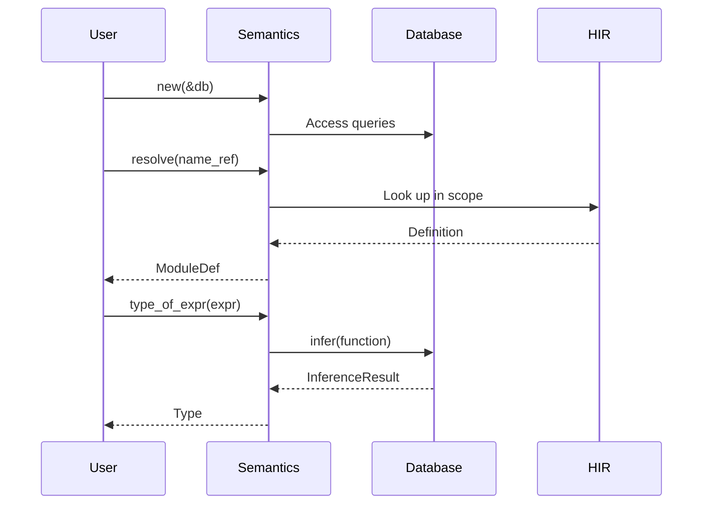

---

### File: hir-def/src/nameres/mod.rs

**Purpose:** Name resolution and DefMap construction

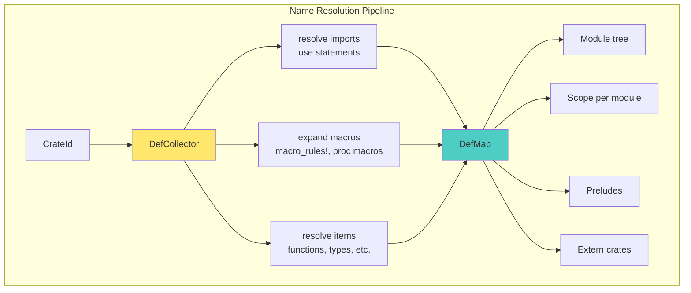

---

### File: hir-ty/src/infer/mod.rs

**Purpose:** Type inference algorithm

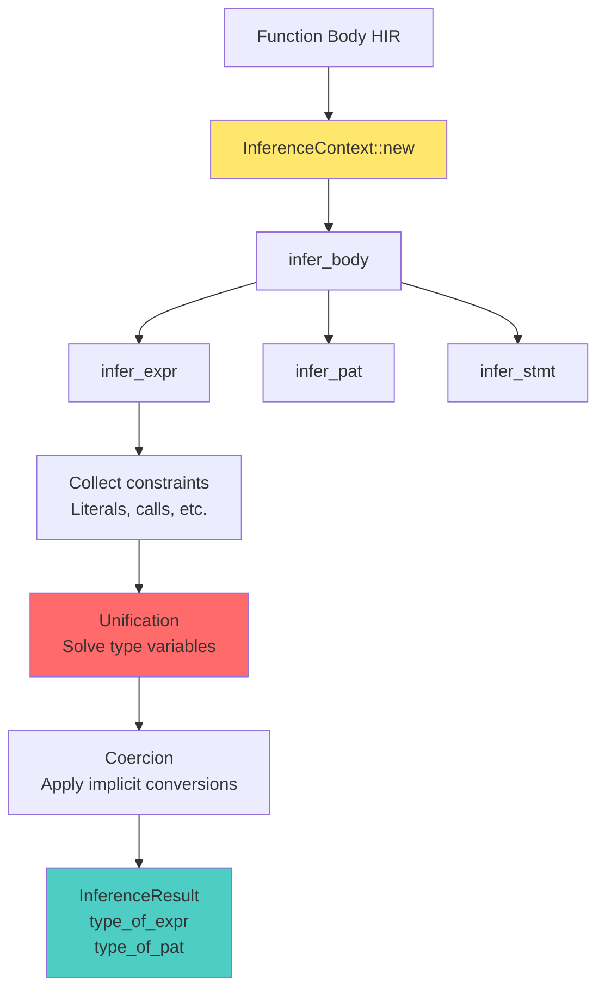

---

## IDE Layer Crates

### File: ide/src/lib.rs

**Purpose:** High-level IDE feature coordinator

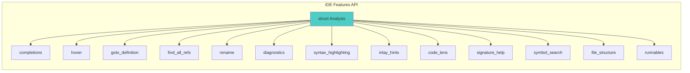

---

### File: ide-completion/src/lib.rs

**Purpose:** Code completion engine

```mermaid
flowchart TB
    POSITION[Cursor Position]

    POSITION --> CONTEXT[CompletionContext::new]

    CONTEXT --> CLASSIFY{Classify Context}

    CLASSIFY --> DOT[Dot Completion<br/>foo.|]
    CLASSIFY --> PATH[Path Completion<br/>foo::|]
    CLASSIFY --> KEYWORD[Keyword Completion]
    CLASSIFY --> ATTR[Attribute Completion<br/>#[|]]

    DOT --> DOT_COMP[completions/dot.rs]
    PATH --> PATH_COMP[completions/use_.rs]
    KEYWORD --> KEYWORD_COMP[completions/keyword.rs]
    ATTR --> ATTR_COMP[completions/attribute.rs]

    DOT_COMP --> RENDER[Rendering]
    PATH_COMP --> RENDER
    KEYWORD_COMP --> RENDER
    ATTR_COMP --> RENDER

    RENDER --> FUNC_RENDER[render/function.rs]
    RENDER --> STRUCT_RENDER[render/struct_literal.rs]
    RENDER --> PATTERN_RENDER[render/pattern.rs]

    FUNC_RENDER --> ITEMS[CompletionItem[]]
    STRUCT_RENDER --> ITEMS
    PATTERN_RENDER --> ITEMS

    style CONTEXT fill:#ffe66d
    style RENDER fill:#4ecdc4
    style ITEMS fill:#95e1d3
```

---

## Syntax Layer Crates

### File: syntax/src/lib.rs

**Purpose:** Concrete Syntax Tree implementation

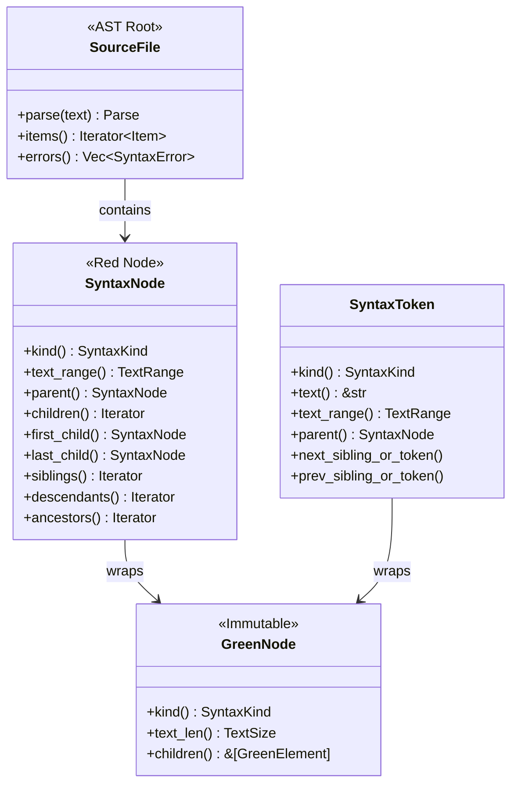

---

### File: parser/src/lib.rs

**Purpose:** Resilient incremental parser

```mermaid
flowchart LR
    TEXT[Source Text]

    TEXT --> LEXER[Lexer<br/>Text → Tokens]

    LEXER --> TOKENS[Token Stream<br/>SyntaxKind[]]

    TOKENS --> PARSER[Parser<br/>Grammar rules]

    PARSER --> EVENTS[Parser Events<br/>Start/Finish/Token]

    EVENTS --> TREE_SINK[TreeSink<br/>Build tree]

    TREE_SINK --> GREEN[GreenNode<br/>Immutable CST]

    GREEN --> SYNTAX[SyntaxNode<br/>With parent pointers]

    style LEXER fill:#ffccbc
    style PARSER fill:#ffe66d
    style GREEN fill:#c8e6c9
    style SYNTAX fill:#4ecdc4
```

---

## Foundation Crates

### File: base-db/src/lib.rs

**Purpose:** Salsa database foundation

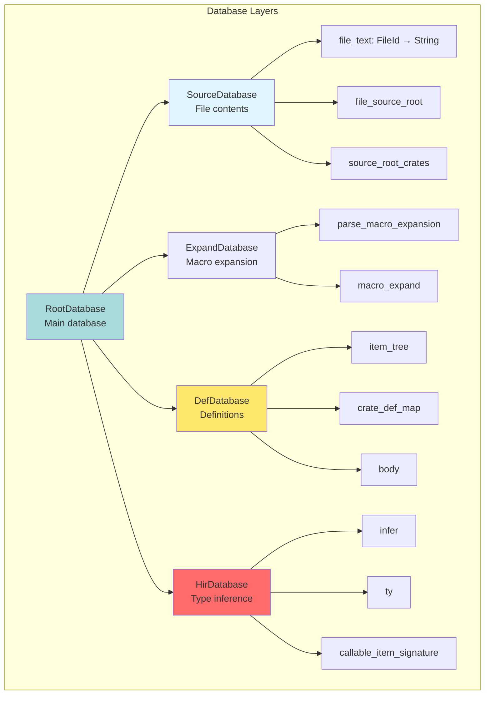

---

### File: vfs/src/lib.rs

**Purpose:** Virtual File System

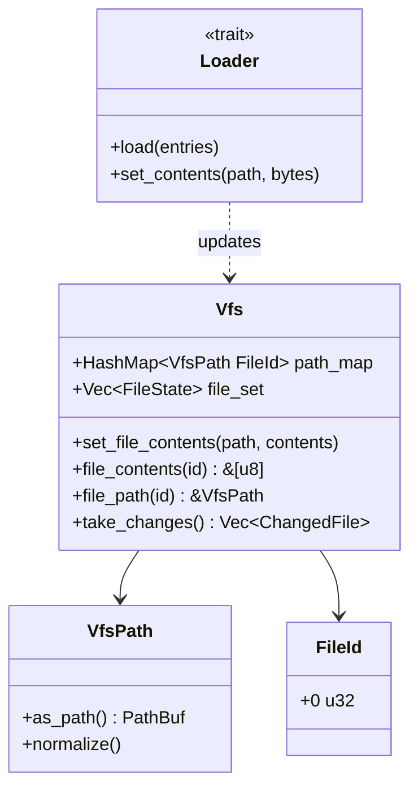

---

## Project Model Crates

### File: project-model/src/workspace.rs

**Purpose:** Cargo workspace loading

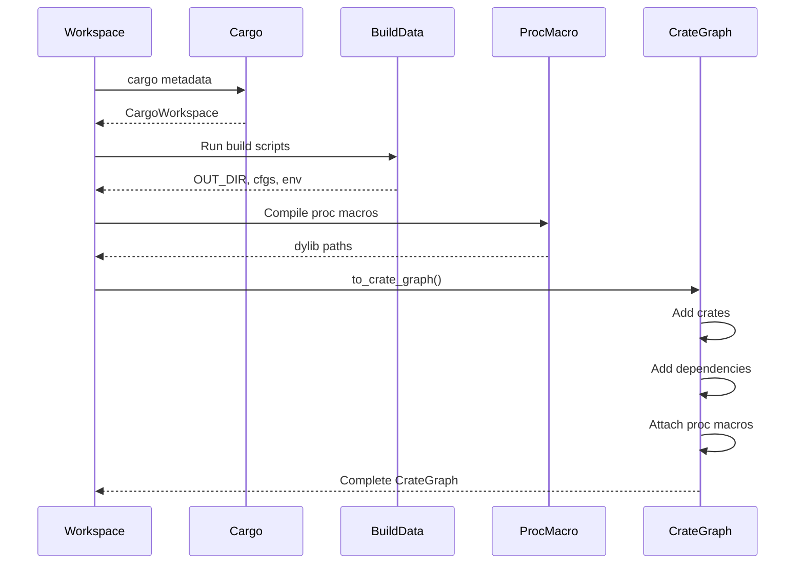

---

## Summary: Entity Counts by Key Files

| File | Entities | Purpose |
|------|----------|---------|
| lsp/ext.rs | 152 | LSP protocol extensions |
| global_state.rs | 44 | Central state management |
| main_loop.rs | 30 | Event loop core |
| diagnostics.rs | 22 | Diagnostic coordination |
| reload.rs | 20 | Workspace reload logic |
| mem_docs.rs | 12 | LSP document tracking |

## Data Flow Summary


This analysis was generated purely from Parseltongue database queries without using grep or glob.
