# Rust-Analyzer Explained Like You're 5

**The Simplest Possible Explanation of How Rust-Analyzer Works**

---

## What IS Rust-Analyzer?

Think of rust-analyzer like a **super-smart assistant** that helps you write Rust code. It's like having a friend who:
- Knows EVERYTHING about Rust
- Can finish your sentences (code completion)
- Can explain what things mean (hover information)
- Can find where things are defined (go to definition)
- Can tell you when you made a mistake (diagnostics)

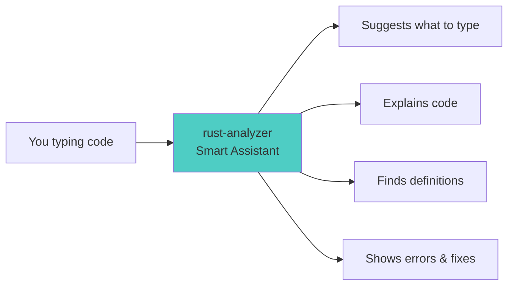

---

## The Big Picture: Like a Restaurant Kitchen

Imagine rust-analyzer is a **restaurant kitchen** preparing your code:

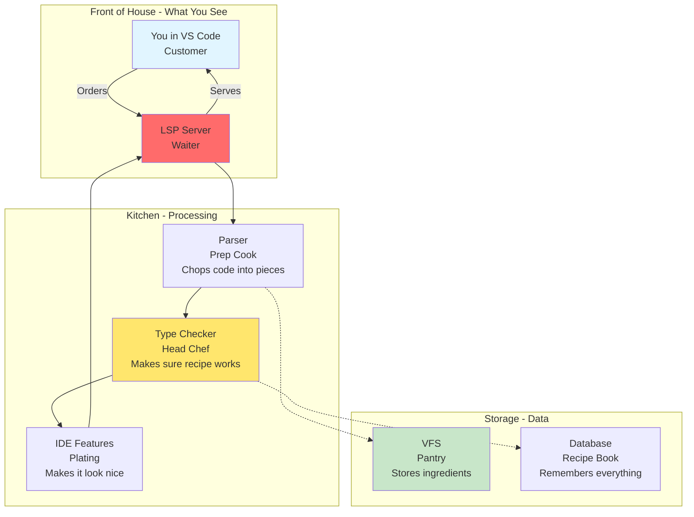

---

## The 5 Main Parts

### 1. **The Waiter** (LSP Server) - `rust-analyzer` crate

**What it does:** Talks between you and the kitchen

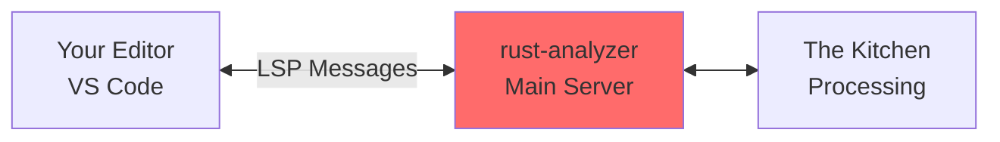

**Files:**
- `main_loop.rs` - Takes orders (waits for events)
- `global_state.rs` - Remembers what's happening
- `handlers/` - Does specific tasks

**ELI5:** Like a waiter who takes your order, brings it to the kitchen, and brings back your food. But instead of food, it's code suggestions!

---

### 2. **The Prep Cook** (Parser) - `syntax` and `parser` crates

**What it does:** Cuts your code into organized pieces

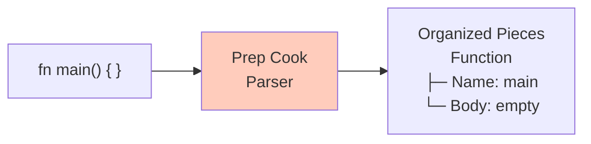

**How it works:**
1. Takes raw code text
2. Breaks it into tokens (words)
3. Arranges tokens into a tree
4. Even if code has errors, makes the best tree possible!

**ELI5:** Like cutting vegetables into nice pieces. Even if a carrot is weird-shaped, you still cut it up as best you can!

---

### 3. **The Recipe Checker** (HIR) - `hir-def` and `hir-ty` crates

**What it does:** Makes sure your "recipe" (code) makes sense

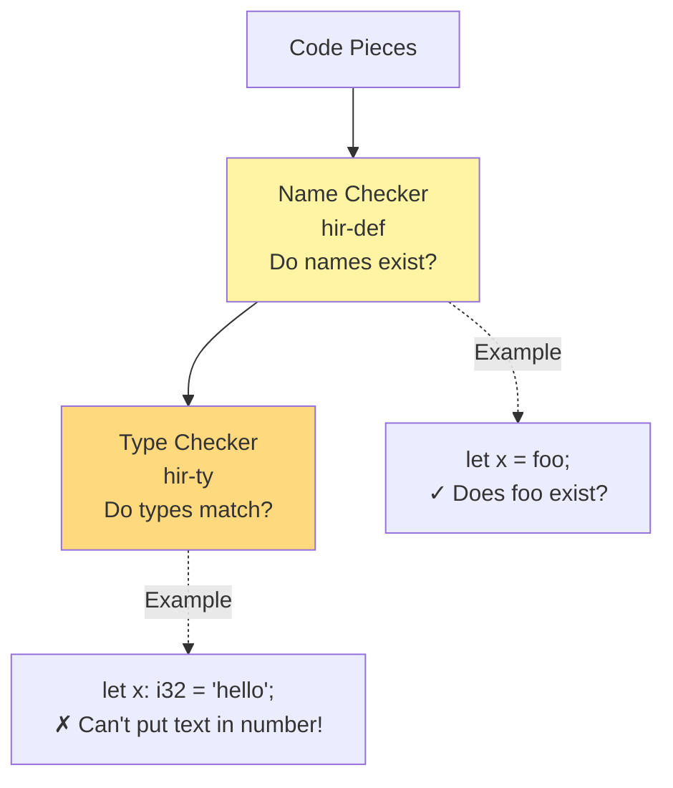

**ELI5:**
- **hir-def:** "Wait, what is 'foo'? Is that a thing we have?"
- **hir-ty:** "You're trying to put water in a salt shaker. That doesn't work!"

---

### 4. **The Plater** (IDE Features) - `ide` crates

**What it does:** Makes everything look nice and useful

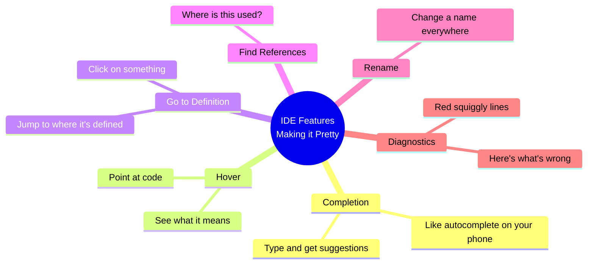

**ELI5:** Like when a fancy restaurant puts your food on a nice plate with garnish. Same food, but now it's beautiful and easy to understand!

---

### 5. **The Memory** (Database) - `base-db` crate using Salsa

**What it does:** Remembers everything so it doesn't have to recalculate

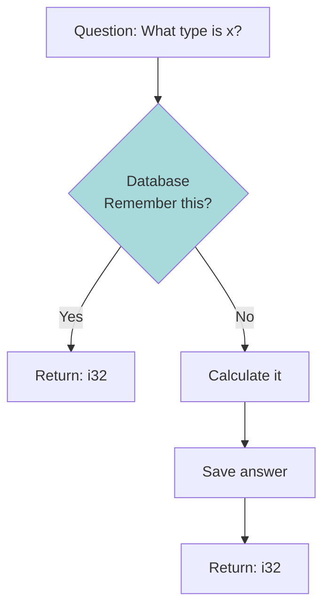

**Smart part:** If file A changes but file B didn't, only recalculate file A!

**ELI5:** Like when you do a math problem once, write down the answer, and if someone asks the same question, you just look at your notes instead of solving it again!

---

## How a Request Works: Step by Step

Let's say you type `foo.` and want suggestions:

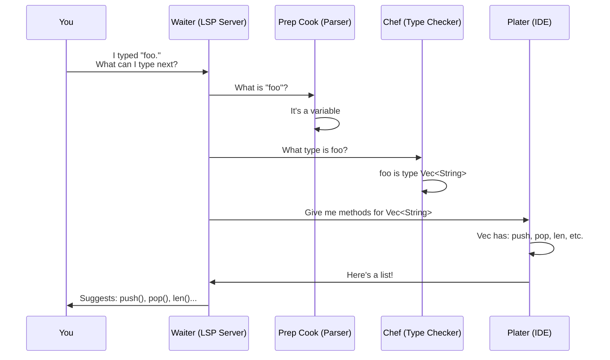

---

## The Magic Trick: Incremental Updates

**The Problem:** If you change one character, do you re-analyze the ENTIRE project? (NO! That's slow!)

**The Solution:** Only re-check what changed!

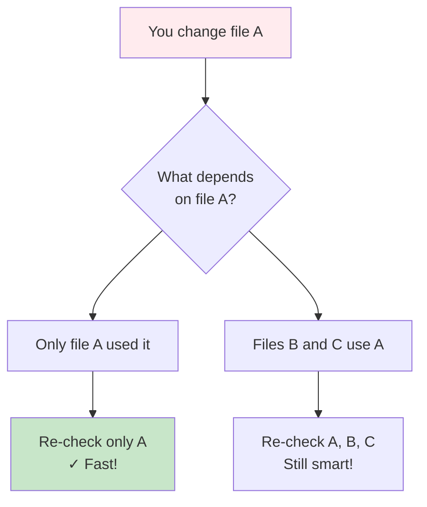

**ELI5:** If you change the tomato sauce recipe, you don't need to remake the bread. Only remake dishes that use tomato sauce!

---

## Key Concepts Simplified

### Concept 1: Syntax Tree (CST)

**Normal people see:**
```rust
fn main() {
    let x = 42;
}
```

**Rust-analyzer sees:**
```
Function
├── name: "main"
├── parameters: (empty)
└── body:
    └── LetStmt
        ├── name: "x"
        └── value: 42
```

**ELI5:** Like an outline of a book. Main chapter → Sub-chapter → Paragraph → Sentence.

---

### Concept 2: Salsa Database

Think of it like a **smart spreadsheet**:

| Question | Answer | Dependencies |
|----------|--------|--------------|
| What's the type of `x`? | `i32` | Function body of `main` |
| What's in file A? | "fn foo..." | File system |

If File A changes → Mark "What's in file A?" as outdated → Recalculate only when needed

**ELI5:** Excel formulas! Change one cell, only formulas using that cell recalculate.

---

### Concept 3: LSP (Language Server Protocol)

**Without LSP:** Every editor (VS Code, Vim, Emacs) needs its own Rust plugin. 😫

**With LSP:** One rust-analyzer works with ALL editors! 🎉

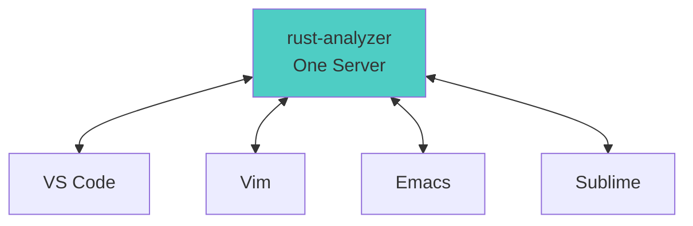

**ELI5:** Like having a universal charging cable that works with all phones, instead of a different cable for each brand!

---

## What Can You DO With Rust-Analyzer?

### As a User (In Your Editor):

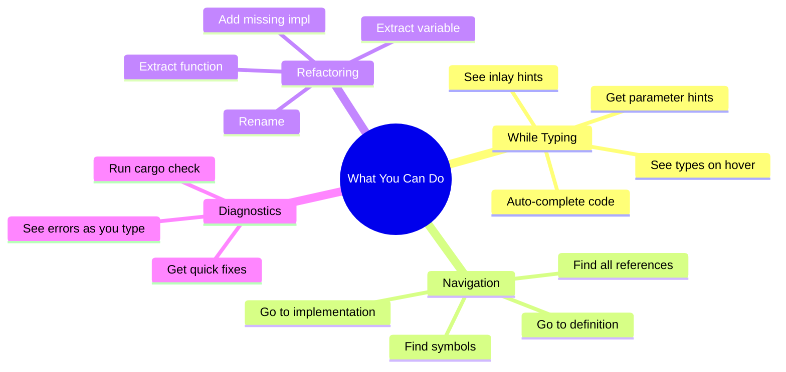

---

### As a Developer (Using the API):

**Example: Build a code analysis tool**

```rust
// Super simple!
let analysis = Analysis::new(...);

// Find all functions
let symbols = analysis.symbol_search(Query::new("fn"))?;

// Get type at cursor
let hover = analysis.hover(position)?;

// Get completions
let completions = analysis.completions(position)?;
```

---

## The Folder Structure (Simplified)

```
rust-analyzer/
├── crates/
│   ├── rust-analyzer/        ← The Waiter (LSP server)
│   ├── parser/               ← The Prep Cook (cuts code)
│   ├── syntax/               ← Organized Pieces (syntax tree)
│   ├── hir-def/              ← Name Checker
│   ├── hir-ty/               ← Type Checker
│   ├── ide/                  ← The Plater (features)
│   ├── ide-completion/       ← Autocomplete magic
│   ├── base-db/              ← The Memory (database)
│   └── vfs/                  ← File storage
```

---

## Common Questions

### Q: Why is it called HIR?
**A:** High-level Intermediate Representation. It's like a simplified version of your code that's easier to analyze.

### Q: What's a macro?
**A:** Like a template that generates code. Rust-analyzer expands these to see the real code.

### Q: Why is it so fast?
**A:**
1. Only recalculates what changed (Salsa)
2. Works in background (doesn't block you)
3. Remembers everything (caching)

### Q: Can I use it outside VS Code?
**A:** Yes! Works with Vim, Emacs, Sublime, and any LSP-compatible editor.

---

## Summary: The Journey of Your Code


---

## Real-World Analogy

Imagine you're writing a letter:

1. **Parser:** Reads your handwriting, understands words
2. **Name Checker:** "Is 'John' a person you know?"
3. **Type Checker:** "Can you actually mail this to the address you wrote?"
4. **IDE Features:** Suggests: "Did you mean 'Dear John' instead of 'Deer John'?"
5. **Salsa Database:** Remembers you already checked the first paragraph, so it doesn't recheck it

**Result:** Your smart word processor that helps you write better letters faster!

---

## Final Takeaway

Rust-analyzer is like having a **super-smart co-pilot** who:
- ✅ Understands your code perfectly
- ✅ Suggests what you might want to type
- ✅ Explains confusing parts
- ✅ Catches mistakes before you even compile
- ✅ Works in any editor you like
- ✅ Is blazingly fast because it's clever about not repeating work

And it's all **open source** so anyone can contribute to making it better! 🎉

