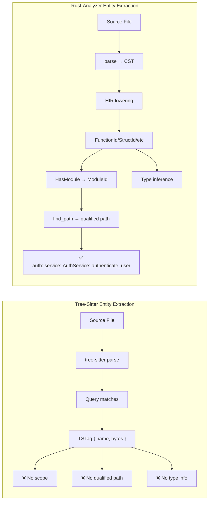
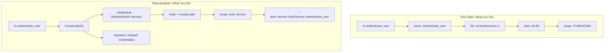

# Rust-Analyzer vs Tree-Sitter: Entity Identity & Primary Key Extraction

**Analysis Date:** 2026-01-29
**Purpose:** Compare entity extraction capabilities for V216 primary key requirements
**Conclusion:** Rust-Analyzer is strictly superior for Rust-only codebases

---

## Executive Summary

Rust-analyzer provides **semantic entity identity** that tree-sitter cannot match. For V216's canonical entity key requirement:

```
language|||kind|||scope|||name|||file_path|||discriminator
```

**The `scope` component is the critical differentiator.** Tree-sitter produces syntax-level tags (byte ranges, names) but cannot resolve:
- Fully-qualified module paths
- Cross-file import resolution
- Type-based disambiguation
- Re-export following

Rust-analyzer provides all of these through its HIR (High-level Intermediate Representation) layer.

---

## Capability Comparison Matrix

| V216 Requirement | Rust-Analyzer | Tree-Sitter | Notes |
|------------------|---------------|-------------|-------|
| `language` | ✅ Built-in (Rust only) | ✅ 12+ languages | RA is Rust-specific |
| `kind` | ✅ `ModuleDefId` variants | ✅ Query captures | Both adequate |
| `scope` | ✅ **Full module path** | ❌ **Cannot resolve** | **Critical gap** |
| `name` | ✅ From AST | ✅ From AST | Both adequate |
| `file_path` | ✅ Via `HasModule` trait | ✅ Direct | Both adequate |
| `discriminator` | ✅ **Type signatures, generics** | ❌ No type info | **Critical gap** |

---

## Rust-Analyzer's Entity ID Architecture

### Core ID Types

From `19-cross-cutting-architecture-patterns.md`:

```rust
/// Every Rust entity resolves to a ModuleDefId
pub enum ModuleDefId {
    ModuleId(ModuleId),
    FunctionId(FunctionId),
    AdtId(AdtId),           // Struct, Enum, Union
    EnumVariantId(EnumVariantId),
    ConstId(ConstId),
    StaticId(StaticId),
    TraitId(TraitId),
    TypeAliasId(TypeAliasId),
    MacroId(MacroId),
    BuiltinType(BuiltinType),
}
```

### The HasModule Trait - Key for Scope Resolution

From `19-cross-cutting-architecture-patterns.md`:

```rust
/// Every definition knows which module it belongs to
pub trait HasModule {
    fn module(&self, db: &dyn DefDatabase) -> Option<ModuleId>;
}

impl HasModule for ModuleDefId {
    fn module(&self, db: &dyn DefDatabase) -> Option<ModuleId> {
        Some(match self {
            ModuleDefId::ModuleId(id) => *id,
            ModuleDefId::FunctionId(id) => id.module(db),
            ModuleDefId::AdtId(id) => id.module(db),
            ModuleDefId::EnumVariantId(id) => id.module(db),
            ModuleDefId::ConstId(id) => id.module(db),
            ModuleDefId::StaticId(id) => id.module(db),
            ModuleDefId::TraitId(id) => id.module(db),
            ModuleDefId::TypeAliasId(id) => id.module(db),
            ModuleDefId::MacroId(id) => id.module(db),
            ModuleDefId::BuiltinType(_) => return None,
        })
    }
}
```

**Why This Matters:** From any entity, you can walk up to its containing module, then to its crate, producing the full qualified path.

---

## Scope Resolution: The Killer Feature

### The find_path API

From `05-ide-assists-patterns.md`:

```rust
// Find the canonical path to any entity, respecting all Rust semantics
let cfg = ctx.config.find_path_config(ctx.sema.is_nightly(module.krate(ctx.db())));
let trait_path = module.find_path(ctx.db(), ModuleDef::Trait(trait_), cfg)?;

// Returns: "std::ops::Deref" or "core::ops::Deref" depending on:
// - Edition (2015/2018/2021)
// - no_std vs std
// - cfg features
// - pub use re-exports
// - prelude imports
```

### Scope Stack Resolution

From `02-hir-def-patterns.md`:

```rust
pub fn resolve_path_in_type_ns(
    &self,
    db: &dyn DefDatabase,
    path: &ModPath,
) -> Option<(TypeNs, Option<usize>)> {
    // Walks the scope stack in reverse order (inner shadows outer):
    // 1. ExprScope - local bindings
    // 2. GenericParams - type parameters
    // 3. BlockScope - items in block expressions
    // 4. ModuleScope - module items and imports
    
    for scope in self.scopes() {
        if let Some(res) = scope.resolve_name_in_type_ns(db, name) {
            return Some(res);
        }
    }
    // Falls back to module-level resolution
    self.module_scope.resolve_path_in_type_ns(db, path)
}
```

---

## What Tree-Sitter Provides (And What It Lacks)

### Tree-Sitter Tag Structure

From `tree-sitter-idiomatic-patterns/03-tags-patterns.md`:

```rust
#[repr(C)]
pub struct TSTag {
    pub start_byte: u32,
    pub end_byte: u32,
    pub name_start_byte: u32,
    pub name_end_byte: u32,
    pub line_start_byte: u32,
    pub line_end_byte: u32,
    pub start_point: TSPoint,  // row, column
    pub end_point: TSPoint,
    pub utf16_start_column: u32,
    pub utf16_end_column: u32,
    pub docs_start_byte: u32,
    pub docs_end_byte: u32,
    pub syntax_type_id: u32,
    pub is_definition: bool,
}
```

### What Tree-Sitter CAN Do

- ✅ Extract entity names from syntax
- ✅ Track byte ranges and line positions
- ✅ Support 12+ languages with unified API
- ✅ Parse at ~100k lines/second
- ✅ Excellent error recovery (produces partial trees)
- ✅ Incremental reparsing

### What Tree-Sitter CANNOT Do

- ❌ **Cross-file resolution** - Cannot follow imports
- ❌ **Qualified path computation** - No `std::collections::HashMap`
- ❌ **Type information** - Cannot distinguish overloads
- ❌ **Import following** - Cannot resolve `use crate::foo::Bar`
- ❌ **Trait impl discovery** - Cannot find impl blocks
- ❌ **Macro expansion** - Sees macro calls, not expansions

---

## Visual Comparison

### Entity Identity Flow



### Scope Resolution Comparison



---

## V216 Primary Key Construction

### With Rust-Analyzer (Full Capability)

```rust
fn build_entity_key(db: &dyn HirDatabase, def_id: ModuleDefId) -> String {
    // 1. Language (always Rust)
    let language = "rust";
    
    // 2. Kind from ModuleDefId variant
    let kind = match def_id {
        ModuleDefId::FunctionId(_) => "fn",
        ModuleDefId::AdtId(AdtId::StructId(_)) => "struct",
        ModuleDefId::AdtId(AdtId::EnumId(_)) => "enum",
        ModuleDefId::TraitId(_) => "trait",
        ModuleDefId::TypeAliasId(_) => "type_alias",
        ModuleDefId::ConstId(_) => "const",
        ModuleDefId::StaticId(_) => "static",
        ModuleDefId::ModuleId(_) => "module",
        ModuleDefId::MacroId(_) => "macro",
        ModuleDefId::EnumVariantId(_) => "variant",
        ModuleDefId::BuiltinType(_) => "builtin",
    };
    
    // 3. Scope from HasModule + find_path
    let module = def_id.module(db).expect("entity has module");
    let scope = module.find_path(db, def_id.into(), FindPathConfig::default())
        .unwrap_or_default()
        .to_string();
    
    // 4. Name from HIR
    let name = match def_id {
        ModuleDefId::FunctionId(id) => id.name(db).to_string(),
        ModuleDefId::AdtId(id) => id.name(db).to_string(),
        // ... etc
    };
    
    // 5. File path from module
    let file_path = module.definition_source(db).file_id;
    
    // 6. Discriminator from signature/generics
    let discriminator = compute_discriminator(db, def_id);
    
    format!("{language}|||{kind}|||{scope}|||{name}|||{file_path}|||{discriminator}")
}
```

### With Tree-Sitter (Degraded Capability)

```rust
fn build_entity_key_tree_sitter(tag: TSTag, source: &[u8]) -> String {
    // 1. Language (from file extension)
    let language = detect_language(file_path);
    
    // 2. Kind (from syntax_type_id)
    let kind = syntax_type_names[tag.syntax_type_id as usize];
    
    // 3. Scope - ❌ CANNOT COMPUTE
    let scope = "UNKNOWN";  // Or best-effort heuristic
    
    // 4. Name (from byte range)
    let name = std::str::from_utf8(&source[tag.name_start_byte..tag.name_end_byte]);
    
    // 5. File path (from input)
    let file_path = tag.file_path;
    
    // 6. Discriminator - ❌ NO TYPE INFO
    let discriminator = format!("{}-{}", tag.start_byte, tag.end_byte);
    
    format!("{language}|||{kind}|||{scope}|||{name}|||{file_path}|||{discriminator}")
}
```

---

## Discriminator: Signature-Based Disambiguation

Rust-analyzer can distinguish overloaded entities by signature:

From `01-hir-ty-patterns.md`:

```rust
// Type inference provides full signatures
fn infer_signature(db: &dyn HirDatabase, func: FunctionId) -> String {
    let body = db.body(func.into());
    let infer = db.infer(func.into());
    
    // Get parameter types
    let params: Vec<String> = body.params.iter()
        .map(|&pat| infer.type_of_pat[pat].display(db).to_string())
        .collect();
    
    // Get return type
    let ret = infer.return_type.display(db).to_string();
    
    format!("({}) -> {}", params.join(", "), ret)
}

// Example outputs:
// "authenticate_user" → "(Credentials) -> Result<Token, AuthError>"
// "authenticate_user" → "(&str, &str) -> Result<Token, AuthError>"
// These are DIFFERENT entities despite same name!
```

---

## Trade-off Summary

| Factor | Rust-Analyzer | Tree-Sitter |
|--------|---------------|-------------|
| **Semantic accuracy** | ★★★★★ | ★★☆☆☆ |
| **Cross-file resolution** | ✅ Yes | ❌ No |
| **Type information** | ✅ Full inference | ❌ None |
| **Scope/namespace** | ✅ Qualified paths | ❌ Unknown |
| **Overload disambiguation** | ✅ By signature | ❌ Impossible |
| **Language support** | 1 (Rust) | 12+ languages |
| **Parsing speed** | Slower (semantic) | ~100k lines/sec |
| **Error recovery** | Good | Excellent |
| **Embedding complexity** | High (Salsa DB) | Low (C library) |
| **Memory usage** | Higher | Lower |

---

## Recommendation for V216

### Commit to Rust-Only → Use Rust-Analyzer

If V216 targets Rust exclusively:

1. **Use rust-analyzer's HIR layer** as the primary extraction engine
2. **Leverage `ModuleDefId` + `HasModule`** for stable entity identity
3. **Use `find_path()`** for canonical qualified paths
4. **Use type inference** for signature-based disambiguation
5. **Get `DefWithBodyId`** for function-level analysis

### Integration Points

```rust
// Core types from rust-analyzer to use:
use hir::{Semantics, ModuleDef, Function, Struct, Enum, Trait, Type};
use hir_def::{ModuleDefId, FunctionId, AdtId, TraitId, GenericDefId};
use base_db::{FileId, CrateId};

// Key APIs:
// 1. Semantics::new(&db) - Entry point
// 2. def.module(db) - Scope resolution via HasModule
// 3. module.find_path(db, def, config) - Qualified path
// 4. db.infer(def) - Type signatures
// 5. db.body(def) - Function body for call extraction
```

### What This Enables for V216

| BR01 Decision | Rust-Analyzer Support |
|---------------|----------------------|
| **BR01-PK-D1**: Canonical entity identity | ✅ `ModuleDefId` is canonical |
| **BR01-PK-D2**: Shared key across retrieval/graph | ✅ DefId works everywhere |
| **BR01-PK-D3**: Chunk → Entity mapping | ✅ FileId + byte range → DefId |
| **BR01-PK-D4**: Metadata-first pointers | ✅ DefId is 32-bit, cheap to store |
| **BR01-PK-D5**: Source-on-read | ✅ FileId resolves to VFS |
| **BR01-PK-D6**: Freshness checks | ✅ Salsa tracks revisions |

---

## Files Analyzed

| Document | Key Findings |
|----------|--------------|
| `01-hir-ty-patterns.md` | Type inference, DefWithBodyId, generics |
| `02-hir-def-patterns.md` | ModuleDefId, scope resolution, HasModule |
| `03-tags-patterns.md` | Tree-sitter tag structure, limitations |
| `05-ide-assists-patterns.md` | find_path API, semantic refactorings |
| `07-ide-db-patterns.md` | FamousDefs, standard library resolution |
| `19-cross-cutting-architecture-patterns.md` | Entity ID design, HasModule trait |

---

## Conclusion

**For Rust-only V216, rust-analyzer is the correct choice.**

Tree-sitter is excellent for:
- Multi-language support
- Fast syntax-only parsing
- Simple tooling integration

Rust-analyzer is essential for:
- Semantic entity identity
- Cross-file dependency tracking
- Type-aware analysis
- Accurate scope resolution

The V216 primary key format requires `scope` and `discriminator` components that only semantic analysis can provide. Tree-sitter fundamentally cannot produce these.

---

*Research compiled: 2026-01-29*
*Sources: rust-analyzer analysis, tree-sitter patterns, V216 PRD*
