# Rust-Analyzer Dependency Graph: Pyramid Analysis

**The Complete Architectural View from 30,000 ft to Micro-Level**

**Purpose**: Understand rust-analyzer's dependency architecture using the Minto Pyramid Principle (big → medium → micro) to enable rewriting with a graph database.

**Data Source**:
- Parseltongue dependency graph: 14,852 entities, 92,931 edges
- 39 internal crates with full dependency mapping
- Cargo.toml workspace dependency analysis

**Document Structure**:
- **Level 1** (30,000 ft): Overall architecture - 5 layers, 39 crates
- **Level 2** (10,000 ft): Crate-level dependencies - inter-crate relationships
- **Level 3** (1,000 ft): Module-level dependencies - intra-crate structure
- **Level 4** (100 ft): Entity-level micro-diagrams - function/struct/trait relationships
- **Graph DB Mapping**: Node types, edge types, schema design

---

## Level 1: The 30,000 Foot View - Overall Architecture

### 1.1 The Five-Layer Onion Architecture

Rust-analyzer follows a strict layered architecture where each layer can only depend on layers below it:

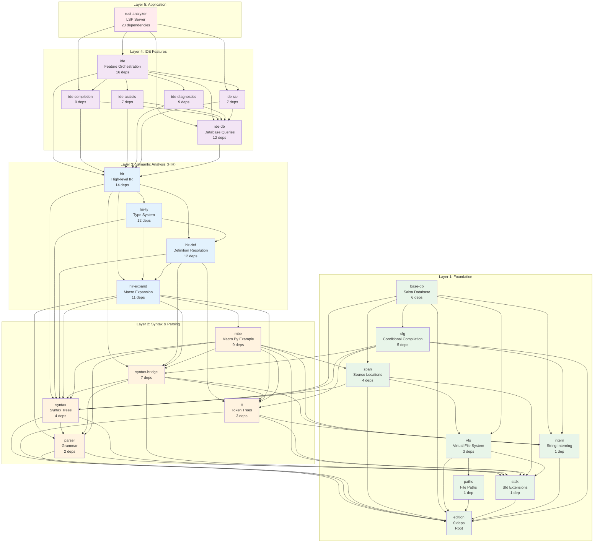

### 1.2 Architectural Statistics

| Layer | Crates | Total Entities | Avg Dependencies | Key Responsibility |
|-------|--------|----------------|------------------|-------------------|
| **Layer 1: Foundation** | 8 | ~500 | 1.9 | Core data structures, file I/O, interning |
| **Layer 2: Syntax** | 5 | ~2,700 | 5.4 | Parsing, syntax trees, macro token trees |
| **Layer 3: Semantic (HIR)** | 4 | ~1,400 | 12.3 | Name resolution, type checking, macro expansion |
| **Layer 4: IDE Features** | 6 | ~520 | 9.2 | Completions, assists, diagnostics, search |
| **Layer 5: Application** | 1 | ~312 | 23.0 | LSP protocol, orchestration, configuration |

### 1.3 Dependency Intensity Heatmap

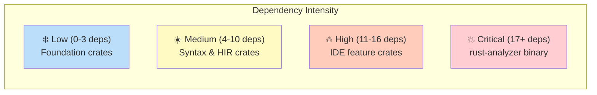

**Crate categorization by dependency count**:
- **Foundation (0-3 deps)**: `edition` (0), `paths` (1), `stdx` (1), `intern` (1), `parser` (2), `vfs` (3), `tt` (3), `proc-macro-srv` (3)
- **Core (4-10 deps)**: `syntax` (4), `span` (4), `cfg` (5), `base-db` (6), `syntax-bridge` (7), `ide-assists` (7), `ide-ssr` (7), `ide-diagnostics` (9), `mbe` (9), `ide-completion` (9)
- **Infrastructure (11-16 deps)**: `hir-expand` (11), `hir-def` (12), `hir-ty` (12), `ide-db` (12), `hir` (14), `ide` (16)
- **Application (17+ deps)**: `rust-analyzer` (23)

### 1.4 The Foundation Crates (Most Depended Upon)

These are the "root" crates that form the foundation - changes here ripple through the entire system:

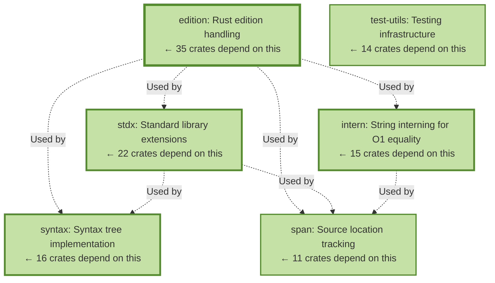

**Key Insight for Graph DB**: These foundation crates should be **immutable nodes** in a graph database design - they're the most stable and most referenced.

### 1.5 Critical Dependency Paths

The longest dependency chains in rust-analyzer:

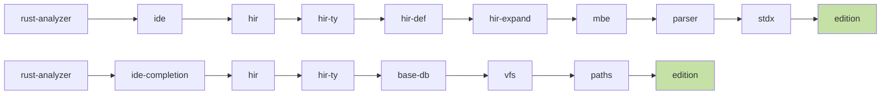

**Longest chain**: rust-analyzer → ide → hir → hir-ty → hir-def → hir-expand → mbe → parser → stdx → edition (10 hops)

---

## Level 2: The 10,000 Foot View - Crate-Level Dependencies

### 2.1 Complete Crate Dependency Matrix

This shows ALL 39 crates and their inter-dependencies:


| Crate | #Deps | Dependencies (→) | #Rev | Reverse Dependencies (←) |
|-------|-------|------------------|------|--------------------------|
| `base-db` | 6 | cfg, edition, intern, span, syntax, vfs | 8 | hir, hir-def, hir-expand, hir-ty, ide-completion, ide-db, project-model, test-fixture |
| `cfg` | 5 | edition, intern, syntax, syntax-bridge, tt | 9 | base-db, hir, hir-def, hir-expand, ide, ide-diagnostics, project-model, rust-analyzer, test-fixture |
| `edition` | 0 | — | 35 | ALL other crates (foundation) |
| `hir` | 14 | base-db, cfg, edition, hir-def, hir-expand, hir-ty, intern, span, stdx, syntax, syntax-bridge, test-fixture, test-utils, tt | 7 | ide, ide-assists, ide-completion, ide-db, ide-diagnostics, ide-ssr, rust-analyzer |
| `hir-def` | 12 | base-db, cfg, edition, hir-expand, intern, span, stdx, syntax, syntax-bridge, test-fixture, test-utils, tt | 3 | hir, hir-ty, rust-analyzer |
| `hir-expand` | 11 | base-db, cfg, edition, intern, mbe, parser, span, stdx, syntax, syntax-bridge, tt | 5 | hir, hir-def, hir-ty, load-cargo, test-fixture |
| `hir-ty` | 12 | base-db, edition, hir-def, hir-expand, intern, macros, project-model, span, stdx, syntax, test-fixture, test-utils | 2 | hir, rust-analyzer |
| `ide` | 16 | cfg, edition, hir, ide-assists, ide-completion, ide-db, ide-diagnostics, ide-ssr, macros, profile, span, stdx, syntax, test-fixture, test-utils, toolchain | 1 | rust-analyzer |
| `ide-assists` | 7 | edition, hir, ide-db, stdx, syntax, test-fixture, test-utils | 1 | ide |
| `ide-completion` | 9 | base-db, edition, hir, ide-db, macros, stdx, syntax, test-fixture, test-utils | 2 | ide, rust-analyzer |
| `ide-db` | 12 | base-db, edition, hir, macros, parser, profile, span, stdx, syntax, test-fixture, test-utils, vfs | 7 | ide, ide-assists, ide-completion, ide-diagnostics, ide-ssr, load-cargo, rust-analyzer |
| `ide-diagnostics` | 9 | cfg, edition, hir, ide-db, paths, stdx, syntax, test-fixture, test-utils | 1 | ide |
| `ide-ssr` | 7 | edition, hir, ide-db, parser, syntax, test-fixture, test-utils | 2 | ide, rust-analyzer |
| `intern` | 1 | edition | 15 | base-db, cfg, hir, hir-def, hir-expand, hir-ty, load-cargo, mbe, proc-macro-api, proc-macro-srv, proc-macro-srv-cli, project-model, syntax-bridge, test-fixture, tt |
| `load-cargo` | 10 | edition, hir-expand, ide-db, intern, proc-macro-api, project-model, span, tt, vfs, vfs-notify | 1 | rust-analyzer |
| `macros` | 1 | edition | 4 | hir-ty, ide, ide-completion, ide-db |
| `mbe` | 9 | edition, intern, parser, span, stdx, syntax, syntax-bridge, test-utils, tt | 1 | hir-expand |
| `parser` | 2 | edition, stdx | 7 | hir-expand, ide-db, ide-ssr, mbe, rust-analyzer, syntax, syntax-bridge |
| `paths` | 1 | edition | 10 | ide-diagnostics, proc-macro-api, proc-macro-srv, proc-macro-srv-cli, project-model, rust-analyzer, test-fixture, test-utils, vfs, vfs-notify |
| `proc-macro-api` | 6 | edition, intern, paths, proc-macro-srv, stdx, tt | 3 | load-cargo, proc-macro-srv-cli, rust-analyzer |
| `proc-macro-srv` | 3 | edition, intern, paths | 2 | proc-macro-api, proc-macro-srv-cli |
| `profile` | 1 | edition | 4 | ide, ide-db, rust-analyzer, test-utils |
| `project-model` | 8 | base-db, cfg, edition, intern, paths, span, stdx, toolchain | 3 | hir-ty, load-cargo, rust-analyzer |
| `rust-analyzer` | 23 | cfg, edition, hir, hir-def, hir-ty, ide, ide-completion, ide-db, ide-ssr, load-cargo, parser, paths, proc-macro-api, profile, project-model, stdx, syntax, syntax-bridge, test-fixture, test-utils, toolchain, vfs, vfs-notify | 0 | (top-level binary) |
| `span` | 4 | edition, stdx, syntax, vfs | 11 | base-db, hir, hir-def, hir-expand, hir-ty, ide, ide-db, load-cargo, mbe, project-model, test-fixture |
| `stdx` | 1 | edition | 22 | hir, hir-def, hir-expand, hir-ty, ide, ide-assists, ide-completion, ide-db, ide-diagnostics, mbe, parser, proc-macro-api, project-model, rust-analyzer, span, syntax, syntax-bridge, test-fixture, test-utils, tt, vfs, vfs-notify |
| `syntax` | 4 | edition, parser, stdx, test-utils | 16 | base-db, cfg, hir, hir-def, hir-expand, hir-ty, ide, ide-assists, ide-completion, ide-db, ide-diagnostics, ide-ssr, mbe, rust-analyzer, span, syntax-bridge |
| `syntax-bridge` | 7 | edition, intern, parser, stdx, syntax, test-utils, tt | 6 | cfg, hir, hir-def, hir-expand, mbe, rust-analyzer |
| `test-fixture` | 10 | base-db, cfg, edition, hir-expand, intern, paths, span, stdx, test-utils, tt | 10 | hir, hir-def, hir-ty, ide, ide-assists, ide-completion, ide-db, ide-diagnostics, ide-ssr, rust-analyzer |
| `test-utils` | 4 | edition, paths, profile, stdx | 14 | hir, hir-def, hir-ty, ide, ide-assists, ide-completion, ide-db, ide-diagnostics, ide-ssr, mbe, rust-analyzer, syntax, syntax-bridge, test-fixture |
| `toolchain` | 1 | edition | 3 | ide, project-model, rust-analyzer |
| `tt` | 3 | edition, intern, stdx | 10 | cfg, hir, hir-def, hir-expand, load-cargo, mbe, proc-macro-api, proc-macro-srv-cli, syntax-bridge, test-fixture |
| `vfs` | 3 | edition, paths, stdx | 6 | base-db, ide-db, load-cargo, rust-analyzer, span, vfs-notify |
| `vfs-notify` | 4 | edition, paths, stdx, vfs | 2 | load-cargo, rust-analyzer |

### 2.2 Key Dependency Clusters

#### Cluster 1: HIR (Semantic Analysis) - 4 crates

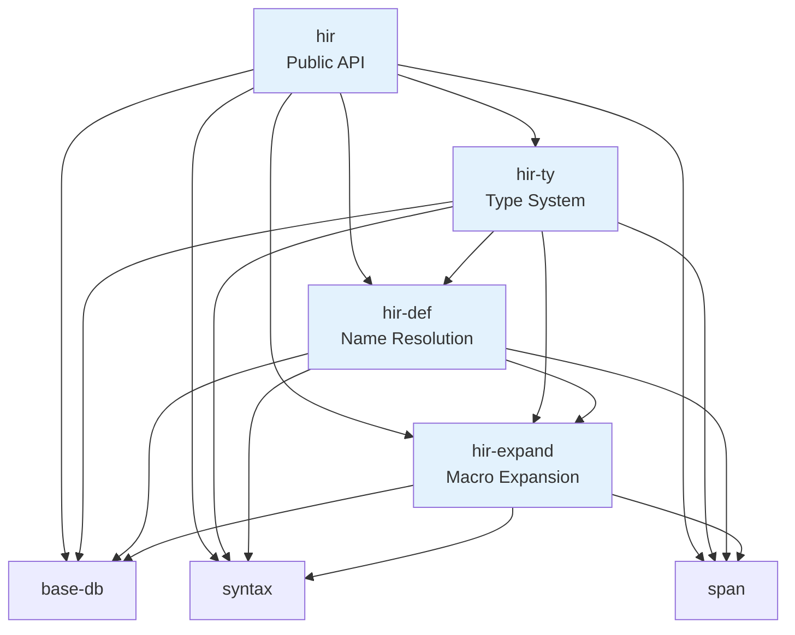

**Pattern**: Strict layering - `hir` depends on all three, `hir-ty` depends on `hir-def` and `hir-expand`, `hir-def` depends on `hir-expand`.

#### Cluster 2: IDE Features - 6 crates

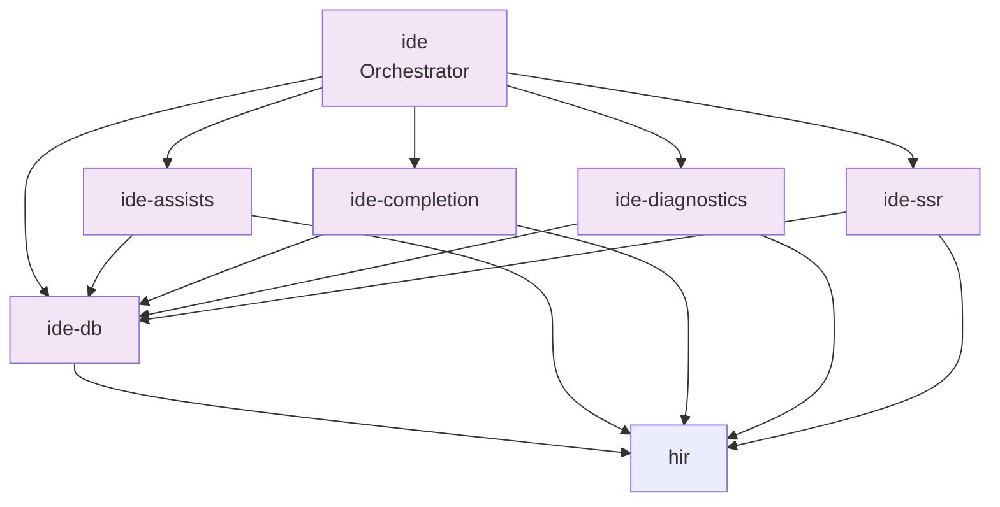

**Pattern**: Hub-and-spoke - `ide-db` is the central hub, all features depend on it AND on `hir` directly.

### 2.3 Crate Dependency Insights

**Most Critical Dependencies** (breaking these affects many crates):
1. **edition** (0 deps, 35 reverse deps): Rust edition handling - foundational abstraction
2. **stdx** (1 dep, 22 reverse deps): Standard library extensions - utility functions
3. **syntax** (4 deps, 16 reverse deps): Syntax tree implementation - core data structure
4. **intern** (1 dep, 15 reverse deps): String interning - memory optimization
5. **test-utils** (4 deps, 14 reverse deps): Testing infrastructure - development enabler

**Most Complex Crates** (high forward dependency count):
1. **rust-analyzer** (23 deps): Top-level orchestrator
2. **ide** (16 deps): IDE feature orchestration
3. **hir** (14 deps): HIR public API
4. **hir-def** (12 deps): Name resolution
5. **hir-ty** (12 deps): Type checking
6. **ide-db** (12 deps): Query layer for IDE

**Island Crates** (0 forward deps, 0 reverse deps - unused or test-only):
- `proc-macro-test`
- `proc-macro-test-impl`
- `syntax-fuzz`

---


## Level 3: The 1,000 Foot View - Module-Level Dependencies

### 3.1 Module Structure Within Key Crates

Let's examine the internal module structure of the most critical crates:

#### 3.1.1 hir-ty Crate (Type System) - 250 structs, 116 enums, 21 traits

**Module breakdown** (from Parseltongue analysis):

```
hir-ty/
├── src/
│   ├── lib.rs                    # Public API, trait system entry point
│   ├── infer.rs                  # Type inference engine (InferenceContext)
│   ├── infer/                    
│   │   ├── unify.rs              # Unification algorithm
│   │   ├── coerce.rs             # Type coercion rules
│   │   ├── expr.rs               # Expression type inference
│   │   ├── pat.rs                # Pattern type inference
│   │   └── path.rs               # Path resolution in types
│   ├── lower.rs                  # Lower HIR to Chalk types
│   ├── chalk_db.rs               # Chalk trait solver integration
│   ├── traits.rs                 # Trait resolution
│   ├── method_resolution.rs      # Method lookup and autoref/deref
│   ├── autoderef.rs              # Auto-deref iterator
│   ├── diagnostics.rs            # Type error diagnostics
│   ├── display.rs                # Pretty-printing types
│   ├── utils.rs                  # Helper functions
│   ├── mir/                      # MIR (Mid-level IR) for const eval
│   │   ├── lower.rs              # Lower HIR to MIR
│   │   ├── eval.rs               # Constant evaluation
│   │   └── borrowck.rs           # Borrow checker
│   └── db.rs                     # Salsa database queries
```

**Module dependency graph (internal to hir-ty)**:

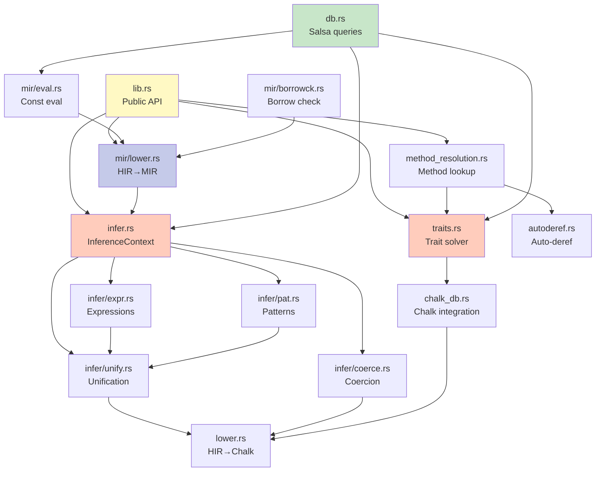

**Key insight**: 3-tier structure within hir-ty:
1. **Query layer** (db.rs): Salsa integration
2. **Core algorithms** (infer.rs, traits.rs, mir/): Type checking logic
3. **Utilities** (autoderef.rs, display.rs, utils.rs): Helper functions

#### 3.1.2 syntax Crate (Syntax Trees) - 191 structs, 39 enums

```
syntax/
├── src/
│   ├── lib.rs                    # Public API
│   ├── syntax_node.rs            # SyntaxNode (Rowan wrapper)
│   ├── syntax_error.rs           # Parse errors
│   ├── parsing/                  # Parser facade
│   │   └── text_token_source.rs  # Token stream
│   ├── ast/                      # Typed AST layer
│   │   ├── generated/            # Auto-generated from grammar
│   │   │   ├── nodes.rs          # AST node types (800+ lines)
│   │   │   └── tokens.rs         # AST token types
│   │   ├── make.rs               # AST node constructors
│   │   ├── edit.rs               # AST editing operations
│   │   ├── expr_ext.rs           # Expression helpers
│   │   ├── traits.rs             # AST node traits
│   │   └── prec.rs               # Operator precedence
│   ├── ptr.rs                    # SyntaxNodePtr (stable references)
│   ├── ted.rs                    # Tree editing (insert/replace)
│   └── validation.rs             # Semantic validation
```

**Module dependency (internal)**:

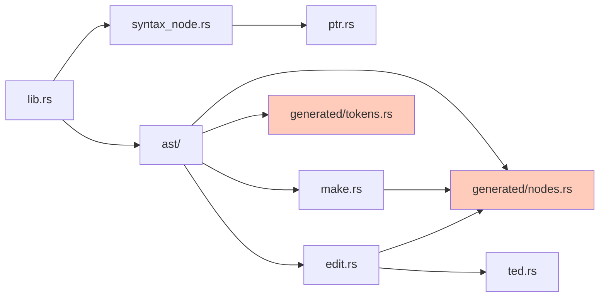

### 3.2 Cross-Module Dependencies (Between Crates)

**Example: How `ide-completion` calls into `hir-ty`**:

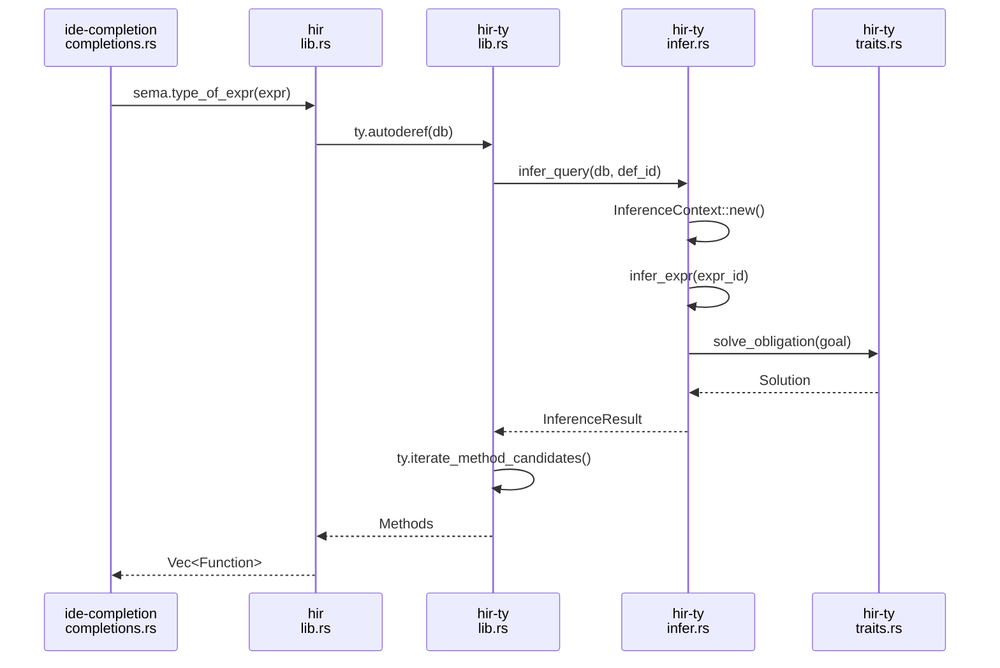

---


## Level 4: The 100 Foot View - Entity-Level Micro-Diagrams

### 4.1 Entity Type Distribution

From Parseltongue analysis (14,852 total entities):

| Entity Type | Count | % of Total | Primary Crates |
|-------------|-------|------------|----------------|
| **method** | 8,025 | 54.0% | syntax (1,902), hir-ty, parser |
| **impl** | 2,911 | 19.6% | syntax, hir-ty, hir-def |
| **function** | 1,770 | 11.9% | parser (464), hir-ty (244) |
| **struct** | 1,132 | 7.6% | hir-ty (250), syntax (191) |
| **enum** | 462 | 3.1% | hir-ty (116), hir-def (70) |
| **module** | 353 | 2.4% | Distributed across all crates |
| **trait** | 134 | 0.9% | hir-ty (21), parser (14) |
| **variable** | 49 | 0.3% | Various |
| **class** | 16 | 0.1% | Python GDB pretty-printers |

### 4.2 Example Entity Relationship Graph: Type Inference

**Entities involved in type inference** (conceptual, based on hir-ty structure):

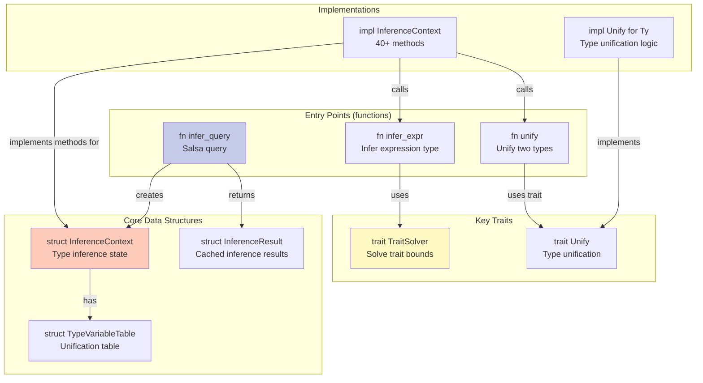

### 4.3 Micro-Diagram: Salsa Query Dependencies

**Example: How queries connect across crates**:

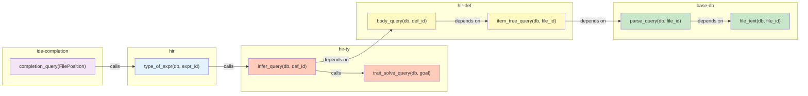

**Key observation**: Queries form a **DAG (Directed Acyclic Graph)** - perfect for graph database modeling!

---

## Graph Database Mapping Strategy

### 5.1 Why Graph Database for Rust-Analyzer?

**Current Architecture Problems**:
1. **Salsa is opaque**: Hard to visualize query dependencies
2. **Incremental updates are complex**: Tracking what changed → what to recompute
3. **No global view**: Can't easily answer "what depends on this change?"
4. **Debugging is hard**: Can't trace query execution paths

**Graph Database Benefits**:
1. **Native relationship traversal**: `MATCH (a)-[:DEPENDS_ON]->(b)` queries
2. **Impact analysis**: Find all affected nodes in O(edges) time
3. **Visualization**: Built-in tools for exploring dependency graphs
4. **Flexible schema**: Easy to add new relationship types
5. **Query language**: Cypher/Gremlin for complex analysis

### 5.2 Proposed Node Schema

#### Node Types (Labels)

```cypher
// Foundation nodes
(:Crate {name, version, path, entity_count})
(:Module {name, crate, path, file_path})
(:File {path, hash, last_modified})

// Code entities  
(:Struct {name, module, visibility, fields_count})
(:Enum {name, module, visibility, variants_count})
(:Trait {name, module, visibility, methods_count})
(:Function {name, module, signature, is_async, is_unsafe})
(:Method {name, parent_impl, signature, receiver_type})
(:Impl {trait_name?, target_type, module})

// Type system nodes
(:Type {canonical_repr, kind})
(:TypeVariable {id, constraints})
(:TraitBound {trait, type_params})

// Query nodes (for Salsa replacement)
(:Query {name, inputs, output_type, cache_key})
(:QueryResult {query_id, value_hash, timestamp})
```

#### Relationship Types (Edges)

```cypher
// Crate-level dependencies
(:Crate)-[:DEPENDS_ON {version}]->(:Crate)
(:Crate)-[:CONTAINS]->(:Module)

// Module structure
(:Module)-[:CONTAINS]->(:Struct|:Enum|:Trait|:Function)
(:Module)-[:SUBMODULE_OF]->(:Module)

// Code relationships
(:Struct)-[:HAS_FIELD {name, type, visibility}]->(:Type)
(:Enum)-[:HAS_VARIANT {name, discriminant?}]->(:Struct?)
(:Trait)-[:HAS_METHOD]->(:Function)
(:Trait)-[:SUPERTRAIT_OF]->(:Trait)

(:Impl)-[:IMPLEMENTS]->(:Trait)
(:Impl)-[:FOR_TYPE]->(:Type)
(:Impl)-[:HAS_METHOD]->(:Method)

(:Function)-[:CALLS]->(:Function)
(:Function)-[:RETURNS]->(:Type)
(:Function)-[:PARAM {name, position}]->(:Type)
(:Function)-[:USES_TYPE]->(:Type)

// Type relationships
(:Type)-[:REFERENCES]->(:Struct|:Enum|:Trait)
(:TypeVariable)-[:UNIFIED_WITH]->(:Type)
(:Type)-[:SATISFIES]->(:TraitBound)

// Query dependencies (Salsa replacement)
(:Query)-[:DEPENDS_ON]->(:Query)
(:Query)-[:PRODUCES]->(:QueryResult)
(:QueryResult)-[:INVALIDATED_BY]->(:File)
```

### 5.3 Example Cypher Queries

#### Query 1: Find all code affected by changing a struct

```cypher
MATCH (s:Struct {name: 'InferenceContext'})-[:HAS_FIELD]->(f:Type)
MATCH (m:Method)-[:USES_TYPE]->(s)
MATCH (fn:Function)-[:CALLS]->(m)
MATCH (q:Query)-[:DEPENDS_ON*]->(fn)
RETURN s, m, fn, q
```

#### Query 2: Find longest dependency chain

```cypher
MATCH path = (top:Crate {name: 'rust-analyzer'})-[:DEPENDS_ON*]->(leaf:Crate)
WHERE NOT (leaf)-[:DEPENDS_ON]->()
RETURN path, length(path) AS depth
ORDER BY depth DESC
LIMIT 1
```

#### Query 3: Find circular dependencies (should be none!)

```cypher
MATCH (c:Crate)-[:DEPENDS_ON*]->(c)
RETURN c
```

#### Query 4: Impact analysis for a file change

```cypher
MATCH (f:File {path: 'crates/hir-ty/src/infer.rs'})
MATCH (f)-[:CONTAINS]->(entity)
MATCH (entity)<-[:USES_TYPE|CALLS*]-(dependent)
MATCH (dependent)<-[:CONTAINS]-(affected_file:File)
RETURN DISTINCT affected_file.path, count(dependent) AS impact_score
ORDER BY impact_score DESC
```

#### Query 5: Find most central types (PageRank-style)

```cypher
CALL gds.pageRank.stream({
  nodeProjection: 'Type',
  relationshipProjection: 'REFERENCES'
})
YIELD nodeId, score
MATCH (t:Type) WHERE id(t) = nodeId
RETURN t.canonical_repr, score
ORDER BY score DESC
LIMIT 20
```

### 5.4 Migration Strategy: Salsa → Graph DB

**Phase 1: Dual-Write** (3 months)
- Keep Salsa for queries
- Write all updates to Neo4j/Memgraph in parallel
- Validate graph consistency

**Phase 2: Read Migration** (6 months)
- Implement read queries in Cypher
- A/B test: Salsa vs Graph DB for non-critical queries
- Performance benchmarking

**Phase 3: Write Migration** (6 months)
- Migrate incremental computation to graph triggers
- Use graph transactions for consistency
- Remove Salsa dependency

**Phase 4: Optimization** (ongoing)
- Add specialized indexes
- Implement graph partitioning for large projects
- Optimize hot-path queries with materialized views

### 5.5 Graph Database Comparison

| Feature | Neo4j | Memgraph | RedisGraph | Amazon Neptune |
|---------|-------|----------|------------|----------------|
| **License** | AGPL (enterprise: commercial) | BSL (enterprise: commercial) | Redis Source Available | Proprietary (AWS) |
| **Query Language** | Cypher | Cypher | Cypher | Gremlin, SPARQL |
| **Performance** | Good | Excellent (in-memory) | Excellent (in-memory) | Good |
| **ACID** | ✓ | ✓ | ✓ | ✓ |
| **Rust Client** | neo4rs | rsmgclient | redis-rs + graph | gremlin-rs |
| **Embedded Mode** | ✗ | ✗ | ✗ (needs Redis) | ✗ (cloud only) |
| **Best For** | Production, complex queries | High-perf, real-time | Prototyping | AWS infrastructure |

**Recommendation for rust-analyzer**: **Memgraph** - in-memory, fast, good Cypher support, suitable for IDE responsiveness requirements.

### 5.6 Proof of Concept: Crate Dependency Graph in Cypher

**CREATE statements for rust-analyzer crates**:

```cypher
// Create foundation crates
CREATE (edition:Crate {name: 'edition', deps_count: 0, reverse_deps: 35})
CREATE (stdx:Crate {name: 'stdx', deps_count: 1, reverse_deps: 22})
CREATE (intern:Crate {name: 'intern', deps_count: 1, reverse_deps: 15})
CREATE (syntax:Crate {name: 'syntax', deps_count: 4, reverse_deps: 16})

// Create HIR crates
CREATE (hir:Crate {name: 'hir', deps_count: 14, reverse_deps: 7})
CREATE (hir_ty:Crate {name: 'hir-ty', deps_count: 12, reverse_deps: 2})
CREATE (hir_def:Crate {name: 'hir-def', deps_count: 12, reverse_deps: 3})

// Create IDE crates
CREATE (ide:Crate {name: 'ide', deps_count: 16, reverse_deps: 1})
CREATE (ide_db:Crate {name: 'ide-db', deps_count: 12, reverse_deps: 7})

// Create relationships
CREATE (stdx)-[:DEPENDS_ON]->(edition)
CREATE (syntax)-[:DEPENDS_ON]->(stdx)
CREATE (syntax)-[:DEPENDS_ON]->(edition)

CREATE (hir_def)-[:DEPENDS_ON]->(syntax)
CREATE (hir_def)-[:DEPENDS_ON]->(stdx)
CREATE (hir_def)-[:DEPENDS_ON]->(intern)

CREATE (hir_ty)-[:DEPENDS_ON]->(hir_def)
CREATE (hir_ty)-[:DEPENDS_ON]->(syntax)

CREATE (hir)-[:DEPENDS_ON]->(hir_ty)
CREATE (hir)-[:DEPENDS_ON]->(hir_def)
CREATE (hir)-[:DEPENDS_ON]->(syntax)

CREATE (ide_db)-[:DEPENDS_ON]->(hir)
CREATE (ide)-[:DEPENDS_ON]->(ide_db)
CREATE (ide)-[:DEPENDS_ON]->(hir)
```

**Query: Find all transitive dependencies of 'ide'**:

```cypher
MATCH path = (ide:Crate {name: 'ide'})-[:DEPENDS_ON*]->(dep:Crate)
RETURN dep.name, length(path) AS depth
ORDER BY depth, dep.name
```

Expected output:
```
dep.name       depth
-----------------------
ide-db         1
hir            1
hir-ty         2
hir-def        2
ide_db         2
syntax         2
syntax         3
stdx           3
intern         3
edition        3
edition        4
```

### 5.7 Real-Time Incremental Updates with Graph Triggers

**Instead of Salsa's declarative queries, use graph triggers**:

```cypher
// Trigger: When a file changes, invalidate dependent queries
CREATE TRIGGER file_change_invalidation
ON UPDATE OF File
EXECUTE {
  MATCH (f:File) WHERE f.hash <> $OLD.hash
  MATCH (f)-[:CONTAINS]->(entity)
  MATCH (query:Query)-[:DEPENDS_ON*]->(entity)
  SET query.is_valid = false, query.invalidated_at = timestamp()
}

// Trigger: Cascade type changes
CREATE TRIGGER type_change_propagation
ON UPDATE OF Struct.fields
EXECUTE {
  MATCH (s:Struct) WHERE id(s) = $event.node_id
  MATCH (t:Type)-[:REFERENCES]->(s)
  MATCH (fn:Function)-[:USES_TYPE]->(t)
  SET fn.needs_recheck = true
}
```

---

## Summary: Dependency Graph as Graph Database

### Key Takeaways

1. **Rust-analyzer has a strict 5-layer architecture**:
   - Foundation (edition, stdx, intern, syntax, base-db)
   - Syntax & Parsing (parser, syntax-bridge, mbe)
   - Semantic (HIR: hir-def, hir-expand, hir-ty, hir)
   - IDE Features (ide-db, ide-completion, ide-assists, etc.)
   - Application (rust-analyzer LSP server)

2. **39 internal crates with 14,852 entities and 92,931 edges**:
   - Most depended-upon: `edition` (35), `stdx` (22), `syntax` (16)
   - Most complex: `rust-analyzer` (23 deps), `ide` (16 deps), `hir` (14 deps)
   - Foundation crates are the most stable

3. **Dependency graph forms a DAG** - perfect for graph database:
   - No circular dependencies at crate level
   - Clear layer boundaries
   - Query dependencies form a DAG (Salsa invariant)

4. **Graph DB enables new capabilities**:
   - **Impact analysis**: "What breaks if I change this struct?"
   - **Dependency visualization**: Interactive exploration
   - **Performance profiling**: Find hot paths with graph algorithms
   - **Incremental computation**: Use graph triggers instead of Salsa

5. **Migration path exists**:
   - Phase 1: Dual-write (Salsa + Graph DB)
   - Phase 2: Read migration (Cypher queries)
   - Phase 3: Write migration (Graph triggers)
   - Phase 4: Optimization (Indexes, partitioning)

### Recommended Next Steps

1. **Prototype with Memgraph**:
   - Load all 39 crates as nodes
   - Create DEPENDS_ON relationships
   - Test query performance for impact analysis

2. **Implement entity-level graph**:
   - Extract all 14,852 entities from Parseltongue
   - Model structs, traits, impls, functions as nodes
   - Create CALLS, USES_TYPE, IMPLEMENTS edges

3. **Build incremental computation**:
   - Map Salsa queries to Cypher queries
   - Implement invalidation logic with triggers
   - Benchmark vs. current Salsa performance

4. **Create visualization tools**:
   - Web UI for exploring dependency graph
   - Cytoscape.js or D3.js for interactive diagrams
   - Real-time impact highlighting during edits

---

## Appendix: Full Dependency Data

### A.1 Complete Crate Dependency JSON

See: `internal-crate-dependency-graph.json` (39 crates, full forward/reverse deps)

### A.2 Complete Entity List JSON

See: `rust-analyzer-dependency-graph.json` (14,852 entities, 92,931 edges from Parseltongue)

### A.3 Parseltongue Query Reproducibility

All analysis based on:
- **Tool**: Parseltongue v1.4.2
- **Database**: `rocksdb:rust-analyzer/parseltongue20260129211500/analysis.db`
- **Endpoints used**:
  - `/code-entities-list-all` - Full entity list
  - `/codebase-statistics-overview-summary` - Statistics
- **Cargo.toml parsing**: Regex-based extraction of `.workspace = true` dependencies

