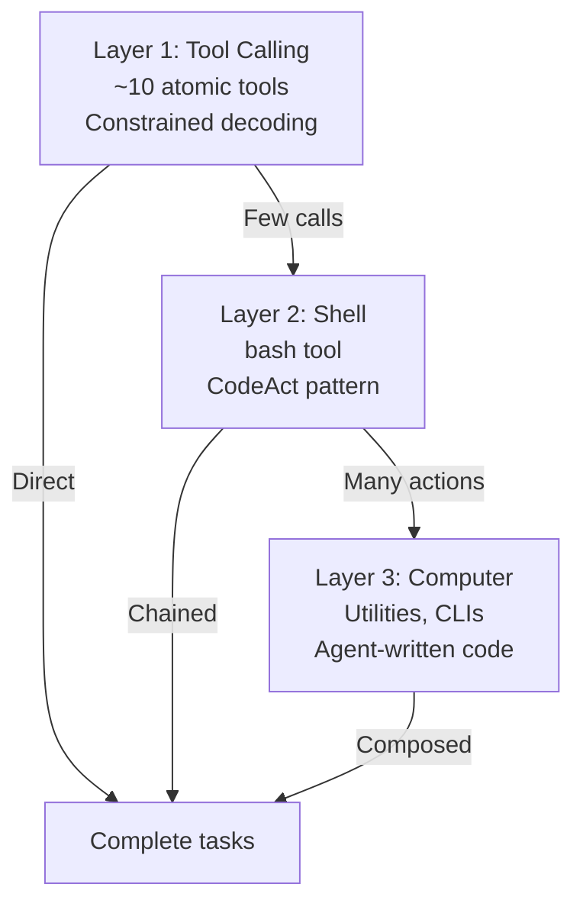
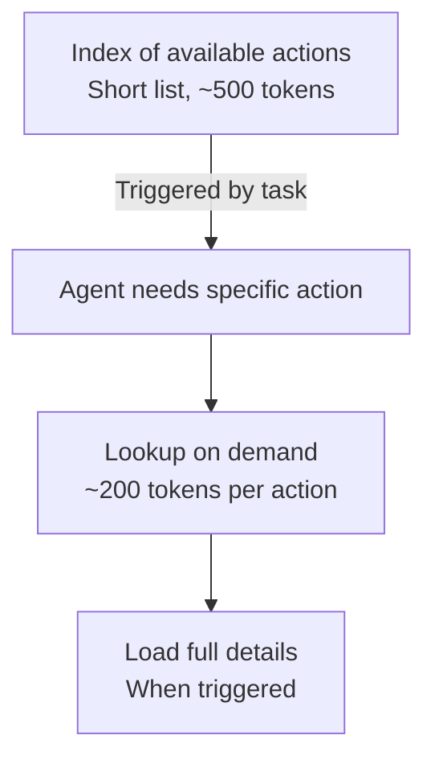
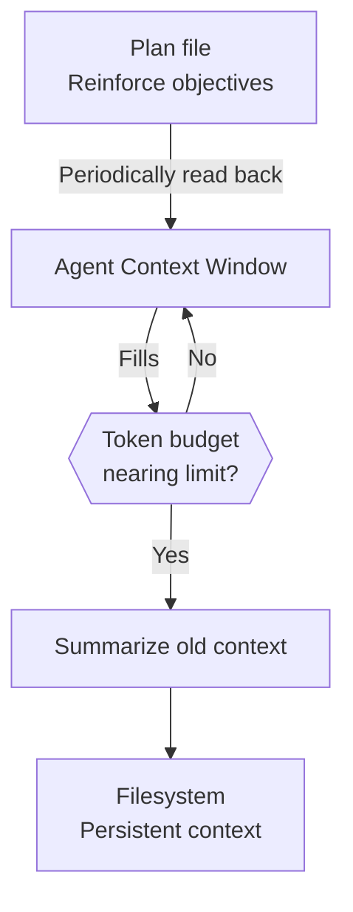
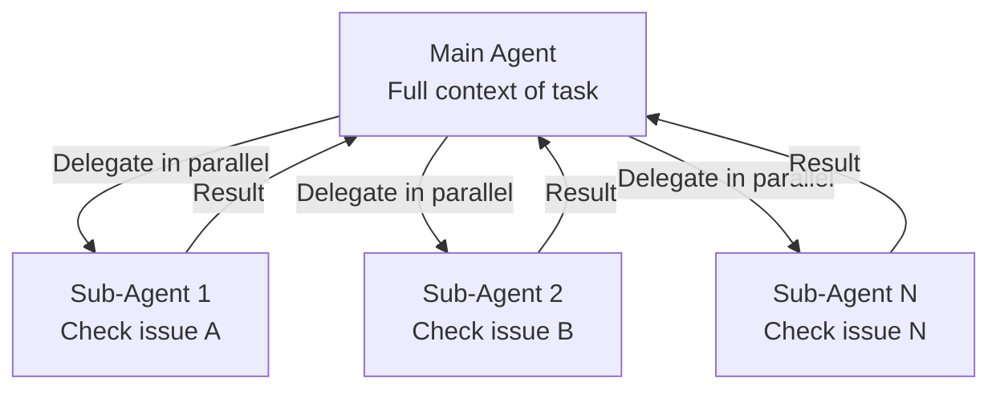
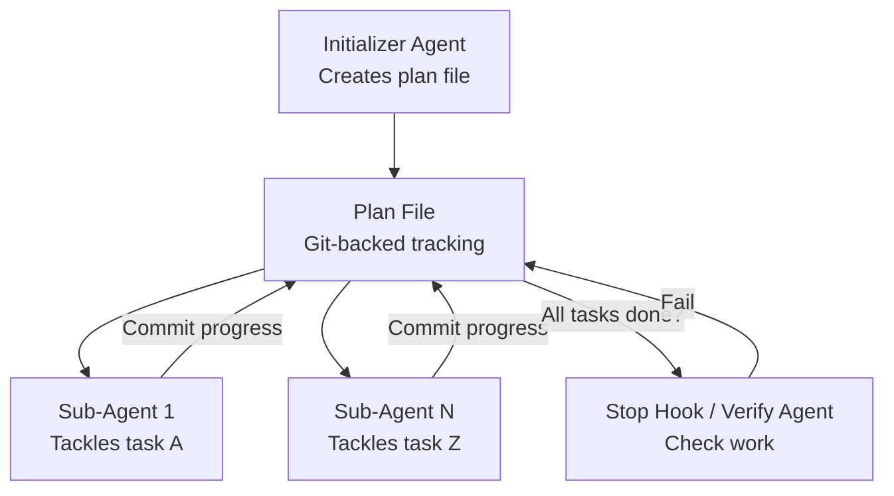
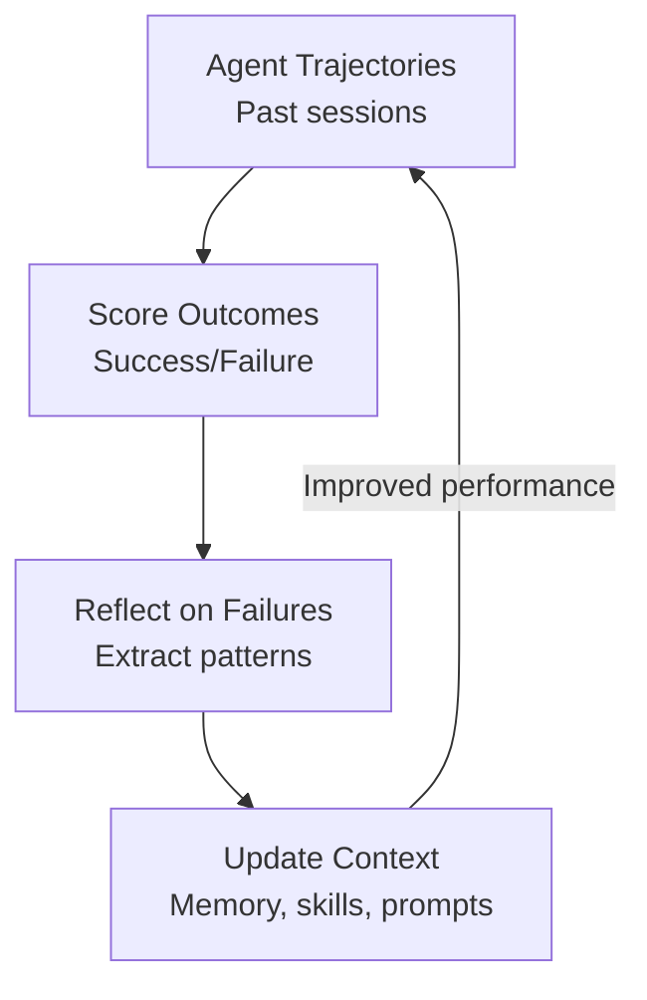
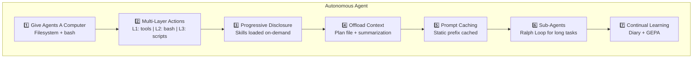
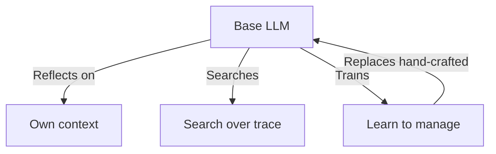
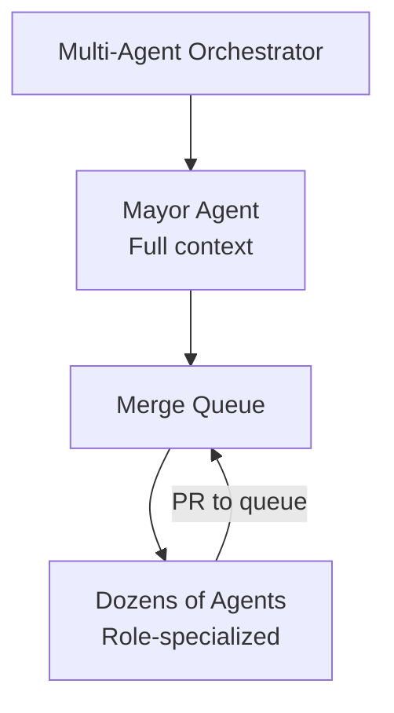

# Context Engineering for Agents

## Overview

Use this skill when designing autonomous LLM agent systems. This skill synthesizes production patterns from Claude Code, Manus, Amp Code, and other 2026-era agents to teach context management—the core bottleneck of agent scalability.

**Core Thesis**: Effective agent design largely boils down to context management. Like humans with limited working memory, LLMs have an "attention budget." Every new token depletes it. Successful agents all share one trait: **they manage context as a finite resource with diminishing marginal returns.**

## When To Use

Use this skill when:
- Designing a new autonomous agent system.
- Scaling existing agents to longer tasks (>100K tokens conversation).
- Optimizing cost per task (caching strategies, token efficiency).
- Architecting multi-agent coordination systems.
- Building agent frameworks for teams or products.

Do not use this skill for single-shot code generation (use `ai-native-spec-writing` or `idiomatic-rust-coding` instead).

## The 7 Context Management Patterns

### Pattern 1: Give Agents A Computer

**Core Idea**: Filesystem + shell primitives over custom tooling.

Successful agents all shift from API-only interfaces to OS-level primitives. An agent with access to your filesystem, shell, CLIs, and the ability to write scripts can compose actions without processing intermediate results.

**Why This Works**:

| Capability | Traditional | Agent Computer |
|------------|-------------|-----------------|
| **Persistence** | Lost in context | Saved to filesystem |
| **Composition** | Pre-built tools | Chain via shell |
| **Domain** | Generic | Use existing CLIs |
| **Flexibility** | Fixed interface | Write new code |

**Pattern**: CodeAct (agent writes and executes code to chain actions):

```bash
# Instead of:
# tool_call("read_file") -> tool_call("write_file") -> tool_call("run_test")
#
# Agent writes:
bash << 'EOF'
  cp src/main.rs src/main.rs.bak
  sed -i 's/old/new/g' src/main.rs
  cargo test --quiet
EOF
# Single action, agent doesn't process intermediate outputs
```

**Implementation Examples**:
- **Claude Code**: Full filesystem + bash + git access.
- **Manus**: File system + shell + domain CLIs.
- **Amp Code**: Curated action space + shell composition.

**Quote**: *"The primary lesson from actually successful agents is the return to Unix fundamentals: file systems, shells, processes & CLIs. Bash is all you need."* — @rauchg

---

### Pattern 2: Multi-Layer Action Space

**Core Idea**: Push actions down through layers to reduce context overhead.

As MCP usage scales, tool definitions overload the context window. GitHub MCP server has ~26K tokens of tool definitions alone. Solution: Create an action hierarchy.

**Architecture**:



**Production Numbers**:

| Agent | Tool Count | Design |
|-------|-----------|--------|
| Claude Code | ~12 | Curated atomic tools |
| Manus | <20 | Hierarchy with bash |
| Amp Code | Few | Curated action space |

**Key Insight**: Atomic tools (10-12) at L1 enable composition at L2/L3 without bloating the context with tool definitions.

---

### Pattern 3: Progressive Disclosure

**Core Idea**: Reveal details on-demand, not upfront.

Loading all tool definitions consumes valuable context budget and can confuse models with overlapping functionality.

**Architecture**:



**Implementations**:

- **Claude Code Skills**: YAML frontmatter loaded; full markdown only if needed.
- **Cursor Agent**: Tool descriptions synced to folder; agent reads full description on demand.
- **Manus**: List of utilities in instructions; agent uses `--help` flags to learn details.

**Skill Frontmatter Pattern**:

```yaml
---
name: validate-identifier-four-words-only
summary: Validates function names follow 4WNC
triggers:
  - "naming convention"
  - "function name"
  - "4WNC"
---
# Full documentation only loaded when triggered...
```

---

### Pattern 4: Offload Context to Filesystem

**Core Idea**: Filesystem extends context; old context is summarized and saved.

Context rot is real: as context grows, models lose early information, become inconsistent, and repeat themselves.

**Architecture**:



**Implementations**:

- **Manus**: Old tool results written to files; summarization applied once diminishing returns hit.
- **Cursor Agent**: Tool results and trajectories offloaded to filesystem.
- **Steering Pattern**: Plan file written and periodically read to reinforce objectives.

**Plan File Pattern**:

```bash
cat > /tmp/plan.md << 'EOF'
# Task: Implement feature X

## Steps
1. [ ] Write test for filter_implementation_entities_only
2. [ ] Implement function
3. [ ] Verify performance < 500μs
4. [ ] Update documentation

## Progress
- Step 1: Complete
- Step 2: In progress
EOF

# Agent periodically reads to stay on track
```

---

### Pattern 5: Cache Context

**Core Idea**: Static prefix (system prompt, tools) cached cheaply; dynamic messages incur full cost.

**Most Important Metric**: Cache hit rate.

@Manus called this out: "Without prompt caching, agents become cost-prohibitive. A higher capacity model with caching can be cheaper than a lower cost model without it."

**Cost Optimization**:

| Strategy | Impact |
|----------|--------|
| Static system prompt | High |
| Tool definitions | High |
| Agent instructions | High |
| Recent conversation | Low (changes frequently) |

**Economics**:

```
Cached token: $0.30 / 1M tokens
Normal token: $3.00 / 1M tokens

100K cached prefix = $0.03
vs $3.00 if not cached

Over 100 calls: $3 savings per call = $300 total
```

---

### Pattern 6: Isolate Context (Sub-Agents)

**Core Idea**: Delegate specialized tasks to isolated sub-agents to keep main context clean.

**Architecture**:



**Use Cases**:

- **Parallel Code Review**: Claude Code spawns sub-agents to independently check different issues.
- **Map-Reduce**: Lint rules, migrations—embarrassingly parallel tasks.

### The Ralph Loop Pattern

@GeoffreyHuntley coined the "Ralph Wiggum"—looping agents until a plan is satisfied:



---

### Pattern 7: Evolve Context (Continual Learning)

**Core Idea**: Update agent context (not model weights) with learnings over time.

@Letta_AI talks about continual learning in token space—agents that improve their own prompts based on past sessions.

**Architecture**:



**Claude Code Diary Pattern**:

```bash
# Pattern: distill sessions into diary entries
~/.claude/diary/
├── 2025-12-01.md  # What worked, what didn't
├── 2025-12-02.md  # Patterns discovered
└── 2025-12-03.md  # Skill distillations

# Update CLAUDE.md based on reflection
cat > CLAUDE.md << 'EOF'
# Project Context

## Learned Patterns
- Always use 4WNC for function names
- TDD cycle prevents 90% of bugs
- Progressive disclosure for large contexts
EOF
```

**GEPA Pattern**: Generate trajectories, Evaluate, Propose variants, Adopt:

1. Collect agent trajectories from past sessions.
2. Score them (success/failure).
3. Reflect on failures to extract patterns.
4. Propose prompt variants based on learnings.
5. Test and adopt winners in next session.

---

## Integration Example: Full Agent Stack

Combining all 7 patterns:



---

## Anti-Patterns to Avoid

- **Monolithic Context**: Loading all tool definitions upfront.
- **No Persistence**: Losing intermediate results to context window.
- **API-Only Interfaces**: Missing composition via shell.
- **No Caching Strategy**: Reprocessing static context repeatedly.
- **Unbounded Tasks**: Long-running agents without the Ralph Loop.
- **Static Prompts**: Not updating context based on past failures.

---

## Future Directions

### Learned Context Management

@RLanceMartin: *"LLMs can learn to perform their own context management. Much of the prompting packed into agent harnesses might get absorbed by models."*

Recursive Language Models (RLM):



### Sleep-Time Compute

Agents that "think offline" about their own context:
- Reflect over past sessions automatically.
- Update their own memories.
- Consolidate experiences.
- Prepare for future tasks.

### Multi-Agent Coordination

**Gas Town** by @Steve_Yegge: Multi-agent orchestrator with git-backed work tracking:



---

## LLM Response Contract

When designing agents with this skill, ensure:

- All 7 patterns understood and justified (or explicitly rejected).
- Context budget tracked and optimized.
- Caching strategy documented.
- Filesystem offloading plan specified.
- Sub-agent delegation strategy defined.
- Continual learning mechanism planned.

---

## Summary Table

| Pattern | Core Idea | Key Metric |
|---------|-----------|------------|
| **1. Computer** | Filesystem + shell | Composability |
| **2. Action Space** | Multi-layer hierarchy | Tool definition overhead |
| **3. Disclosure** | Load on-demand | Context window saved |
| **4. Offload** | Persistent storage | Conversation length |
| **5. Caching** | Static prefix cached | Cost per task |
| **6. Isolate** | Sub-agents | Main agent focus |
| **7. Evolve** | Learn from trajectories | Task success rate |

---

## Resources

- Source: `agents-used-202512/notes01-agent.md` (Part IX + Conclusion)
- References: @karpathy (context engineering), @rauchg (Unix fundamentals), @Letta_AI (continual learning), @Steve_Yegge (Gas Town)
- Related skill: `ai-native-spec-writing` (for planning agent tasks)
- Related skill: `idiomatic-rust-coding` (for implementing agent infrastructure)
