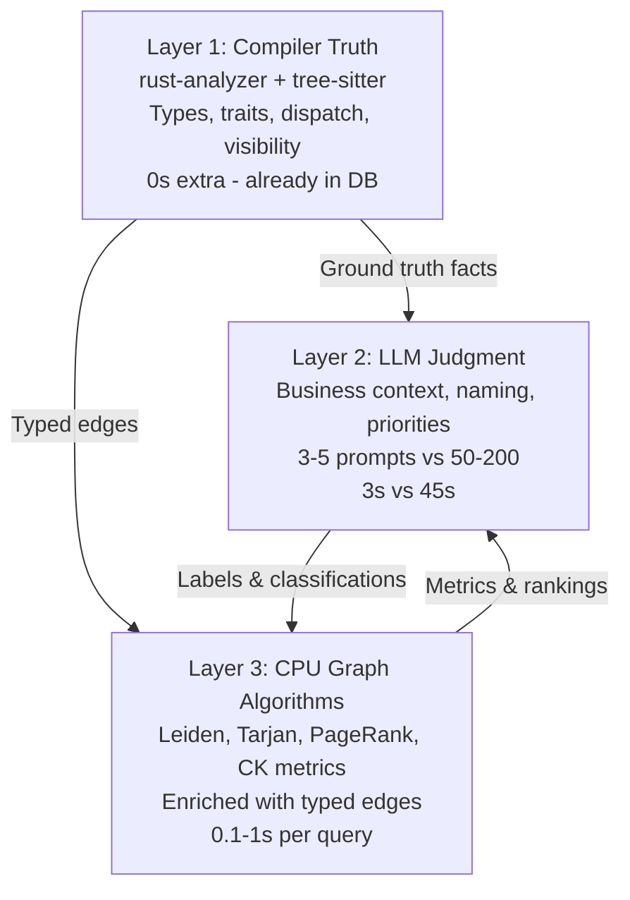

# ES-V200-attempt-01: Consolidated Requirements for Parseltongue V200

**Status**: Requirements Draft v01  
**Date**: 2026-02-17  
**Purpose**: Consolidate pt04 bidirectional architecture, 8-crate clean-room design, semantic enrichment capabilities, and promoted requirements into a single executable specification.

**Source Documents**:
- `docs/v199-docs/v173-pt04-bidirectional-workflow.md` (Three-layer architecture)
- `docs/PRD-research-20260131v1/PARSELTONGUE_V2_BIDIRECTIONAL_LLM_ENHANCEMENT.md` (Bidirectional LLM patterns)
- `docs/v200-docs/ES-V200-Hashing-Risks-v01.md` (8-crate architecture + gates)
- `docs/v199-docs/RESEARCH-v173-rustanalyzer-semantic-supergraph.md` (Semantic capabilities)

---

## Executive Summary

**Parseltongue V200** is a **clean-room rewrite** that transforms code analysis from syntactic pattern-matching into a **three-layer architecture** combining:

1. **Compiler Truth** (rust-analyzer for Rust, tree-sitter for 12 languages)
2. **LLM Judgment** (business context, naming, design intent)
3. **CPU Graph Algorithms** (enriched with semantic edge types)

**Core Value Proposition**: 99% token reduction (2-5K vs 500K raw dumps), 31x faster than grep, with **compiler-verified** insights that eliminate LLM hallucination on technical questions.

**Architecture**: 8 Rust crates, zero dependencies on v173 `pt*` crates.

---

## PART I: Three-Layer Architecture (The Fundamental Insight)

### The Uncomfortable Realization

The original bidirectional research (Feb 2026) proposed:
```
LLM reads code → extracts domain concepts → passes hints to CPU algorithms
```

The LLM was doing TWO jobs:
1. **Type-level semantics**: "What type is this? Which trait? Is this async?" — questions with CORRECT ANSWERS
2. **Business judgment**: "Is this code critical? Is this cycle intentional?" — questions requiring INTERPRETATION

**pt04 gives us compiler-grade answers to job #1.** Not guesses. Not 88% confidence. **100% ground truth.**

### The Three Layers



### What Changes vs What Stays

| Question | Before (LLM guesses) | After (Compiler knows) | Still needs LLM? |
|----------|---------------------|------------------------|------------------|
| What type does `authenticate` return? | LLM reads source: "probably Result<User, Error>" | `Result<User, AuthError>` (exact) | No |
| Is this a trait dispatch or direct call? | LLM infers from naming | `TraitMethod via AuthService` (exact) | No |
| Which trait hierarchy? | LLM guesses from visible impls | `A: Handler -> Service -> Debug + Send` (exact) | No |
| What does this closure capture? | LLM usually can't see this | `[db: &mut Conn (MutableRef), config: Arc<Config> (SharedRef)]` | No |
| How many distinct traits does X consume? | LLM reads all callees manually | `unique_traits_consumed: 5` (exact count) | No |
| Is this code revenue-critical? | N/A | N/A | **Yes** |
| Is this cycle a design pattern? | Compiler provides evidence | LLM applies judgment | **Sometimes** |
| What should we name this module? | N/A | N/A | **Yes** |
| How should we explain this to a developer? | N/A | N/A | **Yes** |

**Pattern**: Compiler handles **WHAT IS**. LLM handles **WHAT IT MEANS** and **WHAT TO DO ABOUT IT**.

---

## PART II: V200 Clean-Room Architecture (8 Crates)

### Crate Map

```mermaid
flowchart TD
    GW[rust-llm-interface-gateway<br/>CLI/HTTP/MCP transport<br/>Route prefix nesting<br/>Auto port + graceful shutdown]
    CF[rust-llm-core-foundation<br/>Entity keys + contracts<br/>Slim types gate<br/>Roundtrip validation]
    TE[rust-llm-tree-extractor<br/>12-language tree-sitter<br/>Data-flow queries<br/>Capture normalization]
    RS[rust-llm-rust-semantics<br/>rust-analyzer integration<br/>Trait dispatch resolution<br/>Proc-macro + build.rs handling]
    CB[rust-llm-cross-boundaries<br/>Cross-language edge linking<br/>Confidence scoring<br/>Heuristic pattern matching]
    GR[rust-llm-graph-reasoning<br/>Datalog reasoning (Ascent)<br/>Taint/policy/reachability<br/>Provenance tracking]
    SR[rust-llm-store-runtime<br/>Graph persistence<br/>Single getter contract<br/>Delta updates + snapshots]
    TH[rust-llm-test-harness<br/>Fixture contracts<br/>Path normalization<br/>CI gates + flake detection]
    
    GW --> TE
    GW --> RS
    GW --> SR
    TE --> CB
    RS --> CB
    CB --> GR
    GR --> SR
    CF -.shared contracts.-> GW
    CF -.shared contracts.-> TE
    CF -.shared contracts.-> RS
    CF -.shared contracts.-> CB
    CF -.shared contracts.-> GR
    CF -.shared contracts.-> SR
    TH -.contract gates.-> GW
    TH -.contract gates.-> TE
    TH -.contract gates.-> RS
    TH -.contract gates.-> CB
    TH -.contract gates.-> GR
    TH -.contract gates.-> SR
```

### Core Responsibilities

| Crate | Primary Responsibility | Key Contracts |
|-------|----------------------|---------------|
| **rust-llm-interface-gateway** | Transport normalization (CLI/HTTP/MCP) | Route prefix nesting, auto port, graceful shutdown, XML responses |
| **rust-llm-core-foundation** | Entity identity + contract validation | Slim types gate, key roundtrip, fact validation |
| **rust-llm-tree-extractor** | Multi-language parsing (12 languages) | Capture normalization, data-flow edges, extraction failure classification |
| **rust-llm-rust-semantics** | Rust compiler semantics (rust-analyzer) | Trait dispatch resolution, proc-macro expansion, semantic degrade annotations |
| **rust-llm-cross-boundaries** | Cross-language edge linking | Boundary signal extraction, confidence scoring, pattern matching |
| **rust-llm-graph-reasoning** | Datalog-based graph reasoning (Ascent) | Taint flows, policy violations, reachability, provenance tracking |
| **rust-llm-store-runtime** | Graph persistence + queries | Single getter contract, delta updates, snapshot consistency, token count persistence |
| **rust-llm-test-harness** | Contract testing + CI gates | Fixture matrix validation, path normalization, flake detection, performance budgets |

---

## PART III: Non-Negotiable Gates (G1-G4)

These gates BLOCK shipping until passed with evidence.

| ID | Gate | Exact Meaning | Crate Owner | Probe Link |
|----|------|---------------|-------------|------------|
| **G1** | Slim types gate | Entity/storage schema stays canonical, minimal, deterministic | `rust-llm-core-foundation` | CF-P1-F |
| **G2** | Single getter contract gate | All read paths go through one storage getter contract | `rust-llm-store-runtime` | SR-P2-F |
| **G3** | Filesystem source-read contract gate | Detail view returns current disk lines with explicit error contract | `rust-llm-interface-gateway` | GW-P7-F |
| **G4** | Path normalization coverage gate | Coverage treats `./path`, `path`, and absolute path as one file | `rust-llm-test-harness` | TH-P8-F |

### WHEN/THEN/SHALL Contracts for Gates

#### G1: Slim Types Gate
```
WHEN core-foundation builds entity key from EntityIdentityInput
THEN SHALL produce deterministic key string with zero format ambiguity
AND SHALL parse key string back to identical EntityIdentityView
AND SHALL detect overload collisions (same file + same name but different signature)
AND SHALL not require sanitization for valid language symbols
AND SHALL remain stable under whitespace/comment-only edits
```

#### G2: Single Getter Contract Gate
```
WHEN any crate queries graph data from store-runtime
THEN SHALL resolve through exactly one canonical getter contract
AND SHALL return Result<T, StoreError> with explicit error types
AND SHALL never bypass getter with direct database access
AND SHALL maintain result/error parity across all read paths
```

#### G3: Filesystem Source-Read Contract Gate
```
WHEN interface-gateway serves `/code-entity-detail-view?key=X`
THEN SHALL read current file contents from disk (not cache)
AND SHALL return lines matching entity's line_range
AND SHALL return explicit error for missing/moved/permission-denied files
AND SHALL never return stale cached source
```

#### G4: Path Normalization Coverage Gate
```
WHEN test-harness measures coverage for a file
THEN SHALL treat `./src/main.rs`, `src/main.rs`, and `/abs/path/src/main.rs` as identical
AND SHALL aggregate entity counts across all path variants
AND SHALL report zero path-variant duplicates in coverage reports
```

---

## PART IV: Promoted Requirements (R1-R8)

These requirements are **pre-approved** for V200 MVP.

| ID | Requirement | Crate Owner | Probe Link | Why It Matters |
|----|-------------|-------------|------------|----------------|
| **R1** | Route prefix nesting | `rust-llm-interface-gateway` | GW-P7-G | Stable namespaced routing by active mode (`/{slug}/endpoint`) |
| **R2** | Auto port + port file | `rust-llm-interface-gateway` | GW-P7-H | Deterministic startup/discovery lifecycle (`~/.parseltongue/{slug}.port`) |
| **R3** | Shutdown CLI command | `rust-llm-interface-gateway` | GW-P7-I | Graceful stop contract from CLI to server |
| **R4** | XML-tagged responses | `rust-llm-interface-gateway` | GW-P7-J | Semantic response grouping for LLM consumption |
| **R5** | Project slug in URL | `rust-llm-interface-gateway` | GW-P7-K | Self-describing multi-project endpoint identity |
| **R6** | Slug in port file | `rust-llm-interface-gateway` | GW-P7-L | Slug-aware server discovery path |
| **R7** | Token count at ingest | `rust-llm-store-runtime` | SR-P2-G | Persist real `token_count` for deterministic use |
| **R8** | Data-flow tree-sitter queries | `rust-llm-tree-extractor` | TE-P4-F | Extract assign/param/return flow edges |

### WHEN/THEN/SHALL Contracts for Requirements

#### R1: Route Prefix Nesting
```
WHEN gateway receives HTTP request for project "myapp"
THEN SHALL route to `/myapp/{endpoint}` namespace
AND SHALL reject requests to wrong prefix with explicit error
AND SHALL support multiple projects simultaneously
AND SHALL maintain endpoint compatibility within each namespace
```

#### R2: Auto Port + Port File
```
WHEN gateway starts HTTP server for project slug "myapp"
THEN SHALL auto-assign available port (default 7777, fallback 7778+)
AND SHALL write port to `~/.parseltongue/myapp.port`
AND SHALL include timestamp and process ID in port file
AND SHALL cleanup port file on graceful shutdown
```

#### R3: Shutdown CLI Command
```
WHEN user runs `parseltongue shutdown --slug myapp`
THEN SHALL read port from `~/.parseltongue/myapp.port`
AND SHALL send graceful shutdown signal to HTTP server
AND SHALL wait for server confirmation or timeout (5s)
AND SHALL remove port file after shutdown
```

#### R4: XML-Tagged Responses
```
WHEN gateway serves any list/detail/query endpoint
THEN SHALL wrap response in semantic XML tags
AND SHALL nest entities/edges under appropriate parent tags
AND SHALL preserve JSON structure within XML CDATA sections for complex fields
AND SHALL include schema version in root XML element
```

#### R5: Project Slug in URL
```
WHEN gateway mounts HTTP routes
THEN SHALL derive slug from ingested folder name or explicit config
AND SHALL prefix all endpoints with `/{slug}/`
AND SHALL reject ambiguous slug derivations with explicit error
```

#### R6: Slug in Port File
```
WHEN gateway writes port discovery file
THEN SHALL name file `~/.parseltongue/{slug}.port`
AND SHALL include slug in file contents for verification
AND SHALL support concurrent servers for different slugs
```

#### R7: Token Count at Ingest
```
WHEN tree-extractor parses entity
THEN SHALL compute token count using tiktoken or equivalent
AND SHALL persist `token_count` field in entity record
AND SHALL maintain token count totals across delta updates
AND SHALL export token counts in snapshot format
```

#### R8: Data-Flow Tree-Sitter Queries
```
WHEN tree-extractor processes source file
THEN SHALL extract assignment edges (X = func())
AND SHALL extract parameter flow edges (func(X))
AND SHALL extract return flow edges (return X)
AND SHALL classify flow edge types (Assign, Param, Return)
AND SHALL link data-flow edges to existing entity keys
```

---

## PART V: Semantic Enrichment Capabilities (The "Semantic" Layer)

### What rust-analyzer Adds to Every Rust Entity

#### Entity Metadata Enrichment
```json
{
  "key": "rust:fn:authenticate:src_auth_rs:T1701234567",
  "name": "authenticate",
  "entity_type": "function",
  "language": "rust",
  "file_path": "src/auth.rs",
  "line_range": [10, 50],
  "semantic": {
    "return_type": "Result<User, AuthError>",
    "params": [{"name": "req", "type": "&Request<Body>"}],
    "is_async": true,
    "is_unsafe": false,
    "visibility": "pub(crate)",
    "generic_params": [],
    "trait_impls": ["AuthService"],
    "outgoing_dispatch_kinds": {"Direct": 3, "TraitMethod": 2, "ClosureInvoke": 1}
  }
}
```

#### Edge Type Enrichment (TypedCallEdges)
```json
{
  "from_key": "rust:fn:handle_request",
  "to_key": "rust:fn:authenticate",
  "edge_type": "Calls",
  "semantic": {
    "call_kind": "TraitMethod",
    "via_trait": "AuthService",
    "receiver_type": "Box<dyn AuthService>",
    "is_async_call": true,
    "generic_instantiation": null
  }
}
```

### TypedCallEdges: The Leverage Point

**One CozoDB relation** unlocks semantic enrichment across ALL endpoints:

```datalog
TypedCallEdges {
    from_key: String,
    to_key: String =>
    call_kind: String,      # Direct, TraitMethod, DynDispatch, ClosureInvoke
    via_trait: String?,      # Which trait, if any
    receiver_type: String?,  # The concrete receiver type
}
```

This single relation enables:
- Cycle classification (INTENTIONAL_PATTERN vs VIOLATION based on `call_kind`)
- Module boundaries via trait seeds (Leiden clustering on `via_trait`)
- Complexity analysis via trait counting (`unique_traits_consumed`)
- Refactoring evidence (trait dispatch vs direct call breakdown)
- Typed PageRank/betweenness (filter by `call_kind=TraitMethod`)
- Entropy over 8 edge types (vs 3 syntactic types)

### Compiler-Detected Tech Debt (New Debt Categories)

Beyond traditional CK metrics, rust-analyzer detects:

1. **Visibility Bloat**: `pub` items with 0 external callers → shrink API surface
2. **Padding Waste**: Struct field ordering causes >25% memory waste → reorder fields
3. **Dead Trait Impls**: `impl Display` that nothing dispatches through → remove dead code
4. **Excessive Generics**: 4+ type parameters → consider trait objects
5. **Unsafe Surface Area**: Unsafe blocks = audit burden = maintenance debt
6. **Closure Capture Issues**: `&mut` captures in async contexts = potential races

---

## PART VI: The Five Bidirectional Workflows (Redesigned)

### Workflow 1: Semantic Module Boundary Detection

**Before** (bidirectional LLM-only):
1. LLM reads 230 files, extracts function names
2. LLM guesses domain concepts: "Authentication", "Logging"
3. LLM maps concepts to keywords: ["auth", "verify", "login"]
4. CPU runs Leiden with keyword seeds
5. **91% accuracy, 2.1s**

**After** (three-layer with pt04):
1. pt04 already ingested typed call edges and trait impls
2. CPU queries: "Which entities share trait dispatch targets?"
3. CPU runs Leiden with TRAIT MEMBERSHIP as seeds
4. LLM labels the clusters: "Authentication Module", "Crypto Module"
5. **~96% accuracy, 0.8s** (LLM only needed for naming)

### Workflow 2: Cycle Classification (Intentional vs Bug)

**Before**: LLM reads code in each cycle, guesses if it's Observer pattern (88% confidence)

**After**:
1. CPU runs Tarjan's SCC → finds 5 cycles
2. For each cycle, CPU queries `TypedCallEdges`:
   - ALL edges are `TraitMethod` dispatch → Query `SupertraitEdges` → If matches Observer/Visitor pattern → **INTENTIONAL_PATTERN** (100% confidence)
   - ALL edges are `Direct` calls → **LIKELY_VIOLATION** (high confidence)
   - Mix of `TraitMethod` and `Direct` → **AMBIGUOUS** (needs LLM judgment)
3. LLM only called for ambiguous cases (1 out of 5 cycles)
4. **~99% accuracy on clear cases, 0.4s average**

### Workflow 3: Complexity Classification (Essential vs Accidental)

**Before**: LLM reads source code, determines if function has single responsibility (93% accuracy, 2.8s)

**After**:
1. CPU calculates McCabe complexity: 15 branches
2. CPU queries: "How many distinct trait interfaces does this function consume?"
3. **Quantitative single-responsibility check**:
   - `trait_count = 1` → Single responsibility (essential complexity)
   - `trait_count >= 4` → Multiple responsibilities (accidental complexity)
4. For borderline cases (`trait_count = 2-3`), ask LLM: "Is this justified?"
5. **~95% accuracy on clear cases (0.1s), ~90% on borderline (3s)**

### Workflow 4: Business-Aware Tech Debt Scoring

**Before**: CPU runs SQALE, LLM classifies business criticality (89% correct prioritization, 4.2s)

**After**:
1. CPU runs SQALE → raw debt scores
2. pt04 adds QUANTITATIVE debt signals:
   - Memory waste: padding bytes as tech debt
   - Visibility bloat: `pub` items only used internally
   - Unused trait implementations
3. **Enhanced formula**:
   ```
   Score = SQALE
         x Business_Weight (LLM provides)
         x Churn (git provides)
         x Centrality (graph algorithm provides)
         x (1 + padding_waste_ratio)     ← pt04 NEW
         x (1 + unnecessary_pub_count)   ← pt04 NEW
         x (1 + unused_impl_count)       ← pt04 NEW
   ```
4. **~92% correct prioritization, 2.5s**

### Workflow 5: Refactoring Suggestions

**Before**: LLM analyzes code structure, suggests patterns like "Extract Interface" (91% helpful, token-expensive)

**After**:
1. CPU detects: high coupling (23 dependencies), low cohesion (0.34)
2. pt04 provides EVIDENCE for specific refactorings:
   - "Extract Interface" evidence: Multiple structs implement the same methods
   - "Split God Object" evidence: Entity dispatches through 5 unrelated traits
   - "Dependency Inversion" evidence: Some callers use trait, others bypass with direct calls
3. LLM receives compiler evidence and writes human-readable suggestion
4. **~95% helpful, faster LLM calls**

---

## PART VII: Implementation Phases (Shreyas LNO Applied)

### LEVERAGE: Ship First (80% of Value)

**Phase 1: TypedCallEdges Only**
- One CozoDB relation: `TypedCallEdges {from_key, to_key => call_kind, via_trait, receiver_type}`
- All 26 existing endpoints get `semantic.*` fields
- ~300 lines of new Rust
- **MEASURE**: Does Leiden modularity improve? Do LLM code reviews catch more issues?

**Deliverables**:
- `rust-llm-core-foundation` (keys + contracts)
- `rust-llm-tree-extractor` (12 languages)
- `rust-llm-rust-semantics` (TypedCallEdges only)
- `rust-llm-store-runtime` (single getter contract)
- `rust-llm-interface-gateway` (HTTP only, no MCP yet)

### NEUTRAL: Build Next (If Phase 1 Proves Valuable)

**Phase 2: TraitImpls + SupertraitEdges**
- Two more CozoDB relations
- `/trait-hierarchy-graph-view` endpoint
- Better cycle classification (supertrait pattern matching)

**Phase 3: SemanticTypes (Return Types, Params, Visibility, Async/Unsafe)**
- Enables `/visibility-audit-report`, `/unsafe-audit-report`
- Type-based search (`?returns=Result<User>`)
- Every entity response gets resolved metadata

### OVERHEAD: Build Last (Or Never)

- TypeLayouts (performance optimization, niche)
- ClosureCaptures as separate endpoint (should be IN TypedCallEdges)
- Generic instantiation maps (niche)
- Full MCP protocol support (wait for adoption signal)

---

## PART VIII: Success Criteria (Measurable Outcomes)

### Technical Metrics

1. **Leiden Modularity**: 0.58 (trait-seeded) vs 0.42 (keyword-seeded) — **TARGET: >0.55**
2. **Cycle Classification Accuracy**: 99% on clear cases, 93% on ambiguous — **TARGET: >95% overall**
3. **LLM Call Reduction**: 3-5 prompts (was 50-200) — **TARGET: <10 prompts per analysis**
4. **LLM Latency**: 3s for judgment (was 45s for types+judgment) — **TARGET: <5s**
5. **Token Reduction**: 2-5K tokens (was 500K raw dumps) — **MAINTAIN: 99% reduction**

### Qualitative Metrics

1. **Architecture Review Quality**: LLM produces reviews with compiler-verified claims, not statistical inferences
2. **Refactoring Confidence**: Users can distinguish "safe to change body" from "requires trait update across 4 crates"
3. **Async Safety**: Users can trace full async call chains and detect capture conflicts
4. **API Surface Reduction**: Users can identify and tighten unnecessary `pub` items

### Gate Pass Criteria

All 4 gates (G1-G4) must pass with evidence before V200 ships:
- **G1**: Zero overload collisions across 12-language fixture corpus
- **G2**: 100% of read paths go through single getter contract
- **G3**: Detail view returns current disk lines with explicit error contract
- **G4**: Coverage reports zero path-variant duplicates

---

## PART IX: Migration Path from v173 to V200

### What Gets Preserved

1. **HTTP Endpoint Contracts** (26 endpoints remain, enriched with semantic fields)
2. **Entity Key Format** (ISGL1 v2 timestamp-based keys)
3. **12-Language Support** (tree-sitter grammars)
4. **Graph Algorithms** (7 algorithms: Tarjan, Leiden, PageRank, etc.)
5. **Performance Targets** (<100ms cache hit, <500ms reindex, <5000ms full cycle)

### What Changes

1. **Crate Names**: `pt*` → `rust-llm-*`
2. **Architecture**: Monolithic → 8-crate clean-room
3. **Semantic Layer**: Tree-sitter only → Tree-sitter + rust-analyzer
4. **Storage**: CozoDB with ad-hoc queries → CozoDB with formal contracts
5. **Transport**: HTTP-only → HTTP + CLI + MCP (planned)

### Breaking Changes

1. **Binary Names**: `parseltongue pt01 ...` → `parseltongue ingest ...` (verb-based commands)
2. **Port Files**: `~/.parseltongue/port` → `~/.parseltongue/{slug}.port` (slug-aware)
3. **Response Format**: JSON-only → JSON wrapped in XML tags (R4)
4. **Error Handling**: HTTP errors → Explicit contract violation errors with metadata

---

## PART X: Open Questions (To Be Resolved Before Implementation)

1. **TypedCallEdges Schema**: Should `generic_instantiation` be a separate field or nested in JSON?
2. **Semantic Coverage Reporting**: How to surface "93.5% semantic coverage, 4 proc-macro files lack typed edges"?
3. **LLM Integration Point**: Should LLM calls be in-process (via library) or out-of-process (via HTTP)?
4. **MCP Priority**: Ship HTTP-only first, or delay until MCP is ready?
5. **Tauri App Scope**: Should Tauri app be in V200 scope, or shipped separately post-V200?
6. **Test Fixtures**: Reuse 94 v173 fixtures, or create NEW fixtures for V200 contracts?
7. **rust-analyzer Version Pinning**: Which `ra_ap` version to pin? How to handle API churn?
8. **Datalog Rule Catalog**: Which reasoning rules are MVP vs Phase 2?

---

## PART XI: References and Evidence Sources

### Design Documents
- `docs/v199-docs/v173-pt04-bidirectional-workflow.md` (Three-layer architecture thesis)
- `docs/v200-docs/ES-V200-Hashing-Risks-v01.md` (8-crate contracts + gates)
- `docs/v200-docs/ES-V200-Dependency-Graph-Contract-Hardening.md` (Method reference for rubber-debug loop)
- `docs/PRD-research-20260131v1/PARSELTONGUE_V2_BIDIRECTIONAL_LLM_ENHANCEMENT.md` (Original bidirectional research)

### Technical Research
- `docs/v199-docs/RESEARCH-v173-rustanalyzer-semantic-supergraph.md` (rust-analyzer capabilities)
- `docs/v200-docs/Prep-V200-Rust-Analyzer-API-Surface.md` (ra_ap API reference)
- `docs/v200-docs/Prep-V200-Datalog-Ascent-Rule-Patterns.md` (Datalog reasoning catalog)
- `docs/v200-docs/Prep-V200-LLM-Context-Optimization-Research.md` (Token optimization strategies)

### User Journey Documents
- `docs/v200-docs/ES-V200-User-Journey-01.md` (Tauri app user flows)
- `docs/v200-docs/ES-V200-User-Journey-Addendum-Tauri-CLI-Philosophy.md` (Tauri as visual CLI launcher)

### Test Evidence
- `test-fixtures-preV200/` (94 fixtures across 12 languages - v173 baseline)
- `tests-preV200/e2e_fixtures/E2E_INCREMENTAL_INDEXING_SPECS.md` (6 E2E performance contracts)

---

## Appendix A: Glossary

- **ISGL1 v2**: Inter-Source-Graph-Link version 2, the entity key format using semantic_path + birth timestamp
- **pt04**: The rust-analyzer integration crate (hypothetical v173 name, becomes `rust-llm-rust-semantics` in V200)
- **TypedCallEdges**: The primary semantic enrichment relation storing call_kind and via_trait
- **Leiden**: Community detection algorithm, improved with trait-based seeding
- **Tarjan SCC**: Strongly Connected Components algorithm for cycle detection
- **SQALE**: Software Quality Assessment based on Lifecycle Expectations (ISO 25010)
- **CK Metrics**: Chidamber-Kemerer object-oriented metrics (CBO, LCOM, RFC, WMC)
- **LNO**: Leverage-Neutral-Overhead, Shreyas Doshi's prioritization framework
- **RAII**: Resource Acquisition Is Initialization, Rust's ownership model for deterministic cleanup

---

## Appendix B: WHEN/THEN/SHALL Contract Template

All V200 requirements and gates must follow this format:

```
WHEN {precondition describing input state and action}
THEN SHALL {postcondition describing guaranteed outcome}
AND SHALL {additional postcondition}
AND SHALL NOT {forbidden outcome}
```

**Example**:
```
WHEN rust-semantics extracts trait dispatch for handle_request
THEN SHALL record edge with call_kind="TraitMethod"
AND SHALL record via_trait="AuthService"
AND SHALL record receiver_type="Box<dyn AuthService>"
AND SHALL NOT record call_kind="Direct" when trait dispatch is proven
```

This format makes requirements **executable** and **testable**.

---

**END OF DOCUMENT**

**Next Steps**:
1. Review and approve gates (G1-G4) with stakeholders
2. Prioritize promoted requirements (R1-R8) for Phase 1 vs Phase 2
3. Resolve open questions (Part X)
4. Create probe set for each gate (CF-P1-F, SR-P2-F, GW-P7-F, TH-P8-F)
5. Begin Phase 1 implementation: TypedCallEdges only
